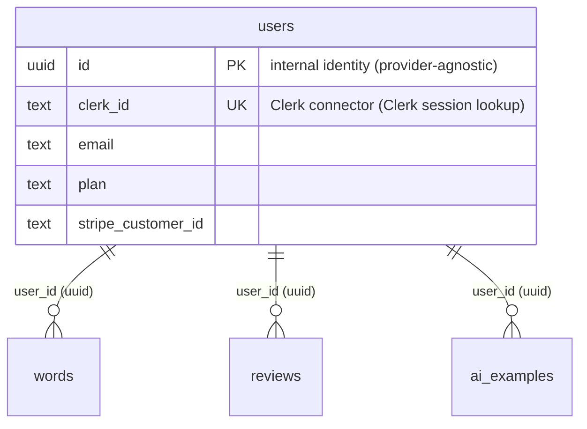

# mcq-platform — 多肢選択問題 PWA

学習資料 (テキスト/ノート/教材) を AI OCR で MCQ 化し、
FSRS 忘却曲線で復習する学習アプリ (Next.js 15.x App Router +
TypeScript strict + Tailwind v4 + Drizzle (Neon serverless) +
Clerk + Stripe + Discord webhook + Gemini 2.5 Flash)。

`devcontainer-template` + `plan00` SaaS template を起点に派生。
vocab 機能 (FSRS 英単語学習 + AI 例文生成) は drop 予定、mcq 機能
(教材 OCR / custom_props / shared_context / 画像プレースホルダ) を
新規追加中。

**現フェーズ**: Phase 0b PoC 完全完了、Sprint A (DB migration +
環境構築) 着手前。Tech Spec 確定版は `docs/02-tech-spec.md` v0.6 +
v0.6 続編。アーキテクチャ詳細は `docs/architecture-guide.md`
(plan00 由来、Sprint A 進行に応じて mcq 用へ更新予定)。

---

## 1. Quick Start

前提: Dev Container (`.devcontainer/` 設定済) を VS Code で開いた状態を想定。 ホスト
側起動手順は別途 `devcontainer-template` repo 参照。

```bash
# 1. 依存導入
pnpm install

# 2. 環境変数設定 (詳細 §5)
cp .env.example .env.local
# .env.local を編集 (Clerk / Stripe / Neon / Discord webhook URL など)

# 3. DB migration (Neon の DATABASE_URL 設定後)
pnpm drizzle-kit migrate

# 4. dev server
pnpm dev
```

`http://localhost:3000` で起動。 Clerk sign-in / sign-up 動作確認。

### 1.1 scaffold 直後 3 点修正 (新 repo 起こし時のみ)

`pnpm create next-app` 直後の新 repo では、 dev server 無限ループ / Neon 接続失敗を
防ぐため以下 3 点を必ず実施 (本 repo は反映済):

- `package.json` `pnpm.onlyBuiltDependencies` で `bufferutil` / `utf-8-validate` を
  承認 (Neon WebSocket native binding 必須)
- `next.config.ts` で dev-only `webpack.watchOptions` 設定 (Vercel build 中の watch
  ループ抑制)
- `.gitignore` に `.env.local` / `tsconfig.tsbuildinfo` を追加

詳細手順: `docs/setup-notes.md`

### 1.2 Native binding 失敗時

`@neondatabase/serverless` は WebSocket 接続で `bufferutil` + `utf-8-validate`
native binding 必須。 初回 install 後に DB 接続失敗 (`bufferUtil.mask is not a
function`) が出たら:

```bash
pnpm install   # native binding を rebuild
```

---

## 2. 見た目変更箇所一覧 (template 利用者書換)

> **注記 (2026-05-13)**: §2 以降は plan00 (vocab template) 由来の
> template 利用者向け書換指針。mcq-platform 本体としては vocab 機能
> drop + mcq 機能新規追加が Sprint A〜J で進行中で、MVP 完成時に §2 以降を
> mcq 用にまとめて整理する予定。それまでは plan00 文脈での記述として参照。

template 利用者は以下の 5 箇所を自身の SaaS 名 / 説明に書換:

| # | file path | 該当行 | 現値 | 変更指針 |
|---|---|---|---|---|
| 1 | `app/layout.tsx` | L10 metadata title | `単語帳学習アプリ` | 自身の SaaS 名 |
| 2 | `app/layout.tsx` | L11 metadata description | `FSRS アルゴリズムによる英単語学習アプリ` | 自身の SaaS 説明文 |
| 3 | `app/(marketing)/page.tsx` | L35 hero 説明 | `FSRS 忘却曲線で効率的に英単語を定着させる学習アプリ` | 自身の SaaS hero 文 (h1 は `{{SERVICE_NAME}}` placeholder 経由で sed 置換、 §3.7 参照) |
| 4 | `package.json` | L2 name | `vocab-learning-app` | 自身の SaaS 名 (kebab-case) |
| 5 | `app/(app)/app/_components/app-header.tsx` | L16 Logo 直書き | `Vocab App` | 自身の SaaS 名 (`components/brand/logo.tsx` 経由化推奨、 当面は両方書換が安全) |

法務 page (`app/(marketing)/{terms,privacy,legal}/page.tsx`) は別途 13 placeholder
sed 置換で完結。 詳細: `docs/legal-placeholders.md`

vocab 機能側文言 (nav link / dashboard / settings 削除確認 / vocab page 全) は次案件
base 利用者向け、 §3.8 で言及。

---

## 3. Architecture

各 pattern 概要 + 詳細 doc / lesson への link。 全体像 + path 別役割は
`docs/architecture-guide.md` (canonical doc、 §1-§8) を参照。

### 3.1 削除フロー (webhook-driven、 Phase 1 D 系列で完成)

- Clerk client SDK self-delete + polling pattern (`/app/settings` 削除ボタン →
  `clerkClient.users.deleteUser` → polling で完了検知)
- 削除後は `window.location.replace` で **hard navigation** (Router Cache 回避)
- BFCacheGuard で browser back の zombie state 防御
- DB は `users.deleted_at` 論理削除、 Stripe active subscriptions を auto-cancel
  (auto-pagination + `status: "all"` で 100 件上限 + iterate-cancel 落とし穴回避)
- 設計原則: Webhook 駆動 + Stripe/Clerk を真実、 アプリ DB はコピー (業界
  ベストプラクティス整合)。 順序保証なし event 配信 + handler 冪等性確保
- 詳細: `docs/architecture-guide.md §4.3` / lesson `2026-04-26-clerk-nextjs-webhook-architecture.md`

### 3.2 Webhook idempotency (Clerk + Stripe 共通 pattern)

- `clerk_events` / `stripe_events` table に event ID PK で保存
- handler 手前で `INSERT ... ON CONFLICT DO NOTHING RETURNING` → 既処理なら 200
  "duplicate" 即 return
- 失敗時も 200 swallow (Stripe / Clerk retry loop 防止)
- recovery: `deletion_failures` audit table + Discord ops notify、 OT 手動経路
- verify 手法 (intentional throw + Stripe trigger + Vercel Protection Bypass):
  lesson `2026-04-28-discord-notify-verify-methodology.md §3.4`

### 3.3 Middleware (Edge 認証のみ + Node layout で 1 段判定)

- `middleware.ts` で `clerkMiddleware` + `createRouteMatcher(['/app(.*)'])` のみ
  protect
- Edge runtime + Neon WebSocket driver 制約のため middleware から DB 接続不可、
  DB 由来判定 (`deletedAt` 等) は Node runtime layout / page で 1 段判定
- webhook endpoint は matcher 通過するが protect 対象外、 署名検証 (Svix /
  Stripe) を handler 側で独自実施
- 詳細: `docs/architecture-guide.md §1.5`

### 3.4 DB pool (Neon serverless lazy singleton)

- `lib/db/index.ts` で `Pool` を module-scope で lazy 化、 1 invocation 内で同 pool
  使い回し
- Vercel cold start ごとに新 pool、 idle 接続溜まりは Neon serverless 側で handle
- `neonConfig.webSocketConstructor = ws` で Node runtime 対応 (Edge runtime 非対応
  設計)
- 詳細: `docs/architecture-guide.md §1.6`

### 3.5 Stripe API basil 対応 (cancel_at で解約予約判定)

- Stripe API 2025-05-28 で `cancel_at_period_end` parameter は flexible billing
  mode で deprecated
- plan00 は `cancel_at != null` を解約予約 source of truth とし、
  `cancelAtPeriodEnd` カラムは migration で DROP 済
- 詳細: lesson `2026-04-29-stripe-deprecation-billing-mode.md`

### 3.6 Users schema 二段構造 (auth provider decoupling)

`users.id` (UUID PK、 auth provider 非依存 internal identity) + `users.clerk_id`
(text UK、 Clerk session connector) を分離。 全 FK table は `users.id` 参照に
統一、 auth provider 切替時の影響を Clerk 関連 column のみに局所化。



将来 multi-provider (WorkOS / Auth0 / Apple Sign In 等) は `users.workos_id` 等の
connector column 追加だけで済む。

詳細経緯 (PG FK constraint 自動 switch 不可 / 一時列方式 backfill / 互換性保持型
段階移行 / audit table 設計原則 等 7 項目): lesson
`2026-04-30-users-schema-decoupling.md`

### 3.7 chrome 3 layer + Route Group 3 構造 (Phase 1 I-K で確立)

Route Group 3 構造 (URL 不変保証):
- `app/(marketing)/` = 未認証 chrome (top + 法務 page + contact form)
- `app/(auth)/` = 認証 chrome (sign-in / sign-up / sign-out-deleted)
- `app/(app)/app/` = 認証必須 zone (`/app(.*)` middleware protect)

chrome 3 layer:
- marketing: `MarketingHeader` + `MarketingFooter` (© + Contact / Terms / Privacy / 特商法 横並び)
- auth: `AuthHeader` (Logo only) + footer なし
- app: `AppHeader` (5 link onClick revalidate + UserButton) + footer なし

Logo は `components/brand/logo.tsx` で marketing / auth 共用、 placeholder
`{{SERVICE_NAME}}` 経由で sed 置換。 13 placeholder 系の詳細: `docs/legal-placeholders.md`

### 3.8 vocab 機能 = 次案件 base 拡張対象

vocab 機能 (FSRS 英単語学習 + AI 例文生成) は次案件 (mcq app 等) の base として
残置。 次案件作業者は以下を全面書換:

- `app/(app)/app/{words,review,quiz}/` = vocab UI / server action 全 (約 290 + 700
  + 1 行)
- `app/(app)/app/_components/app-header.tsx` nav link label (`単語` / `復習` /
  `演習`)
- `app/(app)/app/page.tsx` dashboard 文言 (`今日の学習単語数`)
- `app/(app)/app/settings/page.tsx` 削除確認文言 (`登録した単語と学習履歴`)
- `lib/{fsrs,gemini,ai-usage,jst}.ts` / `lib/db/streak.ts` / `lib/validation/word.ts`
  = vocab/AI 機能 lib
- `lib/auth/plan-limits.ts` = vocab/AI 前提の plan 構造 (`words`/`aiGenPerDay`)
- `lib/db/schema.ts` 内 5 table = `words` / `reviews` / `ai_examples` / `ai_usage`
  / `ai_usage_users`

template 利用者は §2 の 5 箇所のみ書換で起動可能 (vocab 機能は触らず動作)、
次案件 base 利用者は上記全面書換 + plan-limits / schema 再設計。 path 別 削除 /
generic 化の判断 index は `docs/architecture-guide.md §2-§4` を参照。

---

## 4. 開発手順

### 4.1 test / build / lint / migration

```bash
pnpm test          # Vitest 全件 (242 test 維持)
pnpm test:watch    # watch mode
pnpm build         # production build (deploy 前必須)
pnpm lint          # next lint
pnpm drizzle-kit generate  # schema 変更後に migration 生成
pnpm drizzle-kit migrate   # migration 適用 (DATABASE_URL 設定要)
pnpm db:studio     # Drizzle Studio (DB 中身確認)
```

### 4.2 workflow

Spec → Plan → 実装 (TDD where applicable) → Review → Commit のサイクル。 詳細:
`CLAUDE.md` §「Plan の書き方」 / 「Review と Commit のルール」。

- spec / plan は `docs/superpowers/specs/` / `docs/superpowers/plans/` に保存
- 各 sprint 末に lessons 蒸溜 (`docs/superpowers/lessons/`)
- spec / plan / sessions は sprint 完了後 OT 判断で削除可、 lessons は永続保持

### 4.3 Commit 規約 + review tag

`CLAUDE.md` L91-142 が source of truth:

- `feat(_)` / `fix(_)` 系は `superpowers:requesting-code-review` skill canonical 経路の
  formal review 必須、 `[reviewed]` tag 付与
- `chore(_)` / `docs(_)` / `test(_)` / `refactor(_)` で実装ロジック変更なしのもの
  のみ `[no-review]` tag で skip 可
- `.claude/hooks/check-review.sh` (Stop hook) が tag 無し commit を block
- 決済 / 認証 / 削除 / 外部副作用を伴う fix は code-reviewer pass 後 OT 実機観察
  → `git commit --amend` で `[reviewed]` 追記 (CLAUDE.md §重要 Fix 裏取り)

### 4.4 pnpm.overrides (transitive vuln)

transitive vuln (例: `your-app → svix → uuid`) は pnpm.overrides で強制上書き。
各 override に rationale + 解除 trigger を doc 化、 永久残置 risk 防止。

詳細 pattern + cadence + checklist: lesson `2026-05-08-pnpm-overrides-rationale.md`

### 4.5 セキュリティ絶対ルール

`CLAUDE.md` L27-69 が source of truth (Stripe test only / Clerk test only / AI
クレカなし daily limit)。 違反 PR は code-reviewer が Critical で止める。

---

## 5. Deploy

### 5.1 Vercel

ホスト側 (Dev Container 外) で実施。 SSH 鍵 / Vercel トークンはコンテナにマウント
しない。

```bash
git push origin main
vercel --prod
```

#### 5.1.1 初回 deploy 後の確認

1. **Vercel Dashboard → Project → Settings → Domains** で正規 production domain
   確認 (auto-generated short URL に頼らない、 lesson
   `2026-04-29-vercel-domain-confusion.md`)
2. Vercel env vars に `.env.example` 全項目を設定 (production / preview の使い分け)
3. Stripe Dashboard → Developers → Webhooks に production endpoint URL 登録、
   signing secret を Vercel env に設定
4. Clerk Dashboard → Webhooks に production endpoint URL 登録、 Svix signing
   secret を Vercel env に設定
5. webhook endpoint URL は **正規 production domain** を使う

#### 5.1.2 GitHub Push Protection 有効化 (必須)

GitHub → Settings → Code security → Secret scanning → **Push protection** を ON。
`sk_live_...` / AWS / GitHub token 等が push 時に自動検出 + block される。

### 5.2 Clerk production instance 切替 (独自ドメイン必須)

Clerk production instance は `*.vercel.app` domain を許可しない、 独自ドメイン必須。
**Secondary application** 選択で apex domain 汚染を回避、 5 個の DNS records
(`clerk` / `accounts` / `clkmail` / `clk._domainkey` / `clk2._domainkey`) を
subdomain 配下に追加。

詳細: lesson `2026-04-30-clerk-production-domain-setup-pitfalls.md`

env validation は `VERCEL_ENV === 'production'` で `pk_live_` / `sk_live_` 必須、
それ以外で `pk_test_` / `sk_test_` 必須 (環境依存 validation)。 詳細: lesson
`2026-04-30-clerk-env-validation-environment-dependent.md`

### 5.3 Stripe live 切替

env を `sk_live_` / `pk_live_` に切替、 production webhook endpoint 登録 + signing
secret 設定。 CLAUDE.md §Stripe-1 ~ §Stripe-7 厳守 (test only / プレフィックス検証
必須 / webhook idempotency 必須等)。

### 5.4 Discord webhook (2 channel 運用)

mcq-platform は 2 系統の Discord webhook を運用。 channel 混線防止のため env も分離:

- `OPS_DISCORD_WEBHOOK_URL`: アプリのエラー通知 (lib/ops.ts の notifyOps、
  webhook handler 失敗 / 削除 failure / kill 閾値超過等)、 未設定時 silent skip
- `CLAUDE_CODE_DISCORD_WEBHOOK_URL`: Claude Code セッション通知
  (.claude/hooks/discord-notify.py が Stop hook で session 末尾 message を投稿)、
  未設定時 silent skip

Sprint A-2 で contact form の Discord 通知経路は撤去 (DB 保存方針に転換、
DB INSERT 実装は Sprint A-3+ で contact_messages テーブル経由)。

verify 手法: lesson `2026-04-28-discord-notify-verify-methodology.md` (一時 API
route + curl で関数経由 verify、 webhook 動作 verify は §3.4 別 pattern)

### 5.5 環境変数一覧

`.env.example` が source of truth (新規 env 追加時は同 commit で更新):

| 変数 | 取得元 | 形式 / 注意 |
|---|---|---|
| `DATABASE_URL` | <https://console.neon.tech> | `postgresql://...neon.tech/...?sslmode=require` |
| `NEXT_PUBLIC_CLERK_PUBLISHABLE_KEY` | <https://dashboard.clerk.com> | `pk_test_...` (production = `pk_live_...`) |
| `CLERK_SECRET_KEY` | 同上 | `sk_test_...` (production = `sk_live_...`) |
| `CLERK_WEBHOOK_SECRET` | 同 → Webhooks | `whsec_...` (production deploy 後発行) |
| `STRIPE_SECRET_KEY` | <https://dashboard.stripe.com> | **`rk_test_...` Restricted Key** 推奨、 production = `sk_live_...` |
| `STRIPE_PUBLISHABLE_KEY` | 同上 | `pk_test_...` (production = `pk_live_...`) |
| `STRIPE_WEBHOOK_SECRET` | `stripe listen` or Dashboard | `whsec_...` |
| `STRIPE_PRICE_ID_PRO_MONTHLY` | 同 → Products | `price_...` |
| `GEMINI_API_KEY` | <https://aistudio.google.com/app/apikey> | **クレカ紐付けなし** で発行 (CLAUDE.md §AI-1) |
| `GEMINI_DAILY_LIMIT` | 自分で決める | 整数 (default: 1000) |
| `OPS_DISCORD_WEBHOOK_URL` | Discord channel → integration (アプリのエラー通知用) | 未設定で silent skip |
| `CLAUDE_CODE_DISCORD_WEBHOOK_URL` | Discord channel → integration (Claude Code Stop hook 用、 OPS と別 channel) | 未設定で silent skip |
| `NEXT_PUBLIC_APP_URL` | 自分で決める | dev: `http://localhost:3000` / prod: 正規 Vercel domain |

### 5.6 Stripe Webhook ローカル転送 (dev 用)

```bash
stripe login
stripe listen --forward-to localhost:3000/api/webhooks/stripe
```

出力された `whsec_...` を `.env.local` の `STRIPE_WEBHOOK_SECRET` に貼る。

---

## References

### lessons (12 file、 plan00 で確立した再利用可能 pattern)

| file | trigger / 要旨 (実証 sprint) |
|---|---|
| [clerk-nextjs-webhook-architecture](docs/superpowers/lessons/2026-04-26-clerk-nextjs-webhook-architecture.md) | Clerk + Next.js で webhook を source of truth として扱う基本設計 + cached JWT 60 秒 fallback + Stripe sub auto-pagination + 順序保証なし event 冪等性 (Phase 1 R1/R2) |
| [discord-notify-verify-methodology](docs/superpowers/lessons/2026-04-28-discord-notify-verify-methodology.md) | failure path 専用 notifyOps の verify 方法論 (一時 API route + curl) + webhook handler outer catch verify (Stripe trigger + Vercel Protection Bypass) (Phase 1 C / E-3) |
| [stripe-deprecation-billing-mode](docs/superpowers/lessons/2026-04-29-stripe-deprecation-billing-mode.md) | Stripe API basil (2025-05-28) `cancel_at_period_end` deprecation 検知 + cancel_at 一元化 (Phase 1 D-1) |
| [test-fixture-payload-drift](docs/superpowers/lessons/2026-04-29-test-fixture-payload-drift.md) | webhook fixture と production payload の drift 防御 + payload baseline 統一 (Phase 1 E-3) |
| [vercel-domain-confusion](docs/superpowers/lessons/2026-04-29-vercel-domain-confusion.md) | Vercel auto-generated short URL (`<project>.vercel.app`) を本番 domain と取り違える pitfall (Phase 1 E-1) |
| [clerk-env-validation-environment-dependent](docs/superpowers/lessons/2026-04-30-clerk-env-validation-environment-dependent.md) | Clerk env prefix validation の環境依存化 (`VERCEL_ENV` で test/live 分岐) (Phase 1 E-2) |
| [clerk-production-domain-setup-pitfalls](docs/superpowers/lessons/2026-04-30-clerk-production-domain-setup-pitfalls.md) | Clerk production instance 独自ドメイン必須 + Secondary application + 5 DNS records 落とし穴 (Phase 1 E-2) |
| [users-schema-decoupling](docs/superpowers/lessons/2026-04-30-users-schema-decoupling.md) | users schema 二段構造化 + auth provider 抽象化 + PG FK constraint 自動 switch 不可 + 互換性保持型段階移行 (Phase 1 F) |
| [g6-trigger-fact-discoveries](docs/superpowers/lessons/2026-05-03-g6-trigger-fact-discoveries.md) | structured logger 導入時の fact discovery (notifyOps response.ok 化等) (Phase 1 G-6) |
| [spec-confirmed-vs-smoke-judgment](docs/superpowers/lessons/2026-05-07-spec-confirmed-vs-smoke-judgment.md) | smoke 観察で spec 確定設計を覆さない判断軸 (Phase 1 I-K) |
| [clerk-auto-csp-overwrites-next-config](docs/superpowers/lessons/2026-05-08-clerk-auto-csp-overwrites-next-config.md) | Clerk middleware auto CSP の next.config CSP 上書き挙動 + X-Frame-Options DENY 代替防御 (Phase 1 G-baseline-3) |
| [pnpm-overrides-rationale](docs/superpowers/lessons/2026-05-08-pnpm-overrides-rationale.md) | transitive vuln の pnpm.overrides 対処 + maintenance 規律 + 解除 trigger pattern (Phase 1 G-1) |

### 関連 doc

- `CLAUDE.md` — Stripe / Clerk / AI 絶対ルール、 Plan / Review / Commit 規約 (project root)
- `docs/architecture-guide.md` — architecture canonical doc (path indexer + 役割境界 + Setup 手順)
- `docs/TODO.md` — 全体 TODO + Phase 1 完結 record + Phase 2 整備 sprint record
- `docs/legal-placeholders.md` — 13 placeholder mapping + sed 一括置換手順
- `docs/setup-notes.md` — scaffold 直後 3 点修正 (新 repo 起こし時)
- `.env.example` — 環境変数 source of truth
