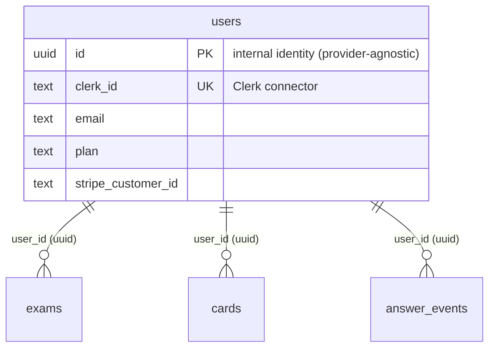

# RecallMint — AI OCR × FSRS 学習 SaaS

学習資料(教材・ノート・過去問)を **AI OCR で MCQ(多肢選択問題)化**し、**FSRS 忘却曲線**で復習する学習 SaaS。**local-first** 設計(Dexie/IndexedDB のミラー + outbox 同期)で、オフラインでも編集・演習ができ、オンライン復帰時にサーバーへ同期する。

- **フロント**: Next.js 16.x(App Router)/ React 19 / TypeScript strict / Tailwind v4
- **サーバー DB**: PostgreSQL(Supabase Transaction pooler)+ Drizzle ORM(postgres-js)
- **クライアント DB**: Dexie(IndexedDB ミラー + `entity_mutations` outbox)
- **認証**: Clerk / **決済**: Stripe / **AI**: Gemini 2.5 Flash(`@google/genai`)
- **運用**: Vercel(hnd1 / Function timeout 900s)/ Node 24 / pnpm(`packageManager` が SSoT)

> 旧称 `mcq-platform`。SaaS テンプレート由来の英単語(vocab)機能は撤去済みで、現在は MCQ 学習アプリ本体。

---

## 1. Quick Start

前提: Dev Container(`.devcontainer/` 設定済)を VS Code で開いた状態。

```bash
pnpm install                       # 依存導入(native binding 含む)
cp .env.example .env.local         # 環境変数(詳細 §5)。Clerk / Stripe / Supabase / Gemini 等
DATABASE_URL_ADMIN='...' pnpm db:migrate   # DB migration(owner 権限・実行時 inline 供給。RLS-P1)
pnpm dev                           # dev server → http://localhost:3000
```

`bufferutil` / `utf-8-validate` は `pnpm-workspace.yaml` の `onlyBuiltDependencies` で承認済み(WebSocket native binding)。初回 DB 接続失敗時は `pnpm install` で rebuild。

---

## 2. Architecture

RecallMint は **pragmatic DDD**(実用的なドメイン駆動設計)で層を分けている。教科書的な entity クラス + repository は導入せず、「純粋なドメイン層 + use-case 関数 + 既存 seam の昇格」で構成する。全体像は `docs/architecture-guide.md` が canonical。

### 2.1 ディレクトリ構造とレイヤー

コードは **役割(責務)ごとの層**に分かれ、依存は上から下への一方通行(`app → use-case → domain`、infra は下支え)。

```
app/                       # presentation 層(画面・route・server action)
├── (marketing)/           #   未認証 chrome(LP / 法務 / contact / pricing)
├── (auth)/                #   認証 chrome(sign-in / sign-up / sign-out-deleted)
├── (app)/app/             #   認証必須ゾーン(/app(.*) を proxy で protect)
└── api/                   #   API route(pull / *-bulk / webhooks / dashboard 等)

lib/
├── cards/ exams/ tags/ reviews/   # ドメイン純粋層 + use-case(業務ルール)
│   ├─ card-filter-predicates.ts, fsrs.ts, streak-core.ts …  # 純粋関数(画面も DB も知らない)
│   └─ reviews/ingest-review-events.ts, tags/tag-crud.ts …    # use-case(1 関数 = 1 tx)
├── db/                    # infra: サーバー DB(Drizzle / postgres-js)+ pull-delta factory
├── sync/                  # infra: クライアント同期(Dexie outbox / flush / pull)
├── auth/ clerk/ stripe/   # infra: 認証・決済・webhook 統合
├── env/ retry/ ai/        # infra: 環境ゲート・再試行分類・Gemini
└── validation/            # infra: Zod スキーマ
```

**層の考え方(レストランのたとえ)**: domain = レシピ(純粋な計算・ルール)、use-case = 厨房の段取り、app = 客席・メニュー(UI)。レシピ(domain)は客席(app)に依存してはいけない — そうすることで FSRS やフィルタ計算を将来別フロント(モバイル等)でそのまま再利用できる。

### 2.2 境界の強制(コメントでなく仕組みで守る)

層とサーバー/クライアント境界は、**自動チェックが commit / build を止める**ことで守られている(コメントや意図に頼らない):

| 守る対象 | 仕組み | いつ止まるか |
|---|---|---|
| 存在しない import / タイポ | TypeScript(`pnpm typecheck`) | build |
| サーバー専用コードのブラウザ混入 | `import 'server-only'`(17 file)+ build | build |
| Dexie をサーバーで呼ぶ | `getClientDb()` の実行時 throw | runtime |
| 層の向き(domain→app 等) | ESLint import 境界ルール(Block A/B/C・`error`)+ lefthook pre-commit | commit |
| 契約(API 形状・error code・文言等)の不変 | contract golden test 70(snapshot 固定) | test |

DDD リファクタ(P0〜P4)で import 境界の allowlist は **0 件化**済み。

### 2.3 local-first 同期(Dexie ミラー + outbox + pull)

- **書込**: 楽観的に Dexie に反映 → `entity_mutations`(outbox)に積む → `/api/entity-mutations/bulk` へ flush → `synced` に遷移。演習の回答は `answer_events` → `/api/review-events/bulk`(FSRS replay + `study_days` 集計)。
- **読込**: `/api/pull` が cards / exams / tag_categories / tag_options / card_tags / tombstones の 6 ストリームを増分 cursor で返す(server 内は `lib/db/pull-delta.ts` の factory に集約)。
- **競合方針は context ごとに最適化**(統一しない): FSRS = event replay、entity 編集 = LWW、mirror = server-wins。

### 2.4 データモデル(主なテーブル)

- **ドメイン**: `exams` / `cards` / `tag_categories` / `tag_options` / `card_tags` / `source_documents` / `upload_records` / `answer_events` / `study_days` / `tombstones` / `entity_mutations`
  - 復習ドメインの正本は `answer_events` 1 表(2026-08-11)。`reviews` / `study_sessions` は廃止済み。`study_days` は `answer_events` からの絶対値再集計で、`answer_events.card_id` は FK を持たない(学習履歴は card でなく user に帰属する)
- **認証・課金・運用**: `users` / `user_settings` / `ai_usage` / `ai_usage_users` / `clerk_events` / `stripe_events` / `deletion_failures` / `contact_messages`



---

## 3. プラン / 課金(Stripe)

### 3.1 プラン構成

課金 plan は 3 段(`lib/auth/plan-limits.ts` = backend 上限 enforce / `lib/plan-catalog.ts` = UI カタログ で分離。機能差は plan 軸のみ、月額/年額は同一機能)。

| プラン | 月額 | 年額 | AI OCR 月次上限 | Stripe price |
|---|---|---|---|---|
| **Free** | ¥0 | ¥0 | 30 ページ/月 | なし(price 不在) |
| **Standard** | ¥680 | ¥6,800 | 300 ページ/月 | あり |
| **Pro** | ¥1,280 | ¥12,800 | 無制限(`null`) | あり |

- 課金 plan の型 = `'standard' | 'pro'`、billing interval = `'month' | 'year'`(`lib/stripe/price-mapping.ts`)。Free は Stripe price を持たない。
- upsell 順位(`plan-catalog.ts` の `rank()`): `free=0 < standard月=1 < standard年=2 < pro月=3 < pro年=4`。
- price は 4 つの env(`STRIPE_PRICE_STANDARD_MONTHLY/YEARLY` / `STRIPE_PRICE_PRO_MONTHLY/YEARLY`)から `priceIdFor(plan, interval)` で双方向 lookup。

### 3.2 Stripe 連携

- **決済 UI = Stripe Checkout**(自前フォーム禁止・`CLAUDE.md §品質基準`)。`/app/upgrade` で `priceIdFor(plan, interval)` → Checkout Session を生成。
- **key は `VERCEL_ENV` で分岐**し `lib/stripe/client.ts` で fail-fast(production = live のみ / その他 = test のみ。SECRET は `rk_` Restricted Key 推奨)。
- **解約予約は `cancel_at` 一元化**: Stripe API basil(2025-05-28)で `cancel_at_period_end` は flexible billing mode で deprecated。`cancel_at != null` を解約予約の source of truth とし、`cancelAtPeriodEnd` カラムは DROP 済。lesson `2026-04-29-stripe-deprecation-billing-mode.md`。
- **Clerk User ↔ Stripe Customer** の紐付けは `users` table(`clerk_id` / `stripe_customer_id`)。

---

## 4. 認証・削除・Webhook

### 4.1 Proxy(Node 認証 + layout で DB 判定)

- `proxy.ts` で `clerkMiddleware` + `createRouteMatcher(['/app(.*)'])` のみ protect(Next 16 で middleware → proxy にリネーム、Node runtime 固定)。
- proxy は thin に保ち DB 接続を持たない。DB 由来判定(`deletedAt` 等)は Node runtime の layout / page で 1 段判定。
- webhook endpoint は matcher を通過するが protect 対象外。署名検証(Svix / Stripe)を handler 側で独自実施。
- 詳細: `docs/architecture-guide.md §1.5`。

### 4.2 Chrome 3 layer + Route Group 3 構造

Route Group(URL 不変保証):
- `app/(marketing)/` = 未認証 chrome(LP + 法務 page + contact form + pricing)
- `app/(auth)/` = 認証 chrome(sign-in / sign-up / sign-out-deleted)
- `app/(app)/app/` = 認証必須 zone(`/app(.*)` を proxy で protect)

chrome 3 layer: marketing(`MarketingHeader` + `MarketingFooter`)/ auth(`AuthHeader` のみ)/ app(`AppHeader` = nav link + UserButton)。brand 名は `components/brand/logo.tsx` に "RecallMint" hardcode。

### 4.3 アカウント削除フロー(webhook 駆動)

- Clerk client SDK の self-delete + polling(`/app/settings` 削除ボタン → `clerkClient.users.deleteUser` → polling で完了検知)。
- 削除後は `window.location.replace` で **hard navigation**(Router Cache 回避)。BFCacheGuard で browser back の zombie state 防御。
- DB は `users.deleted_at` 論理削除、Stripe の active subscription を **auto-cancel**(auto-pagination + `status: "all"` で 100 件上限 + iterate-cancel の落とし穴回避)。関連 10 テーブルを単一 tx で cascade DELETE。
- **設計原則**: Webhook 駆動 + Stripe/Clerk を真実、アプリ DB はコピー。順序保証なしの event 配信 + handler 冪等性で吸収。
- 詳細: `docs/architecture-guide.md §4.3` / lesson `2026-04-26-clerk-nextjs-webhook-architecture.md`。

### 4.4 Webhook 冪等性(Clerk + Stripe 共通)

- `clerk_events` / `stripe_events` に event ID を PK で保存。
- handler 手前で `INSERT ... ON CONFLICT DO NOTHING RETURNING` → 既処理なら 200 "duplicate" 即 return。
- 失敗時も **200 を返す**(Stripe / Clerk の retry loop 防止)。timeout 10 秒以内。
- recovery: `deletion_failures` audit table + Discord ops notify(OT 手動経路)。
- verify 手法(intentional throw + Stripe trigger + Vercel Protection Bypass): lesson `2026-04-28-discord-notify-verify-methodology.md §3.4`。

### 4.5 DB 接続(Supabase serverless lazy singleton)

- `lib/db/index.ts` で postgres-js client を module-scope で lazy singleton 化。**Supabase Transaction pooler** への接続を想定(`prepare: false` は pooler 前提)。
- `import 'server-only'` でクライアントバンドルへの混入を防止(サーバー専用)。
- 詳細: `docs/architecture-guide.md §1.6`。

### 4.6 users schema 二段構造(auth provider decoupling)

`users.id`(UUID PK・auth provider 非依存の internal identity)+ `users.clerk_id`(text UK・Clerk session connector)を分離。全 FK table は `users.id` 参照に統一し、auth provider 切替の影響を Clerk 関連 column のみに局所化。将来 multi-provider(WorkOS / Auth0 等)は connector column 追加だけで済む。詳細: lesson `2026-04-30-users-schema-decoupling.md`。

---

## 5. 開発手順

開発コンテナの構成(image / CLI 導入 / Claude Code 設定レイヤー / hooks / MCP)は **`.devcontainer/README.md`** 参照。

### 5.1 コマンド

```bash
pnpm dev              # dev server
pnpm build            # production build(deploy 前必須・Next matcher の path-to-regexp 制約はここで顕在化)
pnpm typecheck        # tsc --noEmit
pnpm lint             # eslint . --max-warnings=0(import 境界ルール含む)
pnpm test             # Vitest 全件(現行 3004 test)
pnpm test:contract    # 契約 golden(77・snapshot 固定 = 挙動不変の証明)
pnpm db:generate      # schema 変更後に migration 生成
DATABASE_URL_ADMIN='...' pnpm db:migrate   # migration 適用(owner 権限・実行時 inline 供給。RLS-P1)
pnpm db:studio        # Drizzle Studio(DB 中身確認)
```

### 5.2 ワークフロー / commit 規約

`CLAUDE.md` が source of truth。Spec → Plan → 実装(TDD where applicable)→ Review → Commit のサイクル。

- `feat(_)` / `fix(_)` は `superpowers:requesting-code-review` の canonical review 必須 → `[reviewed]` tag。canonical pass 後・commit 前に Codex 独立レビュー(`scripts/ai/codex-review.sh`)。
- `chore(_)` / `docs(_)` / `test(_)` / 実装ロジック変更なしの `refactor(_)` のみ `[no-review]` で skip 可。
- `.claude/hooks/check-review.sh`(Stop hook)が tag 無しの feat/fix を block。`git commit --no-verify` は全面禁止。
- 決済 / 認証 / 削除 / 外部副作用を伴う fix は review pass 後に OT 実機確認 → `[reviewed]` 追記。
- lint gate はローカル 3 層(eslint.config.mjs / lefthook pre-commit / sprint 完了 gate の whole-repo lint)。

### 5.3 テスト方針

- Unit: Vitest(FSRS / 課金ガード / プレフィックス検証は厚く)。契約: `tests/contract/`(pull / mutation / review-events / upload / webhook の snapshot 固定)。
- E2E: 実 browser 依存(実 focus/blur・virtualizer 実 scroll 等)は stg smoke(Playwright MCP)で担保。
- Stripe: `generateTestHeaderString` / Clerk: test トークン / AI: **mock 必須**(実 API 禁止)。

### 5.4 pnpm.overrides(transitive vuln)

transitive vuln(例: `→ svix → uuid`)は `pnpm-workspace.yaml` の `overrides` で強制上書き。各 override に rationale + 解除 trigger を doc 化し永久残置 risk を防止。詳細: lesson `2026-05-08-pnpm-overrides-rationale.md`。

---

## 6. Deploy

### 6.1 Vercel

ホスト側(Dev Container 外)で実施。SSH 鍵 / Vercel トークンはコンテナにマウントしない。デプロイは push で発火(stg = `develop` / prod = `main` 想定)。

**初回 deploy 後の確認**:
1. Vercel Dashboard → Settings → Domains で正規 production domain を確認(auto-generated short URL に頼らない。lesson `2026-04-29-vercel-domain-confusion.md`)。
2. Vercel env vars に `.env.example` 全項目を設定(production / preview 使い分け)。
3. Stripe Dashboard → Developers → Webhooks に **正規 production domain** の endpoint URL 登録 + signing secret を Vercel env に設定。
4. Clerk Dashboard → Webhooks に同様に登録(Svix signing secret)。
5. GitHub → Settings → Code security → **Push protection** を ON(`sk_live_` 等が push 時に自動 block)。

### 6.2 env prefix 検証(fail-fast)

`VERCEL_ENV === 'production'` で live キー必須、それ以外で test キー必須。欠落・不正 prefix は **module-load 時に throw**(fail-fast):

- Clerk: `lib/clerk/env-check.ts`(`pk_live_` / `sk_live_` ⇄ `pk_test_` / `sk_test_`)
- Stripe: `lib/stripe/client.ts`(SECRET は `rk_` Restricted Key 推奨)

この throw は unit test で pin 済み(`lib/clerk/env-check.test.ts` / `lib/stripe/client.test.ts`)。lesson `2026-04-30-clerk-env-validation-environment-dependent.md`。

### 6.3 Clerk production instance 切替(独自ドメイン必須)

Clerk production instance は `*.vercel.app` を許可しない、独自ドメイン必須。**Secondary application** 選択で apex domain 汚染を回避、5 個の DNS records(`clerk` / `accounts` / `clkmail` / `clk._domainkey` / `clk2._domainkey`)を subdomain 配下に追加。詳細: lesson `2026-04-30-clerk-production-domain-setup-pitfalls.md`。

### 6.4 Stripe live 切替

env を `sk_live_`(or `rk_live_`)/ `pk_live_` に切替、production webhook endpoint 登録 + signing secret 設定。`CLAUDE.md §Stripe` 厳守(test only / prefix 検証 / webhook idempotency)。**本番切替は OT 手動、CC 関与不可**。

### 6.5 Discord webhook(2 channel 運用)

channel 混線防止のため env も分離:
- `OPS_DISCORD_WEBHOOK_URL`: アプリのエラー通知(`lib/ops.ts` の `notifyOps` — webhook handler 失敗 / 削除 failure / kill 閾値超過)。未設定で silent skip。
- `CLAUDE_CODE_DISCORD_WEBHOOK_URL`: Claude Code セッション通知(Stop hook)。未設定で silent skip。

### 6.6 環境変数一覧(`.env.example` が SSoT)

| 変数 | 取得元 | 形式 / 注意 |
|---|---|---|
| `DATABASE_URL_APP` | Supabase → Connection(Transaction pooler) | `postgresql://...pooler.supabase.com:6543/...`(app runtime・least-privilege `recallmint_app` role) |
| `DATABASE_URL_ADMIN` | Supabase → Connection(owner) | migration / operator script 用。**常設 env に置かず実行時に inline 供給**(RLS-P1) |
| `NEXT_PUBLIC_CLERK_PUBLISHABLE_KEY` / `CLERK_SECRET_KEY` | Clerk Dashboard | `pk_test_` / `sk_test_`(prod = `_live_`) |
| `NEXT_PUBLIC_CLERK_SIGN_IN_URL` / `NEXT_PUBLIC_CLERK_SIGN_UP_URL` | 自分で決める | `/sign-in` / `/sign-up` |
| `CLERK_WEBHOOK_SECRET` | Clerk → Webhooks | `whsec_...`(production deploy 後発行) |
| `STRIPE_SECRET_KEY` / `STRIPE_PUBLISHABLE_KEY` | Stripe Dashboard | SECRET は **`rk_test_` 推奨**(prod = `_live_`) |
| `STRIPE_WEBHOOK_SECRET` | `stripe listen` or Dashboard | `whsec_...` |
| `STRIPE_PRICE_STANDARD_MONTHLY` / `_STANDARD_YEARLY` / `_PRO_MONTHLY` / `_PRO_YEARLY` | Stripe → Products | `price_...`(4 種) |
| `GEMINI_API_KEY` | Google AI Studio | **クレカ紐付けなし**で発行(`CLAUDE.md §AI`) |
| `GEMINI_DAILY_LIMIT` | 自分で決める | 整数 |
| `OPS_DISCORD_WEBHOOK_URL` / `CLAUDE_CODE_DISCORD_WEBHOOK_URL` | Discord channel integration | 未設定で silent skip |
| `LOG_LEVEL` / `LOG_GATE_ALLOW_PROD` / `OCR_DEBUG_LOG` / `BULK_FULL_PARAMS_LOG` | 自分で決める | ログ制御(任意) |
| `NEXT_PUBLIC_APP_URL` | 自分で決める | dev: `http://localhost:3000` / prod: 正規 domain |

### 6.7 Stripe webhook ローカル転送(dev)

```bash
stripe login
stripe listen --forward-to localhost:3000/api/webhooks/stripe
# 出力の whsec_... を .env.local の STRIPE_WEBHOOK_SECRET に貼る
```

---

## References

### 主要 lessons(再利用可能な設計パターン・落とし穴。全 23 file は `docs/superpowers/lessons/`)

| file | 要旨 |
|---|---|
| [clerk-nextjs-webhook-architecture](docs/superpowers/lessons/2026-04-26-clerk-nextjs-webhook-architecture.md) | Clerk + Next.js で webhook を source of truth とする基本設計 + Stripe sub auto-pagination + 順序保証なし event 冪等性 |
| [discord-notify-verify-methodology](docs/superpowers/lessons/2026-04-28-discord-notify-verify-methodology.md) | failure path 専用 notifyOps の verify 方法論 + webhook handler outer catch verify |
| [stripe-deprecation-billing-mode](docs/superpowers/lessons/2026-04-29-stripe-deprecation-billing-mode.md) | Stripe API basil `cancel_at_period_end` deprecation + `cancel_at` 一元化 |
| [test-fixture-payload-drift](docs/superpowers/lessons/2026-04-29-test-fixture-payload-drift.md) | webhook fixture と production payload の drift 防御 |
| [vercel-domain-confusion](docs/superpowers/lessons/2026-04-29-vercel-domain-confusion.md) | Vercel auto-generated short URL を本番 domain と取り違える pitfall |
| [clerk-env-validation-environment-dependent](docs/superpowers/lessons/2026-04-30-clerk-env-validation-environment-dependent.md) | env prefix validation の環境依存化(`VERCEL_ENV` で test/live 分岐) |
| [clerk-production-domain-setup-pitfalls](docs/superpowers/lessons/2026-04-30-clerk-production-domain-setup-pitfalls.md) | Clerk production 独自ドメイン + Secondary application + 5 DNS records |
| [users-schema-decoupling](docs/superpowers/lessons/2026-04-30-users-schema-decoupling.md) | users schema 二段構造化 + auth provider 抽象化 + 互換性保持型段階移行 |
| [g6-trigger-fact-discoveries](docs/superpowers/lessons/2026-05-03-g6-trigger-fact-discoveries.md) | structured logger 導入時の fact discovery |
| [spec-confirmed-vs-smoke-judgment](docs/superpowers/lessons/2026-05-07-spec-confirmed-vs-smoke-judgment.md) | smoke 観察で spec 確定設計を覆さない判断軸 |
| [clerk-auto-csp-overwrites-next-config](docs/superpowers/lessons/2026-05-08-clerk-auto-csp-overwrites-next-config.md) | Clerk middleware auto CSP の next.config 上書き挙動 + 代替防御 |
| [pnpm-overrides-rationale](docs/superpowers/lessons/2026-05-08-pnpm-overrides-rationale.md) | transitive vuln の pnpm.overrides 対処 + maintenance 規律 |

### 関連 doc

- `CLAUDE.md` — Stripe / Clerk / AI 絶対ルール、Sprint フロー、Review / Commit 規約、簡潔性規律(project root・SSoT)
- `docs/architecture-guide.md` — architecture canonical(path indexer + 役割境界 + Setup 手順)
- `docs/02-tech-spec.md` — data model / API / business logic の implementation reference
- `docs/plans/2026-07-06-ddd-refactor-design-decisions.md` — DDD リファクタ(P0〜P4)の確定判断・進捗・「やらない」判断
- `docs/superpowers/specs/` `docs/superpowers/plans/` — sprint ごとの spec / plan
- `.env.example` — 環境変数 SSoT
