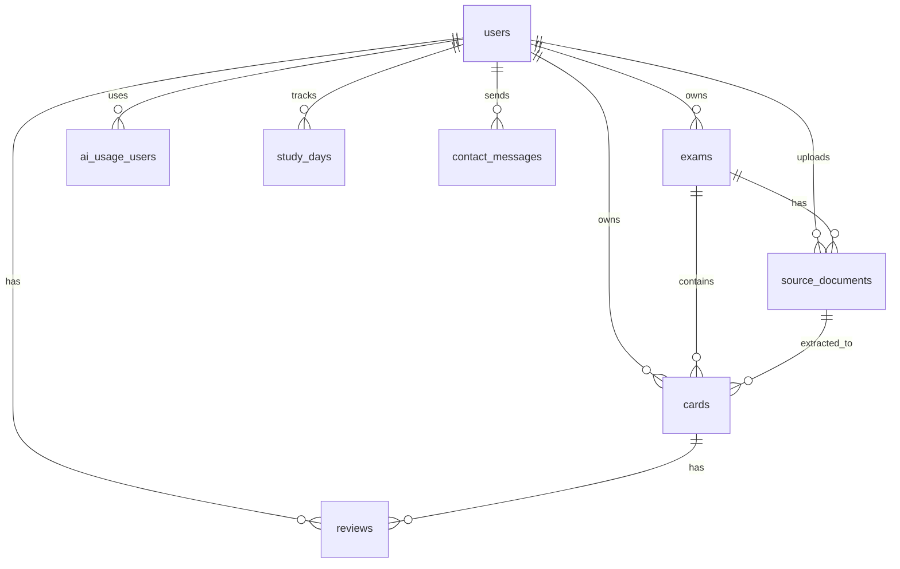

# Tech Spec: 国家試験用のアプリ（多肢選択試験 PWA）

> **役割**: implementation reference。 戦略文脈 (採用理由 narrative / 価格戦略 / 競合分析 /
> ロードマップ / 改訂履歴) は Obsidian 管理、 本 doc は data model / API / module / 認証認可
> / 課金技術仕様 / AI 呼び出し / ビジネスロジック / 非機能 / 環境変数 / セキュリティ /
> 技術系 Open Questions のみ。 schema.ts が最終 source of truth。

---

## 1. システム構成 (Architecture Overview)

```
[ User (PWA) — Browser / Mobile / iOS Safari Add to Home ]
       ↓ HTTPS                 ↑ Service Worker (画像/カード本文ローカルキャッシュ)
[ Next.js 15 App Router on Vercel Pro ]
       ├─ Server Actions (auth required) ──→ [ Neon Postgres ] (RLS / Drizzle ORM)
       ├─ Server Action: submitContact     (お問い合わせ受付、API Route 不要)
       ├─ API Routes (外部 webhook 受信専用)
       │    ├─ /api/webhooks/clerk
       │    ├─ /api/webhooks/stripe
       │    ├─ /api/ocr/process       (Vercel Function 60s、長尺は分割並列、β で Inngest 移行)
       │    └─ /api/admin/kill-check  (Cron)
       ├─ Edge Middleware (Clerk auth)
       └─ Pre-signed URL → クライアントから R2 直アップロード

[ Cloudflare R2 ]    画像 / 元 PDF（egress 無料）
[ Gemini API ]       2.5 Flash 主軸 / 2.5 Pro フォールバック
[ Stripe ]           ──webhook──→ /api/webhooks/stripe
[ Clerk ]            ──webhook──→ /api/webhooks/clerk
[ Discord webhook ]  ←── エラー / お問い合わせ / kill 閾値接近通知
```

### 技術スタック

- **フロント**: Next.js 15 App Router / TypeScript / Tailwind v4 / shadcn/ui
- **認証**: Clerk（OAuth + Email Magic Link）、JWT を Server Action で `auth()` 取得
- **DB**: Neon (PostgreSQL 16) / Drizzle ORM、Row Level Security 有効
- **決済**: Stripe（Subscription、Customer Portal）
- **AI / OCR**: Gemini 2.5 Flash 主軸 + Gemini 2.5 Pro フォールバック（精度不足時）。Flash-Lite はコスト最重視時のフォールバック
- **ストレージ**: Cloudflare R2（画像、egress 無料）。S3 互換 API
- **ホスティング**: Vercel（Pro プラン $20/月、Function 60s）
- **OCR ジョブ**: MVP は Vercel Function（最大 60s）で同期処理。50 ページ以上の PDF はクライアント主導で分割し並列 Function 呼び出し。β スケール時に Inngest / QStash 移行
- **PWA**: `next-pwa` + manifest.json + workbox（§9 で詳細化）
- **監視**: Vercel Analytics + Discord webhook（自前 `/admin` ダッシュボードは v1.2、F-108）

---

## 2. データモデル (Data Model)

### 2.1 設計原則

1. **PK は全テーブル `id` 統一**（plan00 既存スキーマで確認済、`gen_random_uuid()` で生成）
2. **FK は `<table>_id` 形式**（例: `user_id`, `exam_id`, `card_id`）
3. **試験ごとに変わるメタデータは jsonb に統合**（cards.custom_props と exams.property_schema）
4. **学習統計はデノーマライズ**（reviews 履歴と並行して cards にスナップショット保持、ユーザー単位の学習日数は study_days に独立保持）
5. **画像は R2 に保存、DB には URL/key のみ**（Anki 流、Postgres BLOB 不使用）
6. **テキストフィールドは Markdown**（画像参照は `` で flat な images 配列を引く）
7. **全テーブルに RLS** で user_id ベース分離（plan00 流用テーブルの RLS 状況は §13.7 で確認）
8. **timestamp は `timestamp with time zone`**（plan00 既存スキーマと整合）
9. **soft delete を採用**（plan00 既存で users / words に `deleted_at` 採用、cards にも踏襲）
10. **subscription 情報は users に統合**（plan00 既存、subscriptions 別テーブルなし）
11. **plan00 既存命名を尊重**（`last_review` / `difficulty` / `state` integer 等、リネームしない）
12. **append-only テーブル**: reviews は INSERT のみ（UPDATE / DELETE 禁止）。同期時の競合発生を完全に回避するための設計原則。v1.x で local-first 化したとき、複数デバイス間で reviews を競合なくマージできる
13. **同期準備**: 同期対象テーブル（exams / cards / source_documents）は、UUID PK + updated_at + deleted_at（soft delete）+ クライアント採番可能 ID の 4 条件を満たし、v1.x の local-first 化を阻害しない設計とする（§13.14）
14. **同期非対象**: ai_usage_users / study_days はサーバー側集計テーブル、同期対象外。クライアントから直接書き込まず、サーバー側で reviews 等から再計算する想定

### 2.2 テーブル一覧

|区分|テーブル名|用途|状態|
|---|---|---|---|
|plan00 流用|`users`|認証・プラン情報・subscription 状態（統合）|変更なし|
|plan00 流用|`ai_usage`|全体 AI 利用量集計（date PK）|変更なし|
|plan00 流用|`ai_usage_users`|ユーザー別 AI 利用量（user_id, date 複合 PK）|count を「OCR 抽出問題数」として運用|
|plan00 流用|`clerk_events`|Clerk webhook 重複処理防止|変更なし|
|plan00 流用|`stripe_events`|Stripe webhook 重複処理防止|変更なし|
|plan00 流用|`deletion_failures`|アカウント削除失敗ログ|変更なし|
|plan00 流用|`reviews`|FSRS 評価履歴|word_id → card_id にリネーム|
|plan00 流用|`contact_messages`|お問い合わせ（提示 schema に含まれず、要確認 §13.1）|変更なし想定|
|plan00 drop|`words`|vocab 学習用、不要|drop|
|plan00 drop|`ai_examples`|vocab 専用例文、汎用化困難|drop（F-101 解説生成は v1.x で別テーブル新設）|
|新規|`exams`|試験 + プロパティスキーマ|新設|
|新規|`cards`|問題本体（words の置換）|新設|
|新規|`source_documents`|アップロード元の管理|新設|
|新規|`study_days`|ユーザー単位の学習日カレンダー|新設|
|採否保留|`custom_property_definitions`|プロパティテンプレ|MVP 不採用、§2.6 参照|

### 2.3 plan00 流用テーブル（変更なし、参照のみ）

#### 2.3.1 users

plan00 で subscription 情報も統合されている設計。`subscriptions` 別テーブルは存在しない。

```sql
CREATE TABLE "users" (
  "id" uuid PRIMARY KEY DEFAULT gen_random_uuid() NOT NULL,
  "clerk_id" text NOT NULL,
  "email" text NOT NULL,
  "stripe_customer_id" text,
  "plan" text DEFAULT 'free' NOT NULL,
  "subscription_status" text,
  "current_period_end" timestamp with time zone,
  "cancel_at" timestamp with time zone,
  "created_at" timestamp with time zone DEFAULT now() NOT NULL,
  "updated_at" timestamp with time zone DEFAULT now() NOT NULL,
  "deleted_at" timestamp with time zone,
  CONSTRAINT "users_clerk_id_unique" UNIQUE("clerk_id"),
  CONSTRAINT "users_stripe_customer_id_unique" UNIQUE("stripe_customer_id")
);
```

設計メモ:

- `id` PK（UUID）、本仕様原則と一致
- `subscription_status` / `current_period_end` / `cancel_at` で subscription 状態を保持（別テーブル不要）
- `deleted_at` で soft delete を実装（NULL = 有効、非 NULL = 削除済）
- `plan` = 'free' / 'standard' / 'pro'

#### 2.3.2 ai_usage（全体集計）

```sql
CREATE TABLE "ai_usage" (
  "date" date PRIMARY KEY NOT NULL,
  "count" integer DEFAULT 0 NOT NULL
);
```

全ユーザー合計の AI 利用量を日次集計。コスト想定の 2 倍超でアラート発火等の全体監視用。

#### 2.3.3 ai_usage_users（ユーザー別集計）

```sql
CREATE TABLE "ai_usage_users" (
  "user_id" uuid NOT NULL,
  "date" date NOT NULL,
  "count" integer DEFAULT 0 NOT NULL,
  CONSTRAINT "ai_usage_users_user_id_date_pk" PRIMARY KEY("user_id","date")
);
ALTER TABLE "ai_usage_users" ADD CONSTRAINT "ai_usage_users_user_id_users_id_fk"
  FOREIGN KEY ("user_id") REFERENCES "public"."users"("id") ON DELETE no action;
```

mcq-platform での運用:

- `count` = 「OCR で抽出した問題数」として運用（plan00 では「AI 例文生成回数」）
- プラン別月次上限制御は SQL で `SUM(count) WHERE date BETWEEN month_start AND month_end` で集計
- 日次粒度でレコード保持、月次集計は GROUP BY で出す
- コスト追跡（cost_yen 等）は MVP では持たない（v1.x で必要なら ALTER で追加）

#### 2.3.4 reviews（FSRS 評価履歴）

```sql
CREATE TABLE "reviews" (
  "id" uuid PRIMARY KEY DEFAULT gen_random_uuid() NOT NULL,
  "user_id" uuid NOT NULL,
  "word_id" uuid NOT NULL,                  -- mcq-platform で card_id にリネーム
  "rating" integer NOT NULL,                 -- 1=again, 2=hard, 3=good, 4=easy
  "reviewed_at" timestamp with time zone DEFAULT now() NOT NULL
);
CREATE INDEX "reviews_user_reviewed_idx" ON "reviews" USING btree ("user_id","reviewed_at");
```

mcq-platform への変更（migration）:

```sql
ALTER TABLE reviews RENAME COLUMN word_id TO card_id;
ALTER TABLE reviews DROP CONSTRAINT reviews_word_id_words_id_fk;
ALTER TABLE reviews ADD CONSTRAINT reviews_card_id_cards_id_fk
  FOREIGN KEY (card_id) REFERENCES cards(id) ON DELETE CASCADE;
CREATE INDEX "reviews_card_idx" ON "reviews" USING btree ("card_id","reviewed_at");
```

rating の値マッピング（plan00 既存、踏襲）:

- 1 = again（不正解）
- 2 = hard（v1.x で使用、MVP では書き込まない）
- 3 = good（正解）
- 4 = easy（v1.x で使用、MVP では書き込まない）

MVP は二値モード運用、`is_correct = rating IN (3, 4)`。アプリ層で integer ↔ string mapping。

設計メモ:

- plan00 既存をそのまま流用（state_before / state_after / stability_after / due_after / elapsed_days / duration_ms 等は持たない）。シンプル、レコードサイズ小、書き込み負荷小、plan00 で動作確認済
- 詳細履歴が必要なら v1.x で ALTER で追加
- `cards` 削除で CASCADE で消える。月次総学習回数等の集計は MVP では「直近の値のみ」許容（過去履歴の保全は study_days と組み合わせて補完）

#### 2.3.5 clerk_events / stripe_events

```sql
CREATE TABLE "clerk_events" (
  "event_id" text PRIMARY KEY NOT NULL,
  "type" text NOT NULL,
  "processed_at" timestamp with time zone DEFAULT now() NOT NULL
);

CREATE TABLE "stripe_events" (
  "event_id" text PRIMARY KEY NOT NULL,
  "type" text NOT NULL,
  "processed_at" timestamp with time zone DEFAULT now() NOT NULL
);
```

webhook の重複処理防止用。`event_id` を PK にして同じイベントを 2 回処理しないようにする。

#### 2.3.6 deletion_failures

```sql
CREATE TABLE "deletion_failures" (
  "id" uuid PRIMARY KEY DEFAULT gen_random_uuid() NOT NULL,
  "user_id" uuid NOT NULL,
  "clerk_id" text NOT NULL,
  "sub_id" text,
  "failure_kind" text NOT NULL,
  "error_message" text NOT NULL,
  "created_at" timestamp with time zone DEFAULT now() NOT NULL,
  "resolved_at" timestamp with time zone
);
```

アカウント削除フローで失敗が起きた場合の運用ログ。Discord webhook で通知 + このテーブルに記録 → OT が手動対応。

#### 2.3.7 contact_messages

**※ 提示された plan00 schema にこのテーブルは含まれていなかった**（§13.1 確認事項）。memory に「I-J (contact form) 完了」とあるため、別の migration ファイルにある可能性。Sprint A-1 で確認 → 流用するか新設するか決定。

仮の構造（plan00 の I-J で実装されたと推定）:

- `id` uuid PK
- `user_id` uuid FK → users.id（NULL 可、未認証受付）
- `email` text
- `category` text — 'general' / 'bug' / 'takedown' / 'billing' / 'other'
- `subject` text
- `body` text
- `status` text DEFAULT 'open' — 'open' / 'in_progress' / 'resolved'
- `created_at` timestamp

### 2.4 plan00 由来の drop テーブル

`words` / `ai_examples` は Sprint A-2 (commit `fa4dcd9`) で drop 済。 mcq-platform は
`cards` で置換 (§2.5.2)、 解説生成 (F-101) は v1.x で別テーブル新設方針。

### 2.5 mcq-platform 新規テーブル（実装詳細）

#### 2.5.1 exams

ユーザーごとに管理する試験。**カスタムプロパティスキーマ（property_schema）が本テーブルの肝**。

```typescript
export const exams = pgTable('exams', {
  id: uuid('id').defaultRandom().primaryKey(),
  user_id: uuid('user_id')
    .notNull()
    .references(() => users.id, { onDelete: 'cascade' }),
  name: text('name').notNull(),
  property_schema: jsonb('property_schema')
    .notNull()
    .default(sql`'[]'::jsonb`)
    .$type<PropertySchema>(),
  question_no_format: text('question_no_format'),  // 'numeric' | 'hierarchical' | 'free' | NULL
  created_at: timestamp('created_at', { withTimezone: true }).notNull().defaultNow(),
  updated_at: timestamp('updated_at', { withTimezone: true }).notNull().defaultNow(),
  deleted_at: timestamp('deleted_at', { withTimezone: true }),  // plan00 流儀
}, (t) => ({
  userIdx: index('exams_user_id_idx').on(t.user_id),
}));
```

property_schema の TypeScript 型:

```typescript
type PropertyType =
  | 'single_select'
  | 'multi_select'
  | 'number'
  | 'boolean'
  | 'date'
  | 'text';

type PropertyDef = {
  name: string;
  type: PropertyType;
  select_options?: string[];
  default_value?: unknown;
  is_system?: boolean;
  display_order: number;
};

type PropertySchema = PropertyDef[];
```

property_schema の例:

```json
[
  {
    "name": "試験回",
    "type": "single_select",
    "select_options": ["試験1", "試験2", "試験3"],
    "display_order": 1
  },
  {
    "name": "ドメイン",
    "type": "multi_select",
    "select_options": ["EC2", "コンテナ", "RDS", "S3"],
    "display_order": 2
  },
  {
    "name": "重要度",
    "type": "single_select",
    "select_options": ["高", "中", "低", "無"],
    "default_value": "無",
    "display_order": 3
  },
  {
    "name": "進捗",
    "type": "single_select",
    "select_options": ["未着手", "学習中", "完了"],
    "default_value": "未着手",
    "is_system": true,
    "display_order": 4
  }
]
```

バリデーション（アプリ層）:

- `name` は同一 exam 内でユニーク
- `is_system: true` のプロパティはユーザー削除不可、値の上書きは可
- 全 property_schema のサイズは 50KB 以内（DoS 防止）

試験名サジェスト候補は `lib/exams/presets.ts` にハードコード（5-10 試験）。MVP では DB マスタ化しない。

#### 2.5.2 cards（メインテーブル）

plan00 の words テーブルを drop して新設。**plan00 既存の FSRS カラム命名を踏襲**:

- `state` integer（0/1/2/3）— text enum にしない
- `difficulty` real — `fsrs_difficulty` にリネームしない
- `last_review` — `last_reviewed_at` にリネームしない
- `elapsed_days` / `scheduled_days` / `reps` / `lapses` / `learning_steps` — plan00 既存

```typescript
export const cards = pgTable('cards', {
  id: uuid('id').defaultRandom().primaryKey(),
  user_id: uuid('user_id')
    .notNull()
    .references(() => users.id, { onDelete: 'cascade' }),
  exam_id: uuid('exam_id')
    .notNull()
    .references(() => exams.id, { onDelete: 'cascade' }),
  source_document_id: uuid('source_document_id')
    .references(() => sourceDocuments.id, { onDelete: 'set null' }),

  // コンテンツ（必須）
  title: text('title').notNull(),
  sort_key: text('sort_key'),
  question_text: text('question_text').notNull(),
  options: jsonb('options').notNull().$type<CardOption[]>(),
  correct_answer_ids: jsonb('correct_answer_ids').notNull().$type<string[]>(),
  explanation_text: text('explanation_text'),
  images: jsonb('images').notNull().default(sql`'[]'::jsonb`).$type<CardImage[]>(),

  // カスタムプロパティ
  custom_props: jsonb('custom_props').notNull().default(sql`'{}'::jsonb`).$type<Record<string, unknown>>(),

  // 学習統計（mcq-platform 新規追加、デノーマ）
  answered: boolean('answered').notNull().default(false),
  last_correct: boolean('last_correct'),  // NULL = 未回答
  current_streak: integer('current_streak').notNull().default(0),

  // FSRS 状態（plan00 既存命名を踏襲）
  due: timestamp('due', { withTimezone: true }).notNull().defaultNow(),
  stability: real('stability').notNull().default(0),
  difficulty: real('difficulty').notNull().default(0),
  elapsed_days: integer('elapsed_days').notNull().default(0),
  scheduled_days: integer('scheduled_days').notNull().default(0),
  reps: integer('reps').notNull().default(0),
  lapses: integer('lapses').notNull().default(0),
  state: integer('state').notNull().default(0),  // 0=new, 1=learning, 2=review, 3=relearning
  learning_steps: integer('learning_steps').notNull().default(0),
  last_review: timestamp('last_review', { withTimezone: true }),

  // 監査（plan00 流儀）
  created_at: timestamp('created_at', { withTimezone: true }).notNull().defaultNow(),
  updated_at: timestamp('updated_at', { withTimezone: true }).notNull().defaultNow(),
  deleted_at: timestamp('deleted_at', { withTimezone: true }),  // soft delete
}, (t) => ({
  sortIdx: index('cards_sort_idx').on(t.user_id, t.exam_id, t.sort_key),
  dueIdx: index('cards_due_idx').on(t.user_id, t.deleted_at, t.due),  // plan00 words_user_due_idx 踏襲
  propsIdx: index('cards_props_gin_idx').using('gin', t.custom_props),
  answeredIdx: index('cards_answered_idx').on(t.user_id, t.exam_id, t.answered),
  examIdx: index('cards_exam_idx').on(t.exam_id),
}));
```

options の TypeScript 型:

```typescript
type CardOption = {
  id: string;                    // "a", "b", "c", ... または "1", "2", ...
  text: string;                  // Markdown、画像参照可: "ST上昇 "
  is_correct: boolean;
  explanation?: string;          // 任意、Markdown、選択肢別解説、画像参照可
};
```

images の TypeScript 型:

```typescript
type CardImage = {
  key: string;                   // テキスト中の  と一致、例: "img-1"
  url: string;                   // R2 公開 URL or 署名付き URL
  alt?: string;                  // 任意、アクセシビリティ用
};
```

custom_props の構造（exams.property_schema に従って格納）:

```json
{
  "試験回": "試験1",
  "ドメイン": ["EC2", "コンテナ"],
  "重要度": "高",
  "進捗": "学習中"
}
```

key は property_schema の `name`、value は `type` に応じた値（string / string[] / number / boolean / ISO date string）。

state の値マッピング（plan00 既存踏襲）:

- 0 = new
- 1 = learning
- 2 = review
- 3 = relearning

アプリ層で integer ↔ string mapping。

バリデーション（アプリ層）:

- `title` は空文字不可
- `options` は最低 1 個、最大 50 個
- `options[i].id` は同一 card 内でユニーク
- `correct_answer_ids` は `options[].id` の部分集合、最低 1 個
- `correct_answer_ids` は `options.is_correct` のデノーマ：書き込み時にアプリ側で同期（`options.filter(o => o.is_correct).map(o => o.id)`）
- `images[i].key` は同一 card 内でユニーク
- `custom_props` の各 key は exams.property_schema の `name` と一致（厳密チェックは v1.x、MVP は freeform 許容）
- `custom_props` 全体サイズ 100KB 以内

整合性チェック（編集ビューで警告表示）:

- テキスト中の `` 全部が `images` 配列に存在するか
- `images` 配列の全 key がどこかのテキストフィールドで参照されているか
- 不整合は edit 時に警告表示（ブロックはしない、Anki の Check Media 相当）

複数正答 UI 切替:

- `options.filter(o => o.is_correct).length` で自動判定（追加カラム不要）

soft delete の運用:

- `deleted_at IS NULL` で「有効なカード」を抽出
- 削除は `UPDATE cards SET deleted_at = NOW()`、物理削除は通常実行しない
- アカウント削除時は cascade で物理削除
- 復元機能は MVP 不要（soft delete カラムだけ持って、UI は通常の物理削除と同じ挙動でよい）

#### 2.5.3 source_documents

```typescript
export const sourceDocuments = pgTable('source_documents', {
  id: uuid('id').defaultRandom().primaryKey(),
  user_id: uuid('user_id')
    .notNull()
    .references(() => users.id, { onDelete: 'cascade' }),
  exam_id: uuid('exam_id')
    .notNull()
    .references(() => exams.id, { onDelete: 'cascade' }),
  file_type: text('file_type').notNull(),  // 'pdf' | 'image' | 'csv' | 'markdown'
  file_url: text('file_url'),  // R2 URL、破棄前提なら NULL
  filename: text('filename').notNull(),
  file_size_bytes: integer('file_size_bytes').notNull(),
  status: text('status').notNull().default('uploading'),
    // 'uploading' | 'processing' | 'completed' | 'failed'
  pages_processed: integer('pages_processed').notNull().default(0),
  pages_total: integer('pages_total'),
  cards_extracted: integer('cards_extracted').notNull().default(0),
  ocr_cost_yen: integer('ocr_cost_yen'),
  error_message: text('error_message'),
  created_at: timestamp('created_at', { withTimezone: true }).notNull().defaultNow(),
  completed_at: timestamp('completed_at', { withTimezone: true }),
}, (t) => ({
  userExamIdx: index('source_docs_user_exam_idx').on(t.user_id, t.exam_id),
  statusIdx: index('source_docs_status_idx').on(t.user_id, t.status),  // 「処理中ジョブ存在チェック」用
}));
```

設計メモ:

- 同時実行制限はアプリ層で `WHERE user_id = ? AND status = 'processing' LIMIT 1` チェック
- `file_url` NULL = OCR 完了後 R2 元ファイル破棄
- `ocr_cost_yen` は完了時に算出

#### 2.5.4 study_days（学習日カレンダー）

ユーザー単位の学習日付ログ。**reviews と独立** で持つことで cards 削除の影響を受けない。

```typescript
export const studyDays = pgTable('study_days', {
  user_id: uuid('user_id')
    .notNull()
    .references(() => users.id, { onDelete: 'cascade' }),
  day: date('day').notNull(),  // JST 日付 'YYYY-MM-DD'
  review_count: integer('review_count').notNull().default(0),
  correct_count: integer('correct_count').notNull().default(0),
}, (t) => ({
  pk: primaryKey({ columns: [t.user_id, t.day] }),
}));
```

設計メモ:

- 複合 PK `(user_id, day)`、1 ユーザー 1 日 1 行
- `day` は JST 日付
- review 完了時に upsert:

```typescript
await tx.insert(studyDays).values({
  user_id: userId,
  day: todayJST,
  review_count: 1,
  correct_count: isCorrect ? 1 : 0,
}).onConflictDoUpdate({
  target: [studyDays.user_id, studyDays.day],
  set: {
    review_count: sql`${studyDays.review_count} + 1`,
    correct_count: sql`${studyDays.correct_count} + ${isCorrect ? 1 : 0}`,
  },
});
```

出せる指標:

- 連続学習日数（streak）: `day DESC` で連続日付を数える
- 直近 N 日のヒートマップ: `WHERE user_id = ? AND day >= today - N`
- 最後に学習した日: `MAX(day)`
- 月間総学習回数: `SUM(review_count)`
- 月間正答率: `SUM(correct_count) / SUM(review_count)`

ドメイン別 / 試験別の連続学習日数は MVP では出さない（ユーザー方針確定）。

### 2.7 Row Level Security (RLS)

**MVP 不採用** (Sprint A-2 で確定)。 アプリ層認可 (Server Action / API Route で `WHERE
user_id = ?` 必須) で対応。 RLS 復活は v1.x で再評価 (multi-tenant 化や Postgres 直接
接続される場面が出てきた時点で検討)。

### 2.8 インデックス一覧

#### plan00 流用（既存）

|テーブル|index 名|カラム|
|---|---|---|
|reviews|`reviews_user_reviewed_idx`|(user_id, reviewed_at)|

#### plan00 流用（mcq-platform で追加）

|テーブル|index 名|カラム|用途|
|---|---|---|---|
|reviews|`reviews_card_idx`|(card_id, reviewed_at)|カードの review 履歴取得|

#### mcq-platform 新規

|テーブル|index 名|カラム|用途|
|---|---|---|---|
|exams|`exams_user_id_idx`|(user_id)|ユーザーの試験一覧|
|cards|`cards_sort_idx`|(user_id, exam_id, sort_key)|編集ビューのソート|
|cards|`cards_due_idx`|(user_id, deleted_at, due)|スマート復習クエリ（plan00 words_user_due_idx 踏襲）|
|cards|`cards_props_gin_idx`|GIN(custom_props)|カスタムプロパティでフィルタ|
|cards|`cards_answered_idx`|(user_id, exam_id, answered)|カテゴリ別正答率集計|
|cards|`cards_exam_idx`|(exam_id)|exam 削除 cascade 用|
|source_documents|`source_docs_user_exam_idx`|(user_id, exam_id)|試験ごとの取込履歴|
|source_documents|`source_docs_status_idx`|(user_id, status)|処理中ジョブ検出|
|study_days|(PK 複合)|(user_id, day)|学習日カレンダー|

### 2.9 よくあるクエリ例

#### スマート復習キュー取得

```sql
SELECT * FROM cards
WHERE user_id = $1 AND exam_id = $2
  AND deleted_at IS NULL
  AND due IS NOT NULL AND due <= NOW()
ORDER BY due ASC
LIMIT 100;
```

#### カテゴリ別正答率

```sql
SELECT
  custom_props->>'ドメイン' AS domain,
  COUNT(*) FILTER (WHERE answered = true) AS answered_count,
  COUNT(*) FILTER (WHERE last_correct = true) AS correct_count,
  ROUND(
    COUNT(*) FILTER (WHERE last_correct = true)::numeric
    / NULLIF(COUNT(*) FILTER (WHERE answered = true), 0) * 100, 1
  ) AS accuracy_pct
FROM cards
WHERE user_id = $1 AND exam_id = $2 AND deleted_at IS NULL
GROUP BY custom_props->>'ドメイン'
ORDER BY accuracy_pct ASC;  -- 苦手分野順
```

#### 重要度「高」のみ出題

```sql
SELECT * FROM cards
WHERE user_id = $1 AND exam_id = $2
  AND deleted_at IS NULL
  AND custom_props->>'重要度' = '高'
  AND (due IS NULL OR due <= NOW())
ORDER BY RANDOM()
LIMIT 50;
```

#### multi_select プロパティでフィルタ

```sql
SELECT * FROM cards
WHERE user_id = $1 AND exam_id = $2 AND deleted_at IS NULL
  AND custom_props->'ドメイン' @> '["EC2"]'::jsonb;
```

`@>` 演算子は GIN インデックスで高速。

#### 連続学習日数

```sql
WITH consecutive AS (
  SELECT day,
         day - (ROW_NUMBER() OVER (ORDER BY day DESC) || ' days')::interval AS grp
  FROM study_days
  WHERE user_id = $1
)
SELECT COUNT(*) AS streak
FROM consecutive
WHERE grp = (SELECT MAX(grp) FROM consecutive);
```

または直近 N 日を順に走査（アプリ層で計算）。

### 2.10 ER 概略



---

## 3. API / Server Actions 設計

### Public Pages

- `/` ランディング
- `/sign-in`, `/sign-up` (Clerk)
- `/pricing`
- `/contact` お問い合わせフォーム（権利侵害削除申し立て窓口を兼ねる、認証不要、Server Action で送信）
- `/legal/terms`, `/legal/privacy`, `/legal/tokushoho`
- `/legal/import-format` CSV / Markdown インポート形式の公開ドキュメント

### Authenticated Routes

- `/dashboard` — 「今日の復習」「正答率」「連続学習日数」「最近のフラグ」
- `/exams` — 試験一覧（追加・編集・削除）
- `/exams/[id]` — その試験のカード一覧（タブ: カード / アップロード / インポート / プロパティ / 設定）
    - **カードタブ**: フィルタ・検索・複数選択・一括操作（F-009）
    - **アップロードタブ**: 写真／PDF アップロード（F-001）
    - **インポートタブ**: CSV / Markdown インポート（F-008）
    - **プロパティタブ**: exams.property_schema の編集（プロパティ追加・選択肢編集）
- `/study` — 学習セッション入口（「スマート復習」「問題演習」の 2 ボタン）
- `/study/smart` — スマート復習モード（F-004、FSRS 自動出題）
- `/study/practice` — 問題演習モード（F-004、フィルタ + 出題数 + 時間制限の設定 → 開始）
- `/cards/[id]` — カード詳細編集（メモ・カスタムプロパティ・画像挿入）
- `/settings` — プラン管理、Customer Portal リンク、アカウント削除

### Server Actions（`'use server'`）

**試験 / プロパティスキーマ**:

- `createExam(input)` → `Result<Exam>`
- `updateExam(id, input)` → `Result<Exam>`
- `deleteExam(id)` → `Result<void>`（soft delete）
- `updateExamPropertySchema(examId, schema)` → `Result<Exam>` — property_schema 全体を置換
- `addPropertyOption(examId, propertyName, newOption)` → `Result<Exam>` — single/multi_select に選択肢追加（インクリメンタル）

**カード**:

- `createCard(examId, input)` → `Result<Card>`
- `updateCard(id, input)` → `Result<Card>` — custom_props / options / images もここで更新
- `deleteCard(id)` → `Result<void>`（soft delete）
- `bulkUpdateCards(ids, action)` → `Result<{updated: number}>` (F-009)
    - action = `{type: 'setCustomProp', name, value} | {type: 'delete'} | {type: 'export'} | {type: 'resetStatus'}`

**学習セッション (FSRS)**:

- `getNextSmartReviewBatch(limit)` → `Result<Card[]>`（`due <= now()` を `due ASC`、`deleted_at IS NULL`）
- `getPracticeBatch(filter)` → `Result<Card[]>` — filter は custom_props 値も指定可
- `submitReview(cardId, isCorrect: boolean)` → `Result<{nextDue: Date}>` — MVP は 2 段階。内部で `rating = isCorrect ? 3 : 1` (integer)。reviews insert + cards 学習統計 + FSRS 値 + study_days upsert を 1 トランザクションで実行
- `resetCardStatus(cardId)` → `Result<void>` — answered / last_correct / current_streak / FSRS 状態をリセット（reviews 履歴は残す）

**画像アップロード**:

- `getImageUploadUrl(cardId, mimeType)` → `Result<{uploadUrl, key, expiresAt}>` — presigned URL 10 分有効、client → R2 直接アップロード用
- `confirmImageUpload(cardId, key, url)` → `Result<Card>` — cards.images に追加

**ソースドキュメント / OCR**:

- `startUpload(filename, mimeType, examId)` → `Result<{uploadUrl, sourceDocId, expiresAt}>`
- `processSourceDoc(sourceDocId)` → `Result<void>` — OCR ジョブ起動。1 ユーザー同時 1 ジョブ制限
- `getUploadStatus(sourceDocId)` → `Result<SourceDocument>` — 進捗ポーリング、3 秒間隔想定

**インポート (F-008)**:

- `importCSV(examId, csvText)` → `Result<{imported, errors}>` — 未知の列を property_schema に自動追加、値を custom_props に格納
- `importMarkdown(examId, mdText)` → `Result<{imported, errors}>`

**お問い合わせ**:

- `submitContact(input)` → `Result<void>`（DB 記録 + Discord webhook 通知。認証不要）

**アカウント**:

- `requestAccountDeletion()` → `Result<void>`（Clerk delete → webhook で cascade）

### API Routes（外部 webhook 受信専用）

- `POST /api/webhooks/clerk` — `user.created` / `user.deleted` 同期
- `POST /api/webhooks/stripe` — `subscription.created/updated/deleted`、`invoice.paid`
- `POST /api/ocr/process` — OCR 実行（Vercel Function、最大 60s）
- `POST /api/admin/kill-check` — Cron で kill 条件を毎日チェックし Discord 通知

### 非同期処理戦略

- **MVP**:
    - 50 ページ未満 PDF / 写真 → Vercel Function 60s で同期処理
    - 50 ページ以上 PDF → クライアント主導で 50 ページ単位に分割し並列 Function 呼び出し
- **β スケール時**: 50 ページ以上を Inngest / QStash にオフロード、クライアントはポーリング継続
- **Pre-signed Upload**: クライアント → R2 直接アップロード（Vercel 帯域消費を避ける）、有効期限 10 分
- **進捗表示**: クライアントから `getUploadStatus` を 3 秒間隔ポーリング
- **同時実行制限**: 1 ユーザー同時 1 ジョブ。`source_documents.status='processing'` の既存ジョブがあれば新規受付拒否

---

## 4. 主要モジュール構成

```
app/
  (marketing)/
    page.tsx              # LP
    pricing/page.tsx
    contact/page.tsx      # お問い合わせフォーム（Server Action submit）
    legal/
      terms/page.tsx
      privacy/page.tsx
      tokushoho/page.tsx
      import-format/page.tsx  # CSV / Markdown フォーマット公開ドキュメント
  (app)/                  # 認証必須（Clerk middleware）
    dashboard/page.tsx
    exams/
      page.tsx
      [id]/
        page.tsx          # タブ切替（カード / アップロード / インポート / プロパティ / 設定）
    study/
      page.tsx            # 入口、2 ボタン
      smart/page.tsx      # スマート復習
      practice/
        page.tsx          # フィルタ設定画面（custom_props フィルタ含む）
        session/page.tsx  # 開始後の出題画面
    cards/[id]/page.tsx
    settings/page.tsx
  api/
    webhooks/
      clerk/route.ts
      stripe/route.ts
    ocr/process/route.ts
    admin/kill-check/route.ts
lib/
  db/
    schema.ts             # Drizzle schema (source of truth)
    queries/
      cards.ts
      exams.ts
      reviews.ts
      study_days.ts
      ai_usage.ts
      contact.ts
  auth/
    clerk.ts
  users/
    delete.ts             # アカウント削除フロー（Clerk → DB cascade → R2）
  stripe/
    client.ts
    webhook.ts
  storage/
    r2.ts                 # presigned URL 発行 / 削除
  ai/
    gemini.ts
    prompts/
      ocr_extract.ts      # MVP: テキスト抽出のみ
    schemas/
      ocr_response.ts     # Gemini Structured Output 用 JSON Schema、exams.property_schema を動的注入
  fsrs/
    scheduler.ts          # FSRS 6 アルゴリズム（plan00 流用）
  exams/
    presets.ts            # 試験名サジェスト候補（ハードコード）
    property_schema.ts    # property_schema の検証・操作ヘルパ
  cards/
    review.ts             # review 完了時の transaction（reviews insert + cards 学習統計/FSRS update + study_days upsert）
  import/
    csv.ts                # CSV パーサ + 未知列を property_schema に自動追加
    markdown.ts
  notify/
    discord.ts
  pwa/
    cache_strategy.ts     # workbox 設定（§9 参照）
components/
  ui/                     # shadcn/ui
  card/
    CardView.tsx          # Markdown レンダリング、 → cards.images から url 解決
    CardEditor.tsx        # クリップボードペースト + ドラッグ&ドロップ画像追加対応
    CardList.tsx          # 一覧 + 複数選択 + custom_props フィルタ
    BulkActionBar.tsx
    PropertyFilters.tsx   # exams.property_schema を読んで動的にフィルタ UI を生成
  exams/
    PropertySchemaEditor.tsx  # property_schema の追加・編集 UI
  study/
    SmartReviewSession.tsx
    PracticeFilter.tsx
    PracticeSession.tsx
    Timer.tsx
    AnswerButtons.tsx
  upload/
    UploadDropzone.tsx
    OCRProgress.tsx       # 3 秒間隔ポーリング
  import/
    ImportCSVTab.tsx
    ImportMarkdownTab.tsx
  contact/
    ContactForm.tsx
  pwa/
    InstallPrompt.tsx     # iOS Safari 検出 → ホーム画面追加案内
    OfflineBanner.tsx
```

---

## 5. 認証・認可

- **認証**: Clerk JWT（cookie ベース）
- **セッション取得**:
    - Server: `auth()` from `@clerk/nextjs/server`
    - Client: `useUser()`, `useAuth()`
- **DB 同期**: Webhook only（`user.created` で `users` insert、`user.deleted` で cascade）
- **認可方式**: 所有者チェック（`cards.user_id = auth().userId`）+ Postgres RLS
- **管理者ロール**: v1.2 で /admin (F-108) 実装時に Clerk Public Metadata で付与

---

## 6. 課金・サブスクリプション

### プラン定義

| plan | OCR 上限 | unlock 機能 |
|---|---|---|
| Free | 月 30 問 | 1 試験まで |
| Standard | 月 500 問 | 複数試験管理 / FSRS 全機能 / カスタムプロパティ無制限 |
| Pro | 公平利用 | 複数デバイス同期 [v1.x] / エクスポート [v1.x] |

具体的価格は Obsidian (価格戦略 doc) 参照。 Stripe Price ID は §10 環境変数。

### 紐付け

- Stripe Customer ↔ users.id: `users.stripe_customer_id`
- `users.plan` を webhook で更新
- 上限チェックは `lib/db/queries/ai_usage.ts` で `ai_usage_users.count` の月次集計

### Customer Portal

- Stripe ホスト型、`/settings` から遷移

### アカウント削除フロー（`lib/users/delete.ts`）

1. ユーザーが `/settings` で削除リクエスト
2. `clerkClient.users.deleteUser()` 呼び出し
3. Webhook `user.deleted` 受信
4. Stripe subscription cancel（`for await` で全件）
5. R2 上の画像 / 元 PDF を全削除（`/users/{user_id}/` プレフィックス配下）
6. DB cascade で cards / reviews / source_documents / study_days / ai_usage_users 等を削除
7. plan00 で確立済みのフロー（webhook-driven）を流用

---

## 7. AI / LLM 呼び出し

### モデル選択

| モデル | 用途 |
|---|---|
| `gemini-2.5-flash-lite` | 写真 1 枚 (小サイズ)、 コスト最重視時 |
| **`gemini-2.5-flash`** | **MVP 主軸** (PDF / 写真、 テキスト中心) |
| `gemini-2.5-pro` | 複雑問題のフォールバック |

コスト試算は Obsidian (Gemini cost analysis doc) 参照。

### 呼び出し方式

- Server Action / API Route から `@google/generative-ai` SDK
- **Structured Output**: `responseMimeType: 'application/json'` + `responseSchema` を使用
- **動的 responseSchema**: exams.property_schema を読み込み、custom_props のフィールドを responseSchema に注入する。これにより AI は exam ごとに正しいプロパティ構造で抽出する
- プロンプトは `lib/ai/prompts/ocr_extract.ts`、JSON Schema は `lib/ai/schemas/ocr_response.ts`

### フォールバック戦略

1. 第 1 試行: Gemini 2.5 Flash
2. パース失敗 or 信頼度低（cards 抽出 0 件等） → Gemini 2.5 Pro 再試行
3. それでも失敗 → ユーザーに手動編集 UI 提示

### レート制限・コスト管理

- `ai_usage_users.count` でプラン別月次上限を強制（SUM 集計）
- 全体コスト監視は `ai_usage` で
- 月コストが想定の 2 倍超で Discord 通知

### MVP の OCR スコープ

- **MVP**: テキスト抽出のみ（タイトル / 問題文 / 選択肢 / 正答 / 解説 / sort_key 候補 / custom_props 値の構造化抽出）
- **MVP**: 画像は AI が抽出しない。ユーザーが編集ビューで手動添付（クリップボードペースト + ドラッグ&ドロップ + 複数選択）
- **v1.x**: 画像 bbox 抽出 + 自動切り抜きを再挑戦（Phase 0b PoC で精度実測してから採否決定）

### 解説生成 (F-101) は v1.x

- MVP では実装しない
- 実装時に `lib/ai/prompts/explanation.ts`、AI 解説生成用テーブルを新設（plan00 の ai_examples は drop 済のため）

---

## 8. 主要ビジネスロジック

### Logic 1: OCR テキスト抽出（MVP スコープ）

- **入力**: PDF or 画像（R2 上の URL）、ユーザーの試験 ID
- **出力**: `cards[]`（title / question_text / options / correct_answer_ids / explanation_text / sort_key / custom_props）
- **アルゴリズム**:
    1. 試験の property_schema を取得 → responseSchema に注入
    2. PDF サイズ判定:
        - 50 ページ未満: そのまま Gemini に渡す（1 リクエスト）
        - 50 ページ以上: pdf-lib で 50 ページずつ分割 → 並列 Function 呼び出し
    3. Gemini に Structured Output で構造化指示
    4. レスポンスをパース → cards に挿入（`due = now()`, `state = 0`(new), `answered = false`）
    5. `source_documents.status = 'completed'`、`pages_processed` / `cards_extracted` / `ocr_cost_yen` 更新
- **画像は抽出しない**: ユーザーが後から編集ビューで手動添付

### Logic 2: 画像手動添付（MVP）

- **トリガ**: 編集ビューでクリップボードペースト or ドラッグ&ドロップ
- **アルゴリズム**:
    1. クライアント側で blob を取得
    2. `getImageUploadUrl(cardId, mimeType)` で presigned URL を取得
    3. クライアント → R2 直接 PUT（key: `users/{user_id}/cards/{card_id}/{uuid}.{ext}`）
    4. `confirmImageUpload(cardId, key, url)` で cards.images に追加
    5. テキストフィールドのカーソル位置に `` を挿入
- **整合性チェック**: テキスト内の `` 全部が cards.images に存在するか / cards.images の全 key が参照されているか。不整合は編集ビューで警告表示（Anki の Check Media 相当）

### Logic 3: FSRS 6 スケジューリング（plan00 流用）

- **入力**: card_id, isCorrect (boolean)（MVP）。v1.x で 4 段階対応
    
- **内部変換**: `rating = isCorrect ? 3 : 1` (integer、3=good / 1=again)
    
- **出力**: 次回 due 日時、新しい stability / difficulty / state（integer 0/1/2/3）
    
- **アルゴリズム**: FSRS-6 公式（plan00 既存実装を流用）
    
- **保存**（1 トランザクション）:
    
    - `reviews` テーブルに履歴ログ追加（rating integer）
    - `cards.due` / `cards.stability` / `cards.difficulty` / `cards.state` / `cards.elapsed_days` / `cards.scheduled_days` / `cards.reps` / `cards.lapses` / `cards.learning_steps` / `cards.last_review` をデノーマライズ更新
    - `cards.answered = true`, `cards.last_correct = isCorrect`, `cards.current_streak = isCorrect ? +1 : 0`
    - `study_days` に upsert（review_count +1、correct_count += isCorrect ? 1 : 0）
- **「スマート復習」キュー** (`/study/smart`):
    
    ```sql
    SELECT * FROM cards
    WHERE user_id = ? AND deleted_at IS NULL AND due <= now()
    ORDER BY due ASC LIMIT 100;
    ```
    

### Logic 4: 問題演習フィルタ (F-004)

- **入力**: PracticeFilter `{ examIds, customPropFilters, accuracyMax, limit, timeLimitSec }`
- **customPropFilters**: `[{name: "ドメイン", op: "contains", value: "EC2"}, {name: "重要度", op: "equals", value: "高"}, ...]`
- **出力**: 該当 cards リスト + 出題順
- SQL ベース、Drizzle で型安全。custom_props は `WHERE custom_props->>'重要度' = '高'` で絞り込み（GIN インデックス活用）
- 出題順はランダム or 苦手優先（`last_correct = false` AND 直近誤答多い順）から選択可
- `deleted_at IS NULL` で soft delete カードを除外

### Logic 5: CSV / Markdown インポート (F-008)

- **CSV フォーマット**: ヘッダ `title, question_text, option_a, option_b, ..., correct_answer_ids, explanation_text` + 任意のカスタムプロパティ列
    - **未知の列を自動でプロパティ化**: 例えば CSV に「ドメイン」列があり property_schema に未登録なら、type 推定（値の傾向から single_select / multi_select / text）して exams.property_schema に追加 → values を custom_props に格納
    - 推定が外れた場合、ユーザーが後から property_schema 編集 UI で修正可能
- **Markdown フォーマット**: 公開ドキュメント `/legal/import-format` で明示
- バリデーション失敗時は行番号 + エラー理由を返却、部分成功（成功した行だけ insert）

### Logic 6: カード学習統計の同期更新

review 完了時に 1 トランザクション内で以下を一括 update:

```ts
async function recordReview(cardId: string, rating: number /* 1|2|3|4 */) {
  await db.transaction(async (tx) => {
    // reviews 履歴 insert
    await tx.insert(reviews).values({
      card_id: cardId,
      user_id: userId,
      rating,
      reviewed_at: now,
    });

    // FSRS 計算
    const card = await tx.select(cards).where(eq(cards.id, cardId));
    const isCorrect = rating >= 3;  // 3=good, 4=easy
    const newFsrs = fsrs.calculate(card, rating);

    // cards デノーマ + FSRS 値 update
    await tx.update(cards).set({
      // 学習統計
      answered: true,
      last_correct: isCorrect,
      current_streak: isCorrect ? card.current_streak + 1 : 0,
      // FSRS 値（plan00 既存命名）
      due: newFsrs.due,
      stability: newFsrs.stability,
      difficulty: newFsrs.difficulty,
      state: newFsrs.state,  // integer 0/1/2/3
      elapsed_days: newFsrs.elapsed_days,
      scheduled_days: newFsrs.scheduled_days,
      reps: newFsrs.reps,
      lapses: newFsrs.lapses,
      learning_steps: newFsrs.learning_steps,
      last_review: now,
      updated_at: now,
    }).where(eq(cards.id, cardId));

    // study_days upsert
    await tx.insert(studyDays).values({
      user_id: userId,
      day: todayJST,
      review_count: 1,
      correct_count: isCorrect ? 1 : 0,
    }).onConflictDoUpdate({
      target: [studyDays.user_id, studyDays.day],
      set: {
        review_count: sql`${studyDays.review_count} + 1`,
        correct_count: sql`${studyDays.correct_count} + ${isCorrect ? 1 : 0}`,
      },
    });
  });
}
```

### Logic 7: アカウント削除

- §6 のフロー参照
- plan00 で確立済みの webhook-driven 削除を流用
- R2 削除時に `users/{user_id}/` プレフィックスで一括削除

---

## 9. 非機能実装

### 9.1 PWA キャッシュ戦略

#### 目的

- **オフライン学習**: 電車・地下鉄・電波弱所での学習継続
- **速度向上**: 画像・カード本文を瞬時表示
- **データ通信節約**: ユーザーのモバイル通信を消費しない

#### 実装方針

- **ライブラリ**: `next-pwa` + `workbox` (workbox 7 を Next.js 15 のビルドパイプラインに統合)
- **ストレージ**: IndexedDB（最大 500MB、iOS でも比較的安定）+ Cache Storage API（50MB、補助）
- **総容量上限**: 300MB（学習データ含む）、LRU eviction で自動削除
- **キャッシュ有効期限**: 90 日

#### キャッシュ戦略（コンテンツ別）

|コンテンツ|戦略|キャッシュ名|上限|期限|
|---|---|---|---|---|
|画像（R2 origin）|`CacheFirst`|`card-images`|1500 entries / ~250MB|90 日|
|カード本文（API レスポンス）|`StaleWhileRevalidate`|`card-data`|500 entries / ~30MB|30 日|
|静的アセット（JS / CSS / フォント）|`CacheFirst`|`static-assets`|unlimited|build hash で invalidation|
|API（学習以外）|`NetworkFirst` with offline fallback|`api-runtime`|100 entries|1 日|

#### iOS 対策

- **ホーム画面追加促進 UI**: `components/pwa/InstallPrompt.tsx` で iOS Safari 検出時に初回起動から 3 セッション目に「ホーム画面に追加」案内を表示
    - iOS の 7 日 eviction を回避（ホーム画面追加 PWA はストレージが事実上恒久化）
    - 検出: `window.navigator.standalone` が `true` でない & userAgent が iPhone/iPad/iPod
- **eviction フォールバック**: キャッシュ消失時は R2 から再取得（自動）。完全オフライン保証は不可、UI で「オフラインです、一部画像が表示されない可能性があります」と明示
- **manifest.json**: `display: standalone`, `apple-touch-icon` 設定、`theme-color` で標準ブラウザ UI を隠す

#### Android 対策

- 特になし（Chrome PWA はクオータ寛大、eviction も緩い）

#### MVP 実装範囲（必須）

- [x] manifest.json + apple-touch-icon
- [x] Service Worker 登録（next-pwa）
- [x] 画像 CacheFirst 戦略
- [x] カード本文 StaleWhileRevalidate
- [x] API NetworkFirst with offline fallback
- [x] ホーム画面追加促進 UI（iOS Safari 検出）
- [x] オフライン警告バナー
- [x] LRU eviction（300MB 上限）

#### MVP に入れない（v1.x 以降）

- 学習開始前の画像プリフェッチ（β でユーザー要望が強ければ実装）
- 完全オフラインモード保証（iOS の eviction を完全には防げないため明示しない）
- Background Sync（iOS 未サポート）
- Web Push 通知（iOS 16.4+ のみ、MVP では Discord webhook で運用代替）

### 9.2 その他の非機能

|項目|実装方針|
|---|---|
|エラーハンドリング|Result 型で全 Server Action / API ラップ、失敗時は Discord webhook 通知|
|ロギング|`console` + Vercel Logs（保存 7 日）、エラーは Discord に転送|
|テスト|vitest 単体（FSRS scheduler / OCR parser / CSV パーサ / property_schema 検証）、Playwright E2E（学習 / 課金 / インポート）|
|CI/CD|GitHub Actions（main push で Vercel auto deploy、Preview 不使用）、PR で TypeScript / lint チェック|
|OCR 進捗表示|クライアントから `getUploadStatus` を 3 秒間隔ポーリング|
|レート制限|Vercel Edge Middleware で IP / user 単位（OCR 過剰利用対策）|

---

## 10. 環境変数 (Env Vars)

|変数名|用途|scope|
|---|---|---|
|`NEXT_PUBLIC_CLERK_PUBLISHABLE_KEY`|Clerk 公開鍵|All|
|`CLERK_SECRET_KEY`|Clerk 秘密鍵|All|
|`CLERK_WEBHOOK_SECRET`|Clerk webhook 署名検証|Production|
|`DATABASE_URL`|Neon 接続|All|
|`STRIPE_SECRET_KEY`|Stripe|All|
|`STRIPE_WEBHOOK_SECRET`|Stripe webhook 署名検証|All|
|`STRIPE_PRICE_STANDARD_MONTHLY`|Standard 月額 price ID|All|
|`STRIPE_PRICE_STANDARD_YEARLY`|Standard 年額|All|
|`STRIPE_PRICE_PRO_MONTHLY`|Pro 月額|All|
|`STRIPE_PRICE_PRO_YEARLY`|Pro 年額|All|
|`GEMINI_API_KEY`|Google AI / Gemini|All|
|`R2_ACCOUNT_ID`|Cloudflare R2|All|
|`R2_ACCESS_KEY_ID`|R2|All|
|`R2_SECRET_ACCESS_KEY`|R2|All|
|`R2_BUCKET_NAME`|R2|All|
|`R2_PUBLIC_URL`|R2 公開 URL|All|
|`DISCORD_WEBHOOK_URL`|エラー / お問い合わせ / kill 閾値通知|Production|

---

## 11. デプロイ・運用

- **環境**: Production のみ（Preview/staging 不使用、main push で直接反映）
- **ドメイン**: Phase 0 着手前に取得（Service Worker は HTTPS 必須、独自ドメイン推奨）。お名前.com or Cloudflare Registrar
- **DNS**: Cloudflare（R2 と統合管理）
- **監視**: Vercel Analytics + Discord webhook（自前 `/admin` ダッシュボードは v1.2、F-108）
- **バックアップ**:
    - Neon: 自動バックアップ（日次・7 日保持）
    - R2: バージョニング有効、ライフサイクル 90 日
- **ロールバック**: Vercel の Promote previous deployment ボタン
- **Cron**: Vercel Cron で `/api/admin/kill-check` を毎日 06:00 JST 実行

### 11.1 ストレージコスト試算 (意思決定ログ)

1 万ユーザー × 月 1 万問配信ケース (公式料金表からの試算、 実測ではない):

| storage | 月額試算 |
|---|---|
| Cloudflare R2 | 約 230 円 |
| Vercel Blob | 約 6,800 円 |
| AWS S3 | 約 14,000 円 |

R2 採用根拠は egress 無料。 S3 互換 API のため将来 S3 / 他 S3 互換ストレージへ移行容易。

---

## 12. セキュリティ

- [ ] env var を repo に commit しない (.env.local + .gitignore)
- [ ] Stripe webhook 署名検証
- [ ] Clerk webhook 署名検証
- [ ] SQL injection: Drizzle ORM で prepared statement
- [ ] XSS: React デフォルトエスケープ + Markdown は `react-markdown` + DOMPurify でサニタイズ
- [ ] CSRF: Next.js Server Actions ビルトイン保護
- [ ] R2: ユーザーごとに prefix（`users/{user_id}/...`）+ presigned URL 短寿命（10 分）
- [ ] レート制限: Vercel Edge Middleware で IP / user 単位
- [ ] LLM プロンプトインジェクション: ユーザー入力テキストはプロンプトに直接埋め込まず、JSON フィールドで分離
- [ ] custom_props サイズ: cards.custom_props 全体で 100KB 上限、exams.property_schema 全体で 50KB 上限（DoS 防止）

---

## 13. 未決事項 (Open Questions)

> §13.1 / 13.2 / 13.7 は Sprint A-2 で解決済 (詳細は Obsidian 改訂履歴参照)。 番号は後続
> 参照との整合維持のため空席で残す。 §13.6 / 13.9 / 13.10 / 13.11 は戦略系のため Obsidian
> に移管 (本 doc は技術系 Open Questions のみ保持)。

### 13.3 長尺 PDF の OCR 処理

Vercel Function 60s + 並列分割で完結するか、Inngest / QStash 等の background job が必要か。実装着手後に β で測定。

### 13.4 画像 OCR 自動切り抜きの v1.x 採否

v1.x で Phase 0b 相当の PoC を実施し、Gemini bbox 精度を実測してから採否決定。MVP は手動添付で確定。

### 13.5 FSRS 6 のパラメータ最適化

個人最適化（per-user weights）は v1.x、MVP はデフォルト値（plan00 流用）。

### 13.8 Phase 0d 復活（PWA 機能の実機検証）

Sprint G で iOS Safari 16.4+ 実機 + ホーム画面追加 + 7 日放置後のキャッシュ生存確認、Android Chrome での挙動確認を実施。

### 13.12 sort_key 自動生成のアルゴリズム

AI に「title から sort_key を生成」させる際の正規化ルール（数字のゼロパディング桁数、階層区切り、全角数字・漢数字の処理）。実装時に決定。

### 13.13 重複検知の MVP スコープ

- (A) MVP: title 完全一致のみで検知
- (B) MVP: title 正規化（空白・記号・全角半角統一）+ ハッシュ比較 + 警告 + 更新/無視/新規追加 ユーザー選択
- (C) v1.x: question_text の Jaccard / 編集距離による類似度判定

私のおすすめは **(B)** を MVP に含める。関連: cards.title_normalized text カラム追加で重複検知高速化。要判断。

### 13.14 v1.x で local-first 化を検討

Anki が証明している通り、ローカル SQLite + 増分同期は学習アプリの最適解。MVP は Postgres 一本だが、§2.1 の設計原則 12-14 により v1.x での local-first 移行を阻害しない設計を確定済。

#### 既達成の準備条件（v0.5.1 時点）

- UUID PK（クライアント採番可、ID 衝突なし）
- updated_at 全テーブル（差分同期の基準）
- deleted_at（削除追跡、Anki の graves 相当）
- reviews は append-only（競合不発生）
- jsonb で柔軟スキーマ（schema migration の頻度低減）
- 集計系テーブル（ai_usage_users / study_days）は同期対象外、サーバー側再計算

#### v1.x 実装の選択肢

- **(A) PowerSync / ElectricSQL 採用**: Postgres ↔ SQLite の双方向同期を既製ライブラリに任せる。実装コスト小、月額あり。Postgres スキーマほぼそのまま流用可
- **(B) 自前 sync API（GPT 提案の updated_at + sync_status ベース）**: シンプル、`POST /sync/push` + `GET /sync/pull?since=...` の 2 エンドポイント。競合解決は last-write-wins
- **(C) Anki 完コピ（USN ベース）**: 最も堅牢だが実装コスト大、商用 SaaS への適合に追加工数必要

#### クライアント側の永続化

- **WASM SQLite + OPFS**: iOS 16.4+ 対応、数百 MB〜数 GB の容量、ネイティブ並みの性能
- ライブラリ候補: `sqlocal` + Drizzle（Postgres 用 schema をほぼそのまま流用可）
- iOS 16.3 以下のフォールバックは IndexedDB（劣化機能、または最新 iOS 推奨表示）

#### 同期トリガー

iOS は Background Sync 未対応のため、以下の組み合わせで実用上カバー:

- アプリ起動時（最も確実）
- 学習セッション完了時（mcq-platform に最適）
- `visibilitychange` (タブ切替/非表示時)
- 明示的「同期」ボタン（ユーザー安心 UX）

#### 判断のタイミング

v1.x 着手時に β データ（速度・オフライン要望強度・複数デバイス利用率）を基に (A) / (B) / (C) を選択。Phase 0 リスク（OCR 精度・法務・ターゲット）が解消するまで投資は保留。