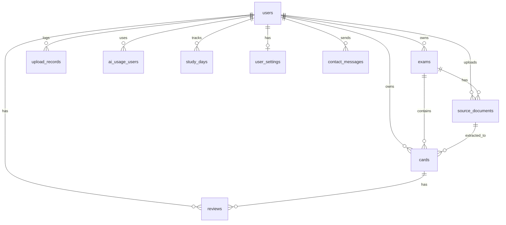

# Tech Spec: 国家試験用のアプリ（多肢選択試験 PWA）

> **役割**: implementation reference。 戦略文脈 (採用理由 narrative / 価格戦略 / 競合分析 /
> ロードマップ / 改訂履歴) は Obsidian 管理、 本 doc は data model / API / module / 認証認可
> / 課金技術仕様 / AI 呼び出し / ビジネスロジック / 非機能 / 環境変数 / セキュリティ /
> 技術系 Open Questions のみ。 schema.ts が最終 source of truth。
>
> **設計不変条件の正 = `docs/architecture.md`**(2026-07-26 新設)。本書の他章は現行実装との一致を未検証。

---

## 1. システム構成 (Architecture Overview)

```
[ User (PWA) — Browser / Mobile / iOS Safari Add to Home ]
       ↓ HTTPS                 ↑ Service Worker (画像/カード本文ローカルキャッシュ)
[ Next.js 15 App Router on Vercel Pro ]
       ├─ Server Actions (auth required) ──→ [ Neon Postgres ] (RLS / Drizzle ORM)
       │    └─ processUpload (OCR: アップロードファイルを inline base64 で
       │       Gemini に送信、同期処理。元ファイルは永続化しない)
       ├─ Server Action: submitContact     (お問い合わせ受付、API Route 不要)
       ├─ API Routes (外部 webhook 受信専用)
       │    ├─ /api/webhooks/clerk
       │    ├─ /api/webhooks/stripe
       │    └─ /api/admin/kill-check  (Cron)
       └─ Edge Middleware (Clerk auth)

[ Cloudflare R2 ]    カード編集時の添付画像（egress 無料、将来機能）
[ Gemini API ]       2.5 Flash (S2.0.5 で Flash only 確定、Pro fallback 廃止)
[ Stripe ]           ──webhook──→ /api/webhooks/stripe
[ Clerk ]            ──webhook──→ /api/webhooks/clerk
[ Discord webhook ]  ←── エラー / お問い合わせ / kill 閾値接近通知
```

### 技術スタック

- **フロント**: Next.js 15 App Router / TypeScript / Tailwind v4 / shadcn/ui
- **認証**: Clerk（OAuth + Email Magic Link）、JWT を Server Action で `auth()` 取得
- **DB**: Neon (PostgreSQL 16) / Drizzle ORM、Row Level Security 有効
- **決済**: Stripe（Subscription、Customer Portal）
- **AI / OCR**: Gemini 2.5 Flash (S2.0.5 で Flash only 確定、Pro fallback 廃止)。Flash-Lite はコスト最重視時のフォールバック候補 (未採用)
- **ストレージ**: Cloudflare R2（カード編集時の添付画像、egress 無料、S3 互換 API）。**将来機能** — OCR スキャン元ファイルは保存しない（inline base64 で Gemini に渡すのみ）
- **ホスティング**: Vercel（Pro プラン $20/月、Function 900s）
- **OCR ジョブ**: `processUpload` Server Action で同期処理。アップロードファイルは inline base64 で Gemini に送信し、結果を直接 return（永続化・ポーリングなし）。per-file ≤ 40 ページ / per-upload 合計 ≤ 40 ページの 2 軸制限
- **PWA**: `next-pwa` + manifest.json + workbox（§9 で詳細化）
- **監視**: Vercel Analytics + Discord webhook（自前 `/admin` ダッシュボードは v1.2、F-108）

---

## 2. データモデル (Data Model)

### 2.1 設計原則

> **復習ドメインに関する記述は歴史記述**(2026-08-11「FSRS 整合 Sprint A」以降の正 = `docs/superpowers/specs/2026-08-11-fsrs-consistency-sprint-a-design.md`): 原則 4 / 9 / 12 / 14 の `reviews` は表ごと廃止され `answer_events` 1 表に統合済み(PK も `id` ではなく `event_id`)。

1. **PK は全テーブル `id` 統一**（`gen_random_uuid()` で生成）
2. **FK は `<table>_id` 形式**（例: `user_id`, `exam_id`, `card_id`）
3. **試験ごとに変わるメタデータは freeform jsonb で持つ**（cards.custom_props のみ。 discover mode 一本化により事前定義 schema は不要、 AI が文書から自由なキー名で抽出する。 経緯: `docs/research/ocr-schema-vs-discover.md`）
4. **学習統計はデノーマライズ**（reviews 履歴と並行して cards にスナップショット保持、ユーザー単位の学習日数は study_days に独立保持）
5. **画像は R2 に保存、DB には URL/key のみ**（Anki 流、Postgres BLOB 不使用）
6. **テキストフィールドは Markdown**（画像参照は `` で flat な images 配列を引く）
7. **全テーブルに RLS** で user_id ベース分離
8. **timestamp は `timestamp with time zone`**
9. **soft delete は `users` のみ**（Stripe / audit retention 用、 `deleted_at`）。 他 (exams / cards / source_documents / study_days / contact_messages / ai_usage_users) は hard delete、 reviews は append-only。 個人情報削除依頼への対応容易性を優先 (Sprint A-2 確定、 `lib/db/schema.ts:11-17` コメント参照)
10. **subscription 情報は users に統合**（subscriptions 別テーブルなし）
11. **FSRS カラム命名を現行実装で維持**（`last_review` / `difficulty` / `state` integer 等、リネームしない・2026-07-26 実装確認）
12. **append-only テーブル**: reviews は INSERT のみ（UPDATE / DELETE 禁止）。同期時の競合発生を完全に回避するための設計原則。v1.x で local-first 化したとき、複数デバイス間で reviews を競合なくマージできる
13. **同期準備**: 同期対象テーブル（exams / cards / source_documents）は、UUID PK + updated_at + クライアント採番可能 ID の 3 条件を満たし、v1.x の local-first 化を阻害しない設計とする。 削除追跡 (Anki graves 相当) は MVP で hard delete 採用のため未対応、 v1.x で再評価（§13.14）
14. **同期非対象**: ai_usage_users / study_days はサーバー側集計テーブル、同期対象外。クライアントから直接書き込まず、サーバー側で reviews 等から再計算する想定

### 2.2 テーブル一覧

> **本表は歴史記述**(2026-08-11「FSRS 整合 Sprint A」以降の正 = `docs/superpowers/specs/2026-08-11-fsrs-consistency-sprint-a-design.md`): `reviews` / `study_sessions` は DROP 済み。現行の表構成は `lib/db/schema.ts` が SSoT。

|区分|テーブル名|用途|状態|
|---|---|---|---|
|流用|`users`|認証・プラン情報・subscription 状態（統合）|変更なし|
|流用|`ai_usage`|全体 AI 利用量集計（date PK）。GEMINI_DAILY_LIMIT guard 用、count は Gemini API call 回数|変更なし|
|流用|`ai_usage_users`|ユーザー別 AI 利用量（user_id, date 複合 PK）。count は Gemini API call 回数（S1.8 で配線、月次 OCR quota とは無関係）|変更なし|
|流用|`clerk_events`|Clerk webhook 重複処理防止|変更なし|
|流用|`stripe_events`|Stripe webhook 重複処理防止|変更なし|
|流用|`deletion_failures`|アカウント削除失敗ログ|変更なし|
|流用|`reviews`|FSRS 評価履歴|word_id → card_id にリネーム|
|流用|`contact_messages`|お問い合わせ（提示 schema に含まれず、要確認 §13.1）|変更なし想定|
|drop|`words`|vocab 学習用、不要|drop|
|drop|`ai_examples`|vocab 専用例文、汎用化困難|drop（F-101 解説生成は v1.x で別テーブル新設）|
|新規|`exams`|試験 + プロパティスキーマ|新設|
|新規|`cards`|問題本体（words の置換）|新設|
|新規|`source_documents`|OCR ジョブの作業 / trace（exam と同寿命）|新設|
|新規|`upload_records`|OCR 月次利用台帳（append-only、月次 quota 集計元）|S1.9.1 新設|
|新規|`study_days`|ユーザー単位の学習日カレンダー|新設|
|新規|`user_settings`|ユーザーごとの学習設定 (session_limit, fsrs_mode)|S2.1 新設 / S2.2 fsrs_mode 追加|
|採否保留|`custom_property_definitions`|プロパティテンプレ|MVP 不採用 (discover mode 一本化、 `docs/research/ocr-schema-vs-discover.md` 参照)|

### 2.3 流用テーブル（変更なし、参照のみ）

#### 2.3.1 users

subscription 情報も users に統合されている設計。`subscriptions` 別テーブルは存在しない。

```sql
CREATE TABLE "users" (
  "id" uuid PRIMARY KEY DEFAULT gen_random_uuid() NOT NULL,
  "clerk_id" text NOT NULL,
  "email" text NOT NULL,
  "stripe_customer_id" text,
  "plan" text DEFAULT 'free' NOT NULL,
  "subscription_status" text,
  "current_period_end" timestamp with time zone,
  "cancel_at" timestamp with time zone,
  "billing_interval" text,
  "created_at" timestamp with time zone DEFAULT now() NOT NULL,
  "updated_at" timestamp with time zone DEFAULT now() NOT NULL,
  "deleted_at" timestamp with time zone,
  CONSTRAINT "users_clerk_id_unique" UNIQUE("clerk_id"),
  CONSTRAINT "users_stripe_customer_id_unique" UNIQUE("stripe_customer_id")
);
```

設計メモ:

- `id` PK（UUID）、本仕様原則と一致
- `subscription_status` / `current_period_end` / `cancel_at` で subscription 状態を保持（別テーブル不要）
- `deleted_at` で soft delete を実装（NULL = 有効、非 NULL = 削除済）
- `plan` = 'free' / 'standard' / 'pro'（機能差は plan 軸のみで決定）
- `billing_interval` = 'month' / 'year' / NULL。 NULL = 課金プランなし (free)、 'month' = 月額、 'year' = 年額。 plan 軸と直交し、 表示・upsell・price_id 選択のみに使用。 webhook で `price_id → (plan, interval)` を解決して同時更新（`lib/stripe/price-mapping.ts` 参照）。 invariant: `plan='free' ⇒ billing_interval IS NULL` / `plan IN ('standard','pro') ⇒ billing_interval IN ('month','year')`。 列導入 (2026-05-17) 以前の課金 user は次回 webhook 受信で resync

#### 2.3.2 ai_usage（全体集計）

```sql
CREATE TABLE "ai_usage" (
  "date" date PRIMARY KEY NOT NULL,
  "count" integer DEFAULT 0 NOT NULL
);
```

全ユーザー合計の AI 利用量を日次集計。コスト想定の 2 倍超でアラート発火等の全体監視用。

#### 2.3.3 ai_usage_users（ユーザー別集計）

```sql
CREATE TABLE "ai_usage_users" (
  "user_id" uuid NOT NULL,
  "date" date NOT NULL,
  "count" integer DEFAULT 0 NOT NULL,
  CONSTRAINT "ai_usage_users_user_id_date_pk" PRIMARY KEY("user_id","date")
);
ALTER TABLE "ai_usage_users" ADD CONSTRAINT "ai_usage_users_user_id_users_id_fk"
  FOREIGN KEY ("user_id") REFERENCES "public"."users"("id") ON DELETE no action;
```

mcq-platform での運用:

- `count` = 「OCR で抽出した問題数」として運用
- プラン別月次上限制御は SQL で `SUM(count) WHERE date BETWEEN month_start AND month_end` で集計
- 日次粒度でレコード保持、月次集計は GROUP BY で出す
- コスト追跡（cost_yen 等）は MVP では持たない（v1.x で必要なら ALTER で追加）

#### 2.3.4 reviews（FSRS 評価履歴）

> **本節は歴史記述・表は廃止済み**(2026-08-11「FSRS 整合 Sprint A」以降の正 = `docs/superpowers/specs/2026-08-11-fsrs-consistency-sprint-a-design.md`): `reviews` は migration 0035 で DROP され、rating 履歴は `answer_events`(PK=`event_id`・`card_id` は FK なし)に統合された。

```sql
CREATE TABLE "reviews" (
  "id" uuid PRIMARY KEY DEFAULT gen_random_uuid() NOT NULL,
  "user_id" uuid NOT NULL,
  "word_id" uuid NOT NULL,                  -- mcq-platform で card_id にリネーム
  "rating" integer NOT NULL,                 -- 1=again, 2=hard, 3=good, 4=easy
  "reviewed_at" timestamp with time zone DEFAULT now() NOT NULL
);
CREATE INDEX "reviews_user_reviewed_idx" ON "reviews" USING btree ("user_id","reviewed_at");
```

mcq-platform への変更（migration）:

```sql
ALTER TABLE reviews RENAME COLUMN word_id TO card_id;
ALTER TABLE reviews DROP CONSTRAINT reviews_word_id_words_id_fk;
ALTER TABLE reviews ADD CONSTRAINT reviews_card_id_cards_id_fk
  FOREIGN KEY (card_id) REFERENCES cards(id) ON DELETE CASCADE;
CREATE INDEX "reviews_card_idx" ON "reviews" USING btree ("card_id","reviewed_at");
```

rating の値マッピング:

- 1 = again（不正解）
- 2 = hard（v1.x で使用、MVP では書き込まない）
- 3 = good（正解）
- 4 = easy（v1.x で使用、MVP では書き込まない）

MVP は二値モード運用、`is_correct = rating IN (3, 4)`。アプリ層で integer ↔ string mapping。

設計メモ:

- reviews は最小構成（state_before / state_after / stability_after / due_after / elapsed_days / duration_ms 等は持たない）。シンプル、レコードサイズ小、書き込み負荷小
- 詳細履歴が必要なら v1.x で ALTER で追加
- `cards` 削除で CASCADE で消える。月次総学習回数等の集計は MVP では「直近の値のみ」許容（過去履歴の保全は study_days と組み合わせて補完）

#### 2.3.5 clerk_events / stripe_events

```sql
CREATE TABLE "clerk_events" (
  "event_id" text PRIMARY KEY NOT NULL,
  "type" text NOT NULL,
  "processed_at" timestamp with time zone DEFAULT now() NOT NULL
);

CREATE TABLE "stripe_events" (
  "event_id" text PRIMARY KEY NOT NULL,
  "type" text NOT NULL,
  "processed_at" timestamp with time zone DEFAULT now() NOT NULL
);
```

webhook の重複処理防止用。`event_id` を PK にして同じイベントを 2 回処理しないようにする。

#### 2.3.6 deletion_failures

```sql
CREATE TABLE "deletion_failures" (
  "id" uuid PRIMARY KEY DEFAULT gen_random_uuid() NOT NULL,
  "user_id" uuid NOT NULL,
  "clerk_id" text NOT NULL,
  "sub_id" text,
  "failure_kind" text NOT NULL,
  "error_message" text NOT NULL,
  "created_at" timestamp with time zone DEFAULT now() NOT NULL,
  "resolved_at" timestamp with time zone
);
```

アカウント削除フローで失敗が起きた場合の運用ログ。Discord webhook で通知 + このテーブルに記録 → OT が手動対応。

#### 2.3.7 contact_messages

現行 `contact_messages` の構造（`lib/db/schema.ts` で実装確認・2026-07-26。`email` / `subject` / `body` は NOT NULL、`category` / `status` は NOT NULL + default）:

- `id` uuid PK
- `user_id` uuid FK → users.id（NULL 可、未認証受付）
- `email` text
- `category` text — 'general' / 'bug' / 'takedown' / 'billing' / 'other'
- `subject` text
- `body` text
- `status` text DEFAULT 'open' — 'open' / 'in_progress' / 'resolved'
- `created_at` timestamp

### 2.4 drop テーブル

`words` / `ai_examples` は Sprint A-2 (commit `fa4dcd9`) で drop 済。 mcq-platform は
`cards` で置換 (§2.5.2)、 解説生成 (F-101) は v1.x で別テーブル新設方針。

### 2.5 mcq-platform 新規テーブル（実装詳細）

#### 2.5.1 exams

ユーザーごとに管理する試験。 hard delete + `archived_at`（NULL = アクティブ、 非 NULL = ダウングレード時の自動アーカイブ）で運用。 カスタムプロパティのキー名は discover mode (OCR sprint) で AI が文書から自動発見し `cards.custom_props` に格納するため、 exams 側に schema 定義列は持たない（経緯: `docs/research/ocr-schema-vs-discover.md`）。

```typescript
export const exams = pgTable('exams', {
  id: uuid('id').defaultRandom().primaryKey(),
  user_id: uuid('user_id')
    .notNull()
    .references(() => users.id, { onDelete: 'cascade' }),
  name: text('name').notNull(),
  question_no_format: text('question_no_format'),  // 'numeric' | 'hierarchical' | 'free' | NULL
  archived_at: timestamp('archived_at', { withTimezone: true }),  // NULL = アクティブ
  created_at: timestamp('created_at', { withTimezone: true }).notNull().defaultNow(),
  updated_at: timestamp('updated_at', { withTimezone: true }).notNull().defaultNow(),
}, (t) => ({
  userIdx: index('exams_user_id_idx').on(t.user_id),
}));
```

設計メモ:

- hard delete + `archived_at` の使い分け: 通常削除は物理削除、 「ダウングレード時に超過 exam を自動非表示」 などの一括非表示は `archived_at = NOW()` で表現する。 archived_at の UX 詳細 (一覧画面での表示切替 / 復活操作等) は後 sprint で確定
- カスタムプロパティのキー名・値は `cards.custom_props` (freeform jsonb) に分散して持つ。 試験単位の事前定義は不要 (discover mode 一本化、 §2.5.2 参照)
- 試験名サジェスト候補は `lib/exams/presets.ts` にハードコード（5-10 試験）。 MVP では DB マスタ化しない

#### 2.5.2 cards（メインテーブル）

> **FSRS 列に関する記述は歴史記述**(2026-08-11「FSRS 整合 Sprint A」以降の正 = `docs/superpowers/specs/2026-08-11-fsrs-consistency-sprint-a-design.md`): `stability` / `difficulty` は `real` → **`double precision`**、`state` に CHECK(0-3)追加、**FSRS 列の DB default は全撤去**(初期値は `lib/cards/domain/initial-fsrs-state.ts` の pure 関数 1 定義から全 insert 経路が明示 set)。`reviews` の FK CASCADE 記述も表の廃止に伴い無効。

旧 words テーブルを drop して新設。**既存の FSRS カラム命名を維持**:

- `state` integer（0/1/2/3）— text enum にしない
- `difficulty` real — `fsrs_difficulty` にリネームしない
- `last_review` — `last_reviewed_at` にリネームしない
- `elapsed_days` / `scheduled_days` / `reps` / `lapses` / `learning_steps`

```typescript
export const cards = pgTable('cards', {
  id: uuid('id').defaultRandom().primaryKey(),
  user_id: uuid('user_id')
    .notNull()
    .references(() => users.id, { onDelete: 'cascade' }),
  exam_id: uuid('exam_id')
    .notNull()
    .references(() => exams.id, { onDelete: 'cascade' }),
  source_document_id: uuid('source_document_id')
    .references(() => sourceDocuments.id, { onDelete: 'set null' }),

  // コンテンツ（必須）
  title: text('title').notNull(),
  sort_key: text('sort_key'),
  question_text: text('question_text').notNull(),
  options: jsonb('options').notNull().$type<CardOption[]>(),
  correct_answer_ids: jsonb('correct_answer_ids').notNull().$type<string[]>(),
  explanation_text: text('explanation_text'),
  memo: text('memo'),  // S2.0b-1 追加。 ユーザー自由メモ (試験詳細 inline 編集で入力)、 nullable
  images: jsonb('images').notNull().default(sql`'[]'::jsonb`).$type<CardImage[]>(),

  // カスタムプロパティ
  custom_props: jsonb('custom_props').notNull().default(sql`'{}'::jsonb`).$type<Record<string, unknown>>(),

  // 学習統計（mcq-platform 新規追加、デノーマ）
  answered: boolean('answered').notNull().default(false),
  last_correct: boolean('last_correct'),  // NULL = 未回答
  current_streak: integer('current_streak').notNull().default(0),

  // FSRS 状態
  due: timestamp('due', { withTimezone: true }).notNull().defaultNow(),
  stability: real('stability').notNull().default(0),
  difficulty: real('difficulty').notNull().default(0),
  elapsed_days: integer('elapsed_days').notNull().default(0),
  scheduled_days: integer('scheduled_days').notNull().default(0),
  reps: integer('reps').notNull().default(0),
  lapses: integer('lapses').notNull().default(0),
  state: integer('state').notNull().default(0),  // 0=new, 1=learning, 2=review, 3=relearning
  learning_steps: integer('learning_steps').notNull().default(0),
  last_review: timestamp('last_review', { withTimezone: true }),

  // 監査（hard delete、 Sprint A-2 確定）
  created_at: timestamp('created_at', { withTimezone: true }).notNull().defaultNow(),
  updated_at: timestamp('updated_at', { withTimezone: true }).notNull().defaultNow(),
}, (t) => ({
  sortIdx: index('cards_sort_idx').on(t.user_id, t.exam_id, t.sort_key),
  dueIdx: index('cards_due_idx').on(t.user_id, t.due),
  propsIdx: index('cards_props_gin_idx').using('gin', t.custom_props),
  answeredIdx: index('cards_answered_idx').on(t.user_id, t.exam_id, t.answered),
  examIdx: index('cards_exam_idx').on(t.exam_id),
}));
```

options の TypeScript 型:

```typescript
type CardOption = {
  id: string;                    // "a", "b", "c", ... または "1", "2", ...
  text: string;                  // Markdown、画像参照可: "ST上昇 "
  is_correct: boolean;
  explanation?: string;          // 任意、Markdown、選択肢別解説、画像参照可
};
```

images の TypeScript 型:

```typescript
type CardImage = {
  key: string;                   // テキスト中の  と一致、例: "img-1"
  url: string;                   // R2 公開 URL or 署名付き URL
  alt?: string;                  // 任意、アクセシビリティ用
};
```

custom_props の構造（discover mode で AI が文書から自由に抽出した freeform jsonb）:

```json
{
  "試験回": "試験1",
  "ドメイン": ["EC2", "コンテナ"],
  "重要度": "高",
  "進捗": "学習中"
}
```

key 名・値の制約は MVP では freeform (string / string[] が中心、 詳細は OCR sprint で確定)。 discover mode の挙動と key 揺れ評価は `docs/research/ocr-schema-vs-discover.md` 参照。

state の値マッピング:

- 0 = new
- 1 = learning
- 2 = review
- 3 = relearning

アプリ層で integer ↔ string mapping。

バリデーション（アプリ層）:

- `title` は空文字不可
- `options` は最低 1 個、最大 50 個
- `options[i].id` は同一 card 内でユニーク
- `correct_answer_ids` は `options[].id` の部分集合
- `correct_answer_ids` は `options.is_correct` のデノーマ：書き込み時にアプリ側で同期（`options.filter(o => o.is_correct).map(o => o.id)`）
- **正答数 0 の扱い (S2.0 確定)**: `correct_answer_ids` 空 (= 正答未設定) も保存を許す。
  OCR が正答未記載で取り込んだ card を user が後から正答付けするユースケースのため、
  card 編集 page では「最低 1 個」 を強制せず警告表示に留める (`lib/validation/card.ts`)
- `images[i].key` は同一 card 内でユニーク
- `custom_props` は freeform jsonb (discover mode で AI が抽出したキー名・値をそのまま格納、 厳密 schema チェックなし)
- `custom_props` 全体サイズ 100KB 以内

整合性チェック（編集ビューで警告表示）:

- テキスト中の `` 全部が `images` 配列に存在するか
- `images` 配列の全 key がどこかのテキストフィールドで参照されているか
- 不整合は edit 時に警告表示（ブロックはしない、Anki の Check Media 相当）

複数正答 UI 切替:

- `options.filter(o => o.is_correct).length` で自動判定（追加カラム不要）

hard delete の運用:

- 削除は `DELETE FROM cards WHERE id = ?` で物理削除（Sprint A-2 確定、 個人情報削除依頼への対応容易性を優先）
- 削除カードの復元は MVP 不要
- アカウント削除時は exams DELETE の FK CASCADE で cards も物理削除（§6 削除フロー参照）
- reviews は `cards.id` ON DELETE CASCADE のため、 cards 物理削除で対応する review 履歴も消える。 月次総学習回数等の長期統計は study_days で別途保持（§2.5.4）

#### 2.5.3 source_documents

OCR ジョブの作業 / trace テーブル。exam とライフサイクルを共有し、exam 削除で
FK CASCADE 連動削除される。**月次 quota 集計には使わない**（S1.9.1 で `upload_records`
に分離）。アップロードファイル自体は inline base64 で Gemini に渡すのみで永続化しない。

```typescript
export const sourceDocuments = pgTable('source_documents', {
  id: uuid('id').defaultRandom().primaryKey(),
  user_id: uuid('user_id')
    .notNull()
    .references(() => users.id, { onDelete: 'cascade' }),
  exam_id: uuid('exam_id')
    .notNull()
    .references(() => exams.id, { onDelete: 'cascade' }),
  file_type: text('file_type').notNull(),  // 'pdf' | 'image' | 'csv' | 'markdown'
  filename: text('filename').notNull(),
  file_size_bytes: integer('file_size_bytes').notNull(),
  status: text('status').notNull().default('processing'),
    // 'processing' | 'completed' | 'failed'（S1.9.1: 'uploading' 廃止）
  pages_processed: integer('pages_processed').notNull().default(0),
  pages_total: integer('pages_total'),
  cards_extracted: integer('cards_extracted').notNull().default(0),
  ocr_cost_yen: numeric('ocr_cost_yen', { precision: 10, scale: 4, mode: 'number' }),
  error_message: text('error_message'),
  created_at: timestamp('created_at', { withTimezone: true }).notNull().defaultNow(),
  completed_at: timestamp('completed_at', { withTimezone: true }),
}, (t) => ({
  userExamIdx: index('source_docs_user_exam_idx').on(t.user_id, t.exam_id),
  statusIdx: index('source_docs_status_idx').on(t.user_id, t.status),
}));
```

設計メモ:

- `ocr_cost_yen` は完了時に算出（S1.9.1: integer → numeric(10,4)、cost を小数で保持）
- S1.9.1: `file_url` 列を drop（R2 にスキャン元を保存しない方針）。`status` から
  `'uploading'`（R2 presigned upload 段階の状態）を廃止、inline 方式では到達経路なし

#### 2.5.3a upload_records（OCR 月次利用台帳、S1.9.1 新設）

`source_documents` が「OCR 作業テーブル（exam と同寿命、discard / cascade で消える）」
と「月次 quota 集計元」 を兼ねていたため、discard の物理削除で quota が返金される
構造欠陥があった（Bug A）。集計元を本テーブルに分離し、OCR 完了 / 失敗時に
**append-only** で記録、discard では一切 touch しない。これにより月次消費は monotonic。

```typescript
export const uploadRecords = pgTable('upload_records', {
  id: uuid('id').defaultRandom().primaryKey(),
  user_id: uuid('user_id')
    .notNull()
    .references(() => users.id, { onDelete: 'cascade' }),
  filename: text('filename').notNull(),
  file_size_bytes: integer('file_size_bytes').notNull(),
  pages_processed: integer('pages_processed').notNull().default(0),
    // 月次 quota SUM の対象列（status='completed' の行のみ集計）
  ocr_cost_yen: numeric('ocr_cost_yen', { precision: 10, scale: 4, mode: 'number' }),
  status: text('status').notNull(),  // 'completed' | 'failed'
  created_at: timestamp('created_at', { withTimezone: true }).notNull().defaultNow(),
}, (t) => ({
  userCreatedIdx: index('upload_records_user_created_idx').on(t.user_id, t.created_at),
}));
```

設計メモ:

- `exam_id` を持たない（台帳は exam から独立、exam 削除の影響を受けない）
- 月次 quota = 当月（JST 月境界）かつ `status='completed'` の `pages_processed` SUM
- 失敗も `status='failed'` で append（台帳として正確、ただし quota SUM は completed で絞る）
- append-only。discard / exam 削除のいずれでも削除されない

#### 2.5.4 study_days（学習日カレンダー）

> **書込意味論の記述は歴史記述**(2026-08-11「FSRS 整合 Sprint A」以降の正 = `docs/superpowers/specs/2026-08-11-fsrs-consistency-sprint-a-design.md` §5): 集計元は `reviews` ではなく `answer_events`(applied=true)、加算 UPSERT ではなく**対象 day のみを VALUES CTE で絶対値再集計**、SQL の `AT TIME ZONE 'Asia/Tokyo'` は全廃し JST 境界は `jstDayRange()` が bind する。

ユーザー単位の学習日付ログ。**reviews と独立** で持つことで cards 削除の影響を受けない。

```typescript
export const studyDays = pgTable(
  'study_days',
  {
    user_id: uuid('user_id')
      .notNull()
      .references(() => users.id, { onDelete: 'cascade' }),
    day: date('day', { mode: 'string' }).notNull(),  // JST 日付 'YYYY-MM-DD'
    review_count: integer('review_count').notNull().default(0),
    correct_count: integer('correct_count').notNull().default(0),
    distinct_card_count: integer('distinct_card_count').notNull().default(0),
      // その日 (JST) に 1 回以上 rate された card のユニーク数。
      // submitReviewTx が毎 review で `COUNT(DISTINCT card_id)` を再集計して
      // UPSERT。 dashboard の「今日学習した枚数」 表示に使用
  },
  (t) => [primaryKey({ columns: [t.user_id, t.day] })],
);
```

設計メモ:

- 複合 PK `(user_id, day)`、1 ユーザー 1 日 1 行
- `day` は JST 日付文字列 (mode: 'string')。 `submitReviewTx` が `todayInJst(now)` で確定
- review 完了時に upsert（`submitReviewTx` 内で実行）:

```typescript
// distinct_card_count は reviews 表の COUNT(DISTINCT card_id) で毎回再集計
// (AT TIME ZONE 'Asia/Tokyo' で JST 境界を適用 — reviews.reviewed_at は timestamptz)
const day = todayInJst(now)
const distinct = await tx.execute(sql`
  SELECT COUNT(DISTINCT card_id)::int AS c FROM reviews
  WHERE user_id = ${userId}::uuid
    AND (reviewed_at AT TIME ZONE 'Asia/Tokyo')::date = ${day}::date
`)
await tx.insert(studyDays).values({
  user_id: userId,
  day,
  review_count: 1,
  correct_count: correct ? 1 : 0,
  distinct_card_count: distinct,
}).onConflictDoUpdate({
  target: [studyDays.user_id, studyDays.day],
  set: {
    review_count: sql`${studyDays.review_count} + 1`,
    correct_count: sql`${studyDays.correct_count} + ${correct ? 1 : 0}`,
    distinct_card_count: distinct,  // 再集計値で上書き (incremental 不採用)
  },
});
```

出せる指標:

- 連続学習日数（streak）: `day DESC` で連続日付を数える。 `getReviewStatsForUser` が `study_days` 経由で計算 (reviews 直読みではない)
- 今日学習したカード数: `distinct_card_count` を `study_days WHERE day = todayJST` で 1 行 SELECT
- 直近 N 日のヒートマップ: `WHERE user_id = ? AND day >= today - N`
- 最後に学習した日: `MAX(day)`
- 月間総学習回数: `SUM(review_count)`
- 月間正答率: `SUM(correct_count) / SUM(review_count)`

ドメイン別 / 試験別の連続学習日数は MVP では出さない（ユーザー方針確定）。

#### 2.5.5 user_settings（ユーザー学習設定、S2.1 新設 / S2.2 fsrs_mode 追加）

1 ユーザー 1 行の設定テーブル。 PK = `user_id`（1 user 1 行、UPSERT で lazy init）。
初回保存時に INSERT、以降は UPDATE。 行が存在しない場合は `session_limit = 20` /
`fsrs_mode = false` をアプリ側でデフォルト値として使用する。

```typescript
export const userSettings = pgTable('user_settings', {
  user_id: uuid('user_id')
    .primaryKey()
    .references(() => users.id, { onDelete: 'cascade' }),
  session_limit: integer('session_limit').notNull().default(20),
    // 1 session あたりの最大 card 数。 UI: 1〜200、preset [10, 20, 50]
  fsrs_mode: boolean('fsrs_mode').notNull().default(false),
    // S2.2 追加。 false=通常 (client が rating を正解判定から自動マッピング: correct→3 / incorrect→1)、
    // true=上級 (user が Again/Hard/Good/Easy を直接選択)
  created_at: timestamp('created_at', { withTimezone: true }).notNull().defaultNow(),
  updated_at: timestamp('updated_at', { withTimezone: true }).notNull().defaultNow(),
    // $onUpdate は onConflictDoUpdate では発火しないため、
    // saveSessionLimit / saveFsrsMode action が conflict set に updatedAt: new Date() を明示追加
});
```

設計メモ:

- PK = `user_id`（UUID、FK → users.id ON DELETE CASCADE）
- `session_limit` default 20。 1〜200 の range。 `saveSessionLimit` server action が validate + UPSERT
- `fsrs_mode` default false。 `saveFsrsMode` server action が UPSERT (validation 不要、 boolean)
- lazy init: `/app/settings` page でも `/app/study/smart/session` page でも `/app/study/smart` page でも、
  行不在時は `session_limit = 20` / `fsrs_mode = false` fallback で動作（INSERT は初回保存まで不要）
- `$onUpdate` は Drizzle の onConflictDoUpdate では発火しないため、
  conflict set に `updatedAt: new Date()` を明示追加（S2.1 T5 確定、 S2.2 T2 で同パターン再確認）

### 2.7 Row Level Security (RLS)

**MVP 不採用** (Sprint A-2 で確定)。 アプリ層認可 (Server Action / API Route で `WHERE
user_id = ?` 必須) で対応。 RLS 復活は v1.x で再評価 (multi-tenant 化や Postgres 直接
接続される場面が出てきた時点で検討)。

### 2.8 インデックス一覧

> **reviews 行は歴史記述**(2026-08-11「FSRS 整合 Sprint A」以降の正 = `docs/superpowers/specs/2026-08-11-fsrs-consistency-sprint-a-design.md` §1.1): `reviews` の 2 index は表ごと消滅。後継 `answer_events` の index は **`(user_id, answered_at)` の 1 本のみ**(card_id 系は読み手ゼロにつき意識的に張らない)。

#### 既存

|テーブル|index 名|カラム|
|---|---|---|
|reviews|`reviews_user_reviewed_idx`|(user_id, reviewed_at)|

#### mcq-platform で追加

|テーブル|index 名|カラム|用途|
|---|---|---|---|
|reviews|`reviews_card_idx`|(card_id, reviewed_at)|カードの review 履歴取得|

#### mcq-platform 新規

|テーブル|index 名|カラム|用途|
|---|---|---|---|
|exams|`exams_user_id_idx`|(user_id)|ユーザーの試験一覧|
|cards|`cards_sort_idx`|(user_id, exam_id, sort_key)|編集ビューのソート|
|cards|`cards_due_idx`|(user_id, due)|スマート復習クエリ|
|cards|`cards_props_gin_idx`|GIN(custom_props)|カスタムプロパティでフィルタ|
|cards|`cards_answered_idx`|(user_id, exam_id, answered)|カテゴリ別正答率集計|
|cards|`cards_exam_idx`|(exam_id)|exam 削除 cascade 用|
|source_documents|`source_docs_user_exam_idx`|(user_id, exam_id)|試験ごとの取込履歴|
|source_documents|`source_docs_status_idx`|(user_id, status)|処理中ジョブ検出|
|upload_records|`upload_records_user_created_idx`|(user_id, created_at)|月次 OCR 利用量 SUM|
|study_days|(PK 複合)|(user_id, day)|学習日カレンダー|

### 2.9 よくあるクエリ例

#### スマート復習キュー取得

```sql
SELECT * FROM cards
WHERE user_id = $1 AND exam_id = $2
  AND due IS NOT NULL AND due <= NOW()
ORDER BY due ASC
LIMIT 100;
```

#### カテゴリ別正答率

```sql
SELECT
  custom_props->>'ドメイン' AS domain,
  COUNT(*) FILTER (WHERE answered = true) AS answered_count,
  COUNT(*) FILTER (WHERE last_correct = true) AS correct_count,
  ROUND(
    COUNT(*) FILTER (WHERE last_correct = true)::numeric
    / NULLIF(COUNT(*) FILTER (WHERE answered = true), 0) * 100, 1
  ) AS accuracy_pct
FROM cards
WHERE user_id = $1 AND exam_id = $2
GROUP BY custom_props->>'ドメイン'
ORDER BY accuracy_pct ASC;  -- 苦手分野順
```

#### 重要度「高」のみ出題

```sql
SELECT * FROM cards
WHERE user_id = $1 AND exam_id = $2
  AND custom_props->>'重要度' = '高'
  AND (due IS NULL OR due <= NOW())
ORDER BY RANDOM()
LIMIT 50;
```

#### multi_select プロパティでフィルタ

```sql
SELECT * FROM cards
WHERE user_id = $1 AND exam_id = $2
  AND custom_props->'ドメイン' @> '["EC2"]'::jsonb;
```

`@>` 演算子は GIN インデックスで高速。

#### 連続学習日数

```sql
WITH consecutive AS (
  SELECT day,
         day - (ROW_NUMBER() OVER (ORDER BY day DESC) || ' days')::interval AS grp
  FROM study_days
  WHERE user_id = $1
)
SELECT COUNT(*) AS streak
FROM consecutive
WHERE grp = (SELECT MAX(grp) FROM consecutive);
```

または直近 N 日を順に走査（アプリ層で計算）。

#### exam 一覧（archived を除外）

```sql
SELECT * FROM exams
WHERE user_id = $1 AND archived_at IS NULL
ORDER BY created_at DESC;
```

ダウングレード時等で archived_at が立った exam は通常一覧から除外。 「アーカイブ済を表示」 UI を出すかは後 sprint で確定。

### 2.10 ER 概略

> **本図は歴史記述**(2026-08-11「FSRS 整合 Sprint A」以降の正 = `lib/db/schema.ts`): `reviews` は廃止、後継 `answer_events` は `users` にのみ FK を持ち **`cards` への FK は無い**(dangling が正規状態)。



`upload_records` は user にのみ紐づき、exam / source_documents とは関連を持たない
（append-only な月次台帳。discard / exam 削除の cascade から独立させるための設計）。

---

## 3. API / Server Actions 設計

### Public Pages

- `/` ランディング
- `/sign-in`, `/sign-up` (Clerk)
- `/pricing`
- `/contact` お問い合わせフォーム（権利侵害削除申し立て窓口を兼ねる、認証不要、Server Action で送信）
- `/legal/terms`, `/legal/privacy`, `/legal/tokushoho`
- `/legal/import-format` CSV / Markdown インポート形式の公開ドキュメント

### Authenticated Routes

- `/dashboard` — 「今日の復習」「正答率」「連続学習日数」「最近のフラグ」
- `/exams` — 試験一覧（追加・編集・削除）
- `/exams/[id]` — その試験のカード一覧
    - **S2.0 実装** (旧): read-only 展開表示 + 各 card に「編集」 ボタンで `/cards/[id]` 遷移
    - **S2.0b-1 で全面 inline 編集化**: 試験詳細画面で 5 テキスト field (sort_key /
      title / question_text / explanation_text / memo) + 各選択肢 4 field (id / text /
      is_correct / explanation) を **常時 inline 編集** 可能に。 click → input/textarea →
      focus out で `updateCardField` 自動保存、 is_correct のみ checkbox 即時保存。
      「編集」 ボタンと `/cards/[id]` 遷移は廃止 (page 自体は残置)。 memo section を新規
      表示。
    - **S2.0b-2 で Optimistic UI + debounce + queue 化**: 上記 inline 編集の挙動を
      根本変更。 focus out 直後に display mode 復帰 + 表示値を新値に **即時楽観反映**
      (spinner なし、 useTransition 廃止)、 テキスト系は **500ms debounce** で
      `updateCardField` 送信 (連続編集は timer reset で最後の値のみ)、 送信中に
      さらに blur が来た場合は **queue (B-2、 最新値で再送信、 深さ 1 固定)**。 失敗時は
      inline error + display を server 反映済値 (`serverCommittedRef`) に **rollback**、
      edit mode には復帰しない。 checkbox は debounce なしで即時送信、 送信中は
      **該当 checkbox のみ** disabled (同 row の text/explanation cell は edit 可能)、
      テキスト編集中の checkbox click は **timer cancel + text 新値を同梱送信**。
      実装は `inline-text-field.tsx` / `inline-option-row.tsx` で ref ベース
      (`inFlightRef` / `pendingPayloadRef` / `debounceTimerRef` / `mountedRef`
      + `serverCommittedRef`)。 mountedRef は Next.js `reactStrictMode: true` の
      二重 effect 実行に対応するため setup で `=true` reset。 handleBlur の
      no-change short-circuit は「真に何も飛んでなく queue も空、 かつ値が
      serverCommitted と一致」 のみに限定 (in-flight 中の revert は queue に最新
      意図を入れる、 さもないと server / display 不整合が起きる)。 値変更なしなら
      server 呼出 skip、 row 内 cell race は **常に最新 committed snapshot で
      payload 再構築 + row 共有 1 並列 + queue** で予防 (異なる InlineTextField
      instance 間は並列許容)。
      MVP 既知制約: 同 row 内の cell 並列編集は構造的に queue で 1 並列、 並行
      server update (= 別 tab / 別 user) 反映遅延は非対応 (v1.x で OCC / etag 検討)。
      失敗時 queue 中の他 cell 編集は silently 破棄される (UX 改善は follow-up)
    - **S2.0b-2 以降**: タブ構成 (カード / アップロード / インポート / 設定)、 フィルタ・
      検索・複数選択・一括操作 (F-009)、 tag 編集 (custom_props の tag schema 移行)。
      アップロード (F-001) は現状 `/upload` 独立 route、 インポート (F-008) は未実装。
- `/study/smart` — スマート復習セッション画面 (S2.1 実装 / S2.2 回答フロー再設計 / S2.2.1 URL 統合)。
  **S2.2.1 変更**: 旧入口画面 `/study/smart` (StartButton + 「現在の設定: XX 枚」 表示) は
  廃止し、 旧 `/study/smart/session` の中身を直接 `/study/smart` に統合 (1 階層 flatten)。
  dashboard / nav リンクは全て `/study/smart` に統一、 `revalidateAppPath` の AppPath
  union からも `/app/study/smart/session` を削除。
  Server Component: auth gate + `user_settings` SELECT (`session_limit=20` / `fsrs_mode=false` fallback)
  + `getSessionCards` (全 exam 横断 due card、due ASC LIMIT session_limit) + 0 件分岐。
  Client: `SessionRunner` 状態機械 (**S2.2**: `selecting → judged → finished`)。
  `submitReview` server action 呼出 (useTransition)、 集合一致は client 判定 (順序非依存、
  `equalSet` helper)。
  - selecting footer (**S2.2.3 で 3 button 化**): `[← 前へ] [回答する (primary)] [次へ →]`
    両モード共通。 「前へ」 idx=0 で disabled、 「回答する」 空選択で disabled (押下時は
    判定 + judged 遷移のみ submit なし)、 「次へ」 常時 enable で submit せず idx+1 (スキップ)。
  - 通常モード (`fsrs_mode=false`) judged footer (**S2.2.3 で 3 button 化**):
    `[← 前へ] [↺ リトライ] [次へ → (primary)]`。 「次へ」 押下で auto-rating
    (`currentCorrect ? 3 : 1`) submit + 成功で idx+1。 「前へ」 idx=0 で disabled、
    「リトライ」 常時 enable で現 card selecting reset (submit なし)。
  - FSRS モード (`fsrs_mode=true`) judged footer (**S2.2.3 で 4 rate + 3 nav の 2 段化**):
    上段 Again/Hard/Good/Easy 4 ボタン (mobile 2x2 grid、 押下で user 選択 rating
    submit + `lastRating` セット、 自動次へなし = judged 維持で上書き対応)。
    **S2.2.4 で押下ハイライト追加 / S2.2.5 で濃色 fill 化**: lastRating 連動で selected
    状態に濃色 fill + 白文字 (bg-{red,orange,emerald,blue}-600 + text-white)、 idle 時は
    outline + 文字色 (border-{c}-300 + text-{c}-700)。 selected 時は Button `variant="default"`
    に切替えて `bg-primary` を override 対象にする (S2.2.4 では薄色 + variant="outline" 維持で
    `bg-background` 衝突により実機 fill されない bug が発生、 S2.2.5 T1 で修正)。 別 rate
    押下で前 highlight が自動解除 (lastRating 単一値切替で race なし)。
    下段 `[← 前へ] [↺ リトライ] [次へ → (primary)]` (「前へ」「次へ」 は `lastRating === null`
    で disabled = rate 押下必須、 「次へ」 押下は submit せず純遷移、 「リトライ」 常時 enable
    で `lastRating` も null に戻す)。
  - **最後の card で「次へ」 (selecting / judged 通常 / FSRS judged のいずれか) 押下 → finished**。
    「前へ」 「リトライ」 では finished 遷移しない。
  - **tally 重複防止** (S2.2.3 T1 review I-1 fix): `submittedCardIds: Set<string>` で
    「過去に submit 済みの card.id 集合」 を管理、 `isFirstSubmit = !submittedCardIds.has(cardId)`
    で判定。 `resetCardState` は Set を touch しないため、 リトライ / 前へ後の再 submit でも
    1 枚 1 カウントを構造的に担保。 server 側は submit-review-tx の UPDATE で常に最新
    rating で上書き (二重登録なし)。
  - 履歴: S2.2 T4 「回答する」 即 submit + 「次へ」 純遷移 → S2.2.1 T1 1-step (selecting で
    4 rate 回答兼用) → S2.2.2 T1 「回答する」 共通化 + judged mode 別 footer (2-step) →
    **S2.2.3 T1 3 button 化 (前後ナビ + リトライ + FSRS judged 2 段)**。
  完了画面は `phase='finished'` 内部 state (別 page 不要)。
  B2 fix: 表示時に `stripPrefix(text, optId)` で `opt.text` 先頭の重複 ID prefix を除去
  (startsWith + ID 直後文字種判定、 年号系 `"1990s"` は保全)。
- `/study/practice` — カスタム演習モード（S2.3 以降、現状 disabled ボタンで残置）
- `/cards/[id]` — カード編集 page (S2.0)。 既存 card の title / 問題文 / 選択肢
  (本文・正解 checkbox・選択肢別解説) / card 全体解説 を編集 + card 単体削除。
  保存成功で元の `/exams/[id]` へリダイレクト。 メモ / custom_props (tag) / 画像挿入は
  S2.0 scope 外 (memo・画像は別 sprint、 tag は S2.0b)。
- `/settings` — プラン管理、Customer Portal リンク、アカウント削除。
  **S2.1 追加**: 「学習設定」 section で `session_limit` (1〜200) を変更可能
  (`SessionLimitForm` + `saveSessionLimit` action、 `user_settings` UPSERT)。
  **S2.2 追加**: 同 section に「FSRSモード (上級)」 toggle を配置
  (`FsrsModeForm` + `saveFsrsMode` action、 optimistic update + 失敗 rollback)。
  S2.2 B1 fix: session_limit 入力欄の先頭ゼロ残り (例 `"030"` → `"30"`) を strip

### Server Actions（`'use server'`）

> **復習系の記述は歴史記述**(2026-08-11「FSRS 整合 Sprint A」以降の正 = `docs/superpowers/specs/2026-08-11-fsrs-consistency-sprint-a-design.md`): `submitReviewTx` / `reviews` INSERT は存在せず、回答の反映は `POST /api/review-events/bulk` の単一 tx(`lib/reviews/ingest-review-events.ts`)に一本化。exam / card 削除は `answer_events` に波及しない。

**試験**:

- `createExam(input)` → `Result<Exam>`
- `updateExam(id, input)` → `Result<Exam>`
- `deleteExam(id)` → `Result<void>`（hard delete、 cards も CASCADE で物理削除）
- `archiveExam(id)` → `Result<Exam>`（`archived_at = NOW()`、 ダウングレード時の自動アーカイブ等）

**カード**:

- `createCard(examId, input)` → `Result<Card>` — **S2.0 時点で未実装** (card 新規作成は
  現状 OCR `processUpload` 経由のみ。 手動作成 UI は後 sprint)
- `updateCard(cardId, input)` → `ActionResult` (S2.0 確定形) — `input` =
  `{ title, questionText, options: {id, text, isCorrect, explanation?}[], explanationText: string | null }`。
  owner-scoped UPDATE で title / question_text / options / explanation_text を更新。
  `correct_answer_ids` は入力に含めず `options[].is_correct` から server 側で再生成。
  custom_props / images は S2.0 では touch しない (custom_props は S2.0b の tag schema 移行で扱う)。
  本 action は `/app/cards/[id]` page (全 field 同時保存型) 専用、 試験詳細 inline
  編集は `updateCardField` (下記) に分離。
- `updateCardField(cardId, field, value)` → `ActionResult` (S2.0b-1 新設) —
  試験詳細 inline 編集用の field 単位 owner-scoped UPDATE。 field union 6 種:
  `'title' | 'sort_key' | 'question_text' | 'explanation_text' | 'memo' | 'options'`。
  各 field の zod 検証は `lib/validation/card.ts` の対応 schema を再利用 (optionSchema
  は本 sprint で export 化)。 field='options' のときは `CardOption[]` を受け取り
  `correct_answer_ids` を server 側で再生成 (`updateCard` と同 logic)。 空文字
  (sort_key / explanation_text / memo) は null に正規化。 成功時
  `revalidatePath('/app/exams/${examId}')` + `revalidatePath('/app/cards/${cardId}')`。
- `deleteCard(cardId)` → `ActionResult<{ examId }>` (S2.0 確定形) — hard delete。
  `reviews` は `card_id` FK CASCADE で連動削除。 戻り値の `examId` で削除後の遷移先を決定
- `bulkUpdateCards(ids, action)` → `Result<{updated: number}>` (F-009) — **S2.0b で再定義予定**。
  現行案の `action='setCustomProp'` は custom_props 前提のため、 tag schema 移行 (S2.0b) と
  同時に tag 操作 (付与 / 削除 / 値書換) へ再設計する

**学習セッション (FSRS)**:

- `submitReview(cardId, rating: RatingInt)` → `ActionResult<{ correct: boolean }>` (S2.1 確定形)。
  `RatingInt = 1|2|3|4` (Again/Hard/Good/Easy)。 auth gate + validation +
  `db.transaction(submitReviewTx)` wrap。 1 tx 内で cards / reviews / study_days を更新。
  正解判定は `rating >= 2`。 `now` は server action 入口で `new Date()` を一本取りして tx に渡す。
  **dashboard 反映機構** (S2.0b-2 T1 → fix `f1d8e55` で再設計): 当初 (`dbc6533`) は成功時に
  `revalidatePath('/app')` を呼んで dashboard cache を invalidate していたが、 Next.js 15
  の server action からの `revalidatePath` 呼出は active page (= `/app/study/smart`) の
  RSC payload まで refresh させるため、 SessionRunner の `props.cards` が submit 直後に
  変化 → idx=0 + judged 維持で 「次のカード」 が current として描画される regression が
  発生し撤回。 現実装は dashboard (`/app/page.tsx`) が `getCurrentUser()` / DB SELECT で
  構成される **dynamic page** で Next.js 15 default `staleTimes.dynamic = 0` により
  client cache されない前提に依存し、 SessionRunner 完了画面の 「ダッシュボードへ」
  **Link navigation** 時に server で fresh fetch される (= submit 時の明示 revalidate 不要)。
  将来 `staleTimes` 上書きや ISR 化で前提が崩れる場合は dashboard 側に
  `export const dynamic = 'force-dynamic'` 明示か、 SessionRunner unmount 時の
  明示 invalidation 等の代替策が必要 (詳細経緯は session log postmortem 参照)
- `getNextSmartReviewBatch(limit)` → `Result<Card[]>`（`due <= now()` を `due ASC`）
- `getPracticeBatch(filter)` → `Result<Card[]>` — filter は custom_props 値も指定可
- `resetCardStatus(cardId)` → `Result<void>` — answered / last_correct / current_streak / FSRS 状態をリセット（reviews 履歴は残す）

**設定**:

- `saveSessionLimit(value: number)` → `ActionResult<void>` (S2.1 確定形)。
  auth gate / `Number.isInteger(value) && value >= 1 && value <= 200` validate /
  `user_settings` UPSERT (target=userId)。 `revalidatePath('/app/settings')`。
  DB error は `try/catch` → `logger.error` → `{ ok: false, error }` 変換
- `saveFsrsMode(value: boolean)` → `ActionResult<{ fsrsMode: boolean }>` (S2.2 確定形)。
  auth gate / `user_settings` UPSERT (target=userId、 conflict set に updatedAt 明示更新) /
  `revalidatePath('/app/settings')`。 boolean なので validation 不要、 DB error は
  `try/catch` → `logger.error` → `{ ok: false, error }` 変換

**画像アップロード（将来機能、未実装）**:

- `getImageUploadUrl(cardId, mimeType)` → `Result<{uploadUrl, key, expiresAt}>` — presigned URL 10 分有効、client → R2 直接アップロード用
- `confirmImageUpload(cardId, key, url)` → `Result<Card>` — cards.images に追加
- ※ カード編集時の画像添付（Logic 2）用。MVP 時点では未着手、`cards.images` 列のみ存在

**OCR（ソースドキュメント）**:

- `processUpload(formData)` → `ProcessUploadResult` — `/app/upload` の OCR Server Action。
  クライアントから `FormData`（ファイル本体 + 投入先 exam）を受け取り、ファイルを
  inline base64 化して Gemini に送信、cards を抽出・保存し、結果を直接 return する。
  R2 / presigned URL / ポーリングは経由しない（同期処理）。プラン月次上限の enforce、
  `source_documents` 記録、`upload_records` への台帳 append もここで行う
- `discardUpload(sourceDocumentId, autoCreatedExamId?)` → `ActionResult` —
  「やり直し」「ファイル変更」用。直前 OCR の cards / source_documents（mode='new'
  なら exam ごと）を削除。`upload_records` は touch しない（月次消費は返金しない）

**インポート (F-008)**:

- `importCSV(examId, csvText)` → `Result<{imported, errors}>` — 任意ヘッダ列の値を freeform jsonb として cards.custom_props に格納（mapping 詳細は v1.x で確定）
- `importMarkdown(examId, mdText)` → `Result<{imported, errors}>`

**お問い合わせ**:

- `submitContact(input)` → `Result<void>`（DB 記録 + Discord webhook 通知。認証不要）

**アカウント**:

- アカウント削除: `/settings` の削除ボタンが client `user.delete()` を呼び、Clerk webhook `user.deleted` 経由で削除フローが走る（§6 参照、専用 server action なし）

### API Routes（外部 webhook 受信専用）

- `POST /api/webhooks/clerk` — `user.created` / `user.deleted` 同期
- `POST /api/webhooks/stripe` — `subscription.created/updated/deleted`、`invoice.paid`
- `POST /api/admin/kill-check` — Cron で kill 条件を毎日チェックし Discord 通知

※ OCR は API Route ではなく `processUpload` Server Action で処理する（下記）。

### OCR 処理戦略

- **MVP**: `processUpload` Server Action で同期処理。クライアントが `FormData` で
  ファイル本体を送信 → サーバーで inline base64 化 → Gemini に送信 → 結果を直接 return。
  R2 / presigned URL / 進捗ポーリングは経由しない
- **入力上限**: per-file ≤ 40 ページ（`MAX_PDF_PAGES`）/ per-upload 合計 ≤ 40 ページ（`OCR_MAX_PAGES`）の 2 軸。Vercel Pro Function 900s で完結
- **クライアント側 timeout**: 90 秒（サーバー応答が返らない場合に spinner を打ち切り
  retry 誘導、S1.7）
- **β スケール時**: さらなる長尺対応が必要になれば Inngest / QStash 等へのオフロードを
  再検討（MVP scope 外）

---

## 4. 主要モジュール構成

> **復習系 module の記述は歴史記述**(2026-08-11「FSRS 整合 Sprint A」以降の正 = `lib/reviews/`): `db/reviews.ts` / `domain/review.ts`(`submitReviewTx`)は存在せず、現行は `lib/reviews/ingest-review-events.ts`(use-case)+ `session-repository.ts`(書込)+ `domain/session-aggregate.ts`(pure)。

```
app/
  (marketing)/
    page.tsx              # LP
    pricing/page.tsx
    contact/page.tsx      # お問い合わせフォーム（Server Action submit）
    legal/
      terms/page.tsx
      privacy/page.tsx
      tokushoho/page.tsx
      import-format/page.tsx  # CSV / Markdown フォーマット公開ドキュメント
  (app)/                  # 認証必須（Clerk middleware）
    dashboard/page.tsx
    exams/
      page.tsx
      [id]/
        page.tsx          # タブ切替（カード / アップロード / インポート / プロパティ / 設定）
    study/
      page.tsx            # 入口、2 ボタン
      smart/page.tsx      # スマート復習
      practice/
        page.tsx          # フィルタ設定画面（custom_props フィルタ含む）
        session/page.tsx  # 開始後の出題画面
    cards/[id]/page.tsx
    settings/page.tsx
  api/
    webhooks/
      clerk/route.ts
      stripe/route.ts
    ocr/process/route.ts
    admin/kill-check/route.ts
lib/
  db/
    schema.ts             # Drizzle schema (source of truth)
    queries/
      cards.ts
      exams.ts
      reviews.ts
      study_days.ts
      ai_usage.ts
      contact.ts
  auth/
    clerk.ts
  stripe/
    client.ts
    webhook.ts
  storage/
    r2.ts                 # presigned URL 発行 / 削除（将来機能、カード添付画像用。未実装）
  ai/
    gemini.ts
    prompts/
      ocr_extract.ts      # MVP: テキスト抽出 + discover mode で custom_props キー自動発見
    schemas/
      ocr_response.ts     # Gemini Structured Output 用 JSON Schema（discover mode = additionalProperties で freeform custom_props）
  fsrs/
    scheduler.ts          # FSRS 6 アルゴリズム
  exams/
    presets.ts            # 試験名サジェスト候補（ハードコード）
  cards/
    review.ts             # review 完了時の transaction（reviews insert + cards 学習統計/FSRS update + study_days upsert）
  import/
    csv.ts                # CSV パーサ（custom_props は freeform、 mapping 詳細は v1.x で確定）
    markdown.ts
  notify/
    discord.ts
  pwa/
    cache_strategy.ts     # workbox 設定（§9 参照）
components/
  ui/                     # shadcn/ui
  card/
    CardView.tsx          # Markdown レンダリング、 → cards.images から url 解決
    CardEditor.tsx        # クリップボードペースト + ドラッグ&ドロップ画像追加対応 + custom_props 自由編集
    CardList.tsx          # 一覧 + 複数選択 + custom_props フィルタ
    BulkActionBar.tsx
    PropertyFilters.tsx   # cards.custom_props 内の出現キーから動的にフィルタ UI を生成
  study/
    SmartReviewSession.tsx
    PracticeFilter.tsx
    PracticeSession.tsx
    Timer.tsx
    AnswerButtons.tsx
  upload/
    UploadDropzone.tsx
    OCRProgress.tsx       # 3 秒間隔ポーリング
  import/
    ImportCSVTab.tsx
    ImportMarkdownTab.tsx
  contact/
    ContactForm.tsx
  pwa/
    InstallPrompt.tsx     # iOS Safari 検出 → ホーム画面追加案内
    OfflineBanner.tsx
```

---

## 5. 認証・認可

- **認証**: Clerk JWT（cookie ベース）
- **セッション取得**:
    - Server: `auth()` from `@clerk/nextjs/server`
    - Client: `useUser()`, `useAuth()`
- **DB 同期**: Webhook only（`user.created` で `users` insert、`user.deleted` で soft delete + 子データ物理削除）
- **認可方式**: 所有者チェック（`cards.user_id = auth().userId`）+ Postgres RLS
- **管理者ロール**: v1.2 で /admin (F-108) 実装時に Clerk Public Metadata で付与

---

## 6. 課金・サブスクリプション

### プラン定義

| plan | OCR 上限 | unlock 機能 |
|---|---|---|
| Free | 月 30 問 | 試験・カードの作成は無制限 |
| Standard | 月 300 問 | 複数試験管理 / FSRS 全機能 / カスタムプロパティ無制限 |
| Pro | 公平利用 | 複数デバイス同期 [v1.x] / エクスポート [v1.x] |

具体的価格は Obsidian (価格戦略 doc) 参照。 Stripe Price ID は §10 環境変数。

### 課金サイクル (monthly / yearly)

Standard / Pro は monthly / yearly の 2 cycle を提供 (yearly は割引付き、 具体的割引率は Obsidian)。 `users.billing_interval` 列に `'month'` / `'year'` / NULL を記録。 plan 軸 (free / standard / pro) と直交し、 機能差は plan 単軸で決定 (cycle は表示・upsell・price_id 選択のみに使用)。 Stripe price_id ↔ (plan, interval) mapping は `lib/stripe/price-mapping.ts` で集中管理、 webhook で price_id 解決 + (plan, interval) 同時更新。 不明 price_id 受信時は notifyOps + plan='free' fallback (Stripe 再送ループ防止)。

### 紐付け

- Stripe Customer ↔ users.id: `users.stripe_customer_id`
- `users.plan` / `users.billing_interval` を webhook で更新
- 月次 OCR 上限チェックは `lib/ai-usage-mcq.ts` の `canRunOcr` / `getCurrentMonthOcrPages`
  で、`upload_records` の当月（JST 月境界）かつ `status='completed'` 行の
  `pages_processed` SUM を plan 別上限と比較（S1.9.1）

### Customer Portal

- Stripe ホスト型、`/settings` から遷移

### アカウント削除フロー

**現行の削除契約は `docs/architecture.md` §4(GDPR 削除契約)が正**。退会 = users soft-delete + PII scrub + Group I 明示 DELETE + assets soft-delete、Group II は FK cascade。正本 = `lib/clerk/handle-clerk-event.ts`。

> 本節の旧記述(S1.9.5 版・`deletion_failures` 前提・「exams/study_days/contact_messages の 3 表削除 + upload_records/ai_usage_users 保持」)は現行実装(Group I 11 表 + `integration_failures`)と乖離していたため撤去した(注記追加でなく置換・2026-07-26)。

---

## 7. AI / LLM 呼び出し

### モデル選択

| モデル | 用途 |
|---|---|
| `gemini-2.5-flash-lite` | 写真 1 枚 (小サイズ)、 コスト最重視時 |
| **`gemini-2.5-flash`** | **MVP 主軸** (PDF / 写真、 テキスト中心) |
| `gemini-2.5-pro` | 複雑問題のフォールバック |

コスト試算は Obsidian (Gemini cost analysis doc) 参照。

### 呼び出し方式

- Server Action / API Route から `@google/generative-ai` SDK
- **Structured Output (discover mode)**: `responseMimeType: 'application/json'` + `responseJsonSchema` (full JSON Schema) を使用。 `custom_props` は `additionalProperties` で AI が文書から自由なキー名で抽出できる構造とする。 OpenAPI subset の `responseSchema` 経路は採用しない (`additionalProperties` 未対応のため、 詳細: `docs/research/ocr-schema-vs-discover.md`)
- 試験ごとの property_schema 事前定義は不要 (discover mode 一本化)
- プロンプトは `lib/ai/prompts/ocr_extract.ts`、JSON Schema は `lib/ai/schemas/ocr_response.ts`

### フォールバック戦略

> **S2.0.5 確定**: Flash only pipeline。Pro fallback は廃止。

1. 第 1 試行: Gemini 2.5 Flash (timeout / network error は retry、具体値は §7「OCR pipeline タイムアウト・リトライ仕様」参照)
2. リトライ上限 (3 attempts) 超過 or 非対象エラー → ユーザーにエラー表示 + 手動編集 UI 提示

### レート制限・コスト管理

- `ai_usage_users.count` でプラン別月次上限を強制（SUM 集計）
- 全体コスト監視は `ai_usage` で
- 月コストが想定の 2 倍超で Discord 通知

### MVP の OCR スコープ

- **MVP**: テキスト抽出のみ（タイトル / 問題文 / 選択肢 / 正答 / 解説 / sort_key 候補 / custom_props 値の構造化抽出）
- **MVP**: 画像は AI が抽出しない。ユーザーが編集ビューで手動添付（クリップボードペースト + ドラッグ&ドロップ + 複数選択）
- **v1.x**: 画像 bbox 抽出 + 自動切り抜きを再挑戦（Phase 0b PoC で精度実測してから採否決定）

### 解説生成 (F-101) は v1.x

- MVP では実装しない
- 実装時に `lib/ai/prompts/explanation.ts`、AI 解説生成用テーブルを新設（ai_examples は drop 済のため）

### OCR pipeline タイムアウト・リトライ仕様 (S2.0.5 確定)

> CLAUDE.md §「AI API 呼出」ルール 6 の具体値。 30s timeout が OCR では短すぎた反省を踏まえ、
> pipeline 固有の具体値をここに集約する (CLAUDE.md 側は原則のみ)。

#### タイムアウト

| 項目 | 値 | 備考 |
|---|---|---|
| per-attempt timeout (Gemini call) | **220s** | `AbortController` + `setTimeout(abort, 220_000)` で fetch を打ち切る (timeout 時は "timeout" を含む Error に正規化) |
| overall job deadline | **720s** | `Promise.race` で自前停止。Vercel Function `maxDuration=800s` のうち 80s を後処理 (cards INSERT + `markFailed`) に確保 |
| クライアント側 spinner timeout | 90s | サーバー応答が返らない場合に spinner を打ち切り retry 誘導 (S1.7、 §3 OCR 処理戦略参照) |

#### リトライ

| 項目 | 値 |
|---|---|
| max attempts | **3** (初回 + retry 2 回、`MAX_HTTP_RETRIES=2` に対応) |
| retry 対象 | 5xx (500/502/503/504)、timeout、network error (`ECONNRESET` / `ECONNREFUSED` / `ENOTFOUND` / `EAI_AGAIN` / `fetch failed` / `socket hang up`) |
| retry 非対象 (即 throw) | 4xx (400/401/403/404)、**429 (即時停止、リトライ禁止、CLAUDE.md ルール 5)**、JSON parse failure、zod schema validation failure |

#### バックオフ

- `Retry-After` header が取得可能な場合は優先使用
- static fallback: 1st retry = 5s + jitter(0–2s)、2nd retry = 20s + jitter(0–5s)

#### ページ上限

- 1 upload の合算 `totalPages` 上限: **40 ページ** (`OCR_MAX_PAGES=40`)
- plan-limits (月次 OCR quota) とは別軸。pipeline の現実的制約 (Vercel Function timeout / Gemini token 上限への安全マージン)

#### モデル構成

- **Flash only pipeline**: `gemini-2.5-flash` のみ使用。Pro fallback は廃止
- `lib/ai/cost.ts` の Pro 単価定義は将来の手動 Pro 再 OCR 余地として残置 (現行 pipeline では未使用)
- §7「フォールバック戦略」の旧記述 (Flash → Pro → 手動編集) は本 sprint で廃止確定

---

## 8. 主要ビジネスロジック

### Logic 1: OCR テキスト抽出（MVP スコープ）

- **入力**: PDF or 画像ファイル（クライアントから `FormData` で送信、R2 非経由）、投入先 exam
- **出力**: `cards[]`（title / question_text / options / correct_answer_ids / explanation_text / sort_key / custom_props）
- **実行**: `processUpload` Server Action で同期処理
- **アルゴリズム**:
    1. 認証 → ページ数推定 → 月次 quota enforce（`canRunOcr`、`upload_records` SUM 比較）
       → GEMINI_DAILY_LIMIT guard
    2. exam 確定（mode='new' なら INSERT、mode='existing' なら所有者検証）→
       `source_documents` を `status='processing'` で INSERT
    3. ファイルを `arrayBuffer` → base64 化し、Gemini に **inline base64** で送信。
       Structured Output (discover mode) で構造化指示。AI は文書中に明示記載された
       問題ごとのメタデータを自由なキー名で `custom_props` に抽出（推測補完は禁止、
       経緯: `docs/research/ocr-schema-vs-discover.md`）
    4. レスポンスをパース → cards に挿入（`due = now()`, `state = 0`(new), `answered = false`）
    5. 1 transaction で `source_documents` を `status='completed'` に更新
       （`pages_processed` / `cards_extracted` / `ocr_cost_yen`）+ `upload_records` に
       `status='completed'` 行を append（月次台帳）。失敗時は両テーブルに failed 記録
- **長尺方針**: per-file ≤ 40 ページ / per-upload 合計 ≤ 40 ページ（Vercel Pro Function 900s で完結）。
  ページ分割・並列呼び出しは行わない
- **画像は抽出しない**: ユーザーが後から編集ビューで手動添付（Logic 2、将来機能）

### Logic 2: 画像手動添付（将来機能、未実装）

- **トリガ**: 編集ビューでクリップボードペースト or ドラッグ&ドロップ
- **アルゴリズム**:
    1. クライアント側で blob を取得
    2. `getImageUploadUrl(cardId, mimeType)` で presigned URL を取得
    3. クライアント → R2 直接 PUT（key: `users/{user_id}/cards/{card_id}/{uuid}.{ext}`）
    4. `confirmImageUpload(cardId, key, url)` で cards.images に追加
    5. テキストフィールドのカーソル位置に `` を挿入
- **整合性チェック**: テキスト内の `` 全部が cards.images に存在するか / cards.images の全 key が参照されているか。不整合は編集ビューで警告表示（Anki の Check Media 相当）

### Logic 3: FSRS 6 スケジューリング（S2.1 確定形 / S2.2 rating mapping 追記）

> **tx 構成の記述は歴史記述**(2026-08-11「FSRS 整合 Sprint A」以降の正 = `docs/superpowers/specs/2026-08-11-fsrs-consistency-sprint-a-design.md` §2): `submitReviewTx` の 1 回答 1 tx ではなく、bulk ingest の**単一 tx 9 手順**(clamp → cards を ID 昇順 FOR UPDATE → event INSERT → 衝突 2 段検証 → 順序ガード fold → cards UPDATE → applied 更新 → study_days 再集計)。`reviews` INSERT は無く、`rating` は client 必須送信(`deriveRating` の fallback は撤去)。

- **入力**: `cardId`, `rating: RatingInt` (1=Again / 2=Hard / 3=Good / 4=Easy)
- **正解定義 (server 側)**: `rating >= 2`（Anki 互換、`submitReviewTx` 内 study_days /
  cards 列更新に使用、全コードで一貫使用）
- **rating mapping (client 側、S2.2 追加)**: SessionRunner が `user_settings.fsrs_mode` で
  分岐。 通常モード = 集合一致判定 (`equalSet`) で correct→3 (Good) / incorrect→1 (Again)
  を自動算出し submit。 FSRS モード = user が直接 1/2/3/4 を選択して submit。
  client 集合一致判定値 (`currentCorrect`) は tally と UI 表示の真実 source。 server 戻り値
  `data.correct` は **参照しない** (FSRS モードで user rating と判定値が乖離するため、
  例: ユーザーが選択肢を間違えたが Easy=4 を押した → client 判定=incorrect / server correct=true)
- **出力**: 次回 due 日時、新しい stability / difficulty / state（integer 0/1/2/3）
- **アルゴリズム**: FSRS-6 公式 (`ts-fsrs` ライブラリ、`rate(card, rating, now)`)
- **now の一本取り**: `submitReview` server action 入口で `new Date()` を 1 回生成し、
  `submitReviewTx` に渡す。 tx 内の全 step (rate / reviews INSERT / study_days UPSERT) が
  同一 `now` を使用（時刻の不整合を防ぐ）
- **保存**（1 トランザクション、`submitReviewTx` 純関数）:
    - `cards` を owner-scoped SELECT → FSRS 列 + streak 関連
    - `ts-fsrs` の `rate()` で次 state を計算
    - `cards` UPDATE: FSRS 全列 + `answered = true` + `last_correct = (rating>=2)` +
      `current_streak = correct ? +1 : 0`
    - `reviews` INSERT (append-only)
    - `study_days` UPSERT: `review_count +1` / `correct_count += (correct ? 1 : 0)` /
      `distinct_card_count` = `COUNT(DISTINCT card_id)` 再集計（AT TIME ZONE 'Asia/Tokyo' で JST 境界適用。 この AT TIME ZONE は reviews.reviewed_at が timestamptz のため維持、 streak.ts とは別）
- **「スマート復習」キュー** (`getSessionCards`、全 exam 横断):
    
    ```sql
    SELECT * FROM cards
    WHERE user_id = ? AND due <= now()
    ORDER BY due ASC LIMIT ?;  -- ? = user_settings.session_limit (default 20)
    ```
    

### Logic 4: 問題演習フィルタ (F-004)

- **入力**: PracticeFilter `{ examIds, customPropFilters, accuracyMax, limit, timeLimitSec }`
- **customPropFilters**: `[{name: "ドメイン", op: "contains", value: "EC2"}, {name: "重要度", op: "equals", value: "高"}, ...]`
- **出力**: 該当 cards リスト + 出題順
- SQL ベース、Drizzle で型安全。custom_props は `WHERE custom_props->>'重要度' = '高'` で絞り込み（GIN インデックス活用）
- 出題順はランダム or 苦手優先（`last_correct = false` AND 直近誤答多い順）から選択可
- cards は hard delete のため、 削除済カードは物理的に存在しない (除外条件不要)

### Logic 5: CSV / Markdown インポート (F-008)

- **CSV フォーマット**: ヘッダ `title, question_text, option_a, option_b, ..., correct_answer_ids, explanation_text` + 任意のカスタムプロパティ列
    - **custom_props 列の取り扱い**: 任意ヘッダ列の値をそのままキー名・値として `cards.custom_props` (freeform jsonb) に格納する。 試験単位の property_schema 事前定義は不要 (discover mode 一本化、 §2.5.1 参照)
    - CSV import の詳細仕様 (型推定 / 列 mapping UI / 部分成功時の表示) は v1.x で確定。 MVP では「freeform 文字列で格納」 のシンプル運用
- **Markdown フォーマット**: 公開ドキュメント `/legal/import-format` で明示
- バリデーション失敗時は行番号 + エラー理由を返却、部分成功（成功した行だけ insert）

### Logic 6: カード学習統計の同期更新（S2.1 確定形）

> **本節は歴史記述**(2026-08-11「FSRS 整合 Sprint A」以降の正 = `docs/superpowers/specs/2026-08-11-fsrs-consistency-sprint-a-design.md` §5/§6): `submitReviewTx` は存在せず、統計は `answer_events` からの再集計。**正誤は 2 本立て**で、統計・フィルタ(`answered` / `last_correct` / `current_streak` / `correct_count`)は `is_correct`、scheduling のみ `rating` を使う(`rating>=2` を正解の代用にしない)。

review 完了時に `submitReviewTx` 純関数が 1 tx で cards / reviews / study_days を一括更新。

**streak / 今日の学習数の集計元 (T3 で変更)**:

- **旧**: `reviews` を直読み + SQL 側 `AT TIME ZONE 'Asia/Tokyo'` で JST 日付を算出
- **新**: `study_days` 経由 + TS 側 `todayInJst(now)` で JST today を確定
  - `todayCardCount` = `study_days.distinct_card_count WHERE day = todayJST`
  - `streak` = `study_days` の `review_count > 0` な直近 61 日の連続日数を `computeStreak` で計算
  - SQL 側の `AT TIME ZONE 'Asia/Tokyo'` は `streak.ts` から完全削除。
    `study_days.day` が既に JST date 文字列で保存されているため不要
- `distinct_card_count` の意味: その日 (JST) に 1 回以上 rate されたユニーク card 数。
  `submitReviewTx` が `COUNT(DISTINCT card_id) FROM reviews WHERE ... AT TIME ZONE 'Asia/Tokyo'`
  で毎 review 後に再集計し UPSERT（incremental 更新ではなく全件再集計で正確性を保証）

**`submitReviewTx` の実装概要** (`lib/cards/submit-review-tx.ts`):

```ts
// now は submitReview server action 入口で一本取り、tx 内の全 step に同 instance を渡す
async function submitReviewTx(tx, { userId, cardId, rating, now }) {
  // (1) owner-scoped SELECT cards (FSRS 列 + streak 関連)
  // (2) rate(fsrsCard, rating, now) → next state
  // (3) cards UPDATE (FSRS 全列 + answered + last_correct + current_streak)
  //     correct = rating >= 2
  // (4) reviews INSERT (append-only, reviewedAt = now)
  // (5) study_days UPSERT
  //     distinct_card_count = COUNT(DISTINCT card_id) 再集計 (AT TIME ZONE 維持)
  //     review_count +1 / correct_count += (correct ? 1 : 0)
  return { correct }
}
```

### Logic 7: アカウント削除

- §6 のアカウント削除フロー参照
- soft delete（`users.deleted_at`）+ 子データ物理削除 + transient retry。
  S1.9.5 で新規確立
- R2 等の外部ストレージは未使用のためファイル削除ステップなし

---

## 9. 非機能実装

### 9.1 PWA キャッシュ戦略

#### 目的

- **オフライン学習**: 電車・地下鉄・電波弱所での学習継続
- **速度向上**: 画像・カード本文を瞬時表示
- **データ通信節約**: ユーザーのモバイル通信を消費しない

#### 実装方針

- **ライブラリ**: `next-pwa` + `workbox` (workbox 7 を Next.js 15 のビルドパイプラインに統合)
- **ストレージ**: IndexedDB（最大 500MB、iOS でも比較的安定）+ Cache Storage API（50MB、補助）
- **総容量上限**: 300MB（学習データ含む）、LRU eviction で自動削除
- **キャッシュ有効期限**: 90 日

#### キャッシュ戦略（コンテンツ別）

|コンテンツ|戦略|キャッシュ名|上限|期限|
|---|---|---|---|---|
|画像（R2 origin）|`CacheFirst`|`card-images`|1500 entries / ~250MB|90 日|
|カード本文|**Dexie / IndexedDB が正本** (§14)|—|—|—|
|静的アセット（JS / CSS / フォント）|`CacheFirst`|`static-assets`|unlimited|build hash で invalidation|
|API（学習以外）|`NetworkFirst` with offline fallback|`api-runtime`|100 entries|1 日|

> **§14 整合**: カード本文 (`cards.question_text` / `options` / `explanation_text` 等)
> の正本は Dexie (IndexedDB)。 旧 `StaleWhileRevalidate` による `card-data` キャッシュは
> **廃止**。 Cache Storage は画像と静的アセット専用とする。 Dexie の差分同期は §14.7 /
> §14.8 で扱う。

#### iOS 対策

- **ホーム画面追加促進 UI**: `components/pwa/InstallPrompt.tsx` で iOS Safari 検出時に初回起動から 3 セッション目に「ホーム画面に追加」案内を表示
    - iOS の 7 日 eviction を回避（ホーム画面追加 PWA はストレージが事実上恒久化）
    - 検出: `window.navigator.standalone` が `true` でない & userAgent が iPhone/iPad/iPod
- **eviction フォールバック**: キャッシュ消失時は R2 から再取得（自動）。完全オフライン保証は不可、UI で「オフラインです、一部画像が表示されない可能性があります」と明示
- **manifest.json**: `display: standalone`, `apple-touch-icon` 設定、`theme-color` で標準ブラウザ UI を隠す

#### Android 対策

- 特になし（Chrome PWA はクオータ寛大、eviction も緩い）

#### MVP 実装範囲（必須）

- [x] manifest.json + apple-touch-icon
- [x] Service Worker 登録（next-pwa）
- [x] 画像 CacheFirst 戦略
- [x] **カード本文は Dexie / IndexedDB が正本** (§14、 StaleWhileRevalidate は不採用)
- [x] API NetworkFirst with offline fallback
- [x] ホーム画面追加促進 UI（iOS Safari 検出）
- [x] オフライン警告バナー
- [x] LRU eviction（300MB 上限、 画像 Cache Storage のみ対象、 Dexie は §14 で別管理）

#### MVP に入れない（v1.x 以降）

- 学習開始前の画像プリフェッチ（β でユーザー要望が強ければ実装）
- 完全オフラインモード保証（iOS の eviction を完全には防げないため明示しない）
- Background Sync（iOS 未サポート）
- Web Push 通知（iOS 16.4+ のみ、MVP では Discord webhook で運用代替）

### 9.2 その他の非機能

|項目|実装方針|
|---|---|
|エラーハンドリング|Result 型で全 Server Action / API ラップ、失敗時は Discord webhook 通知|
|ロギング|`console` + Vercel Logs（保存 7 日）、エラーは Discord に転送|
|テスト|vitest 単体（FSRS scheduler / OCR parser / CSV パーサ）、Playwright E2E（学習 / 課金 / インポート）|
|CI/CD|GitHub Actions（main push で Vercel auto deploy、Preview 不使用）、PR で TypeScript / lint チェック|
|OCR 進捗表示|`processUpload` Server Action の同期応答待ち（spinner 表示、クライアント側 90 秒 timeout）。ポーリングなし|
|レート制限|Vercel Edge Middleware で IP / user 単位（OCR 過剰利用対策）|

---

## 10. 環境変数 (Env Vars)

|変数名|用途|scope|
|---|---|---|
|`NEXT_PUBLIC_CLERK_PUBLISHABLE_KEY`|Clerk 公開鍵|All|
|`CLERK_SECRET_KEY`|Clerk 秘密鍵|All|
|`CLERK_WEBHOOK_SECRET`|Clerk webhook 署名検証|Production|
|`DATABASE_URL_APP`|Supabase 接続(app runtime・least-privilege `recallmint_app` role)|All|
|`DATABASE_URL_ADMIN`|Supabase 接続(owner・migration/operator script 用。常設 env に置かず実行時 inline 供給。RLS-P1)|Migration/operator|
|`STRIPE_SECRET_KEY`|Stripe|All|
|`STRIPE_WEBHOOK_SECRET`|Stripe webhook 署名検証|All|
|`STRIPE_PRICE_STANDARD_MONTHLY`|Standard 月額 price ID|All|
|`STRIPE_PRICE_STANDARD_YEARLY`|Standard 年額|All|
|`STRIPE_PRICE_PRO_MONTHLY`|Pro 月額|All|
|`STRIPE_PRICE_PRO_YEARLY`|Pro 年額|All|
|`GEMINI_API_KEY`|Google AI / Gemini|All|
|`OCR_DEBUG_LOG`|`1` のとき Gemini raw response を log 出力 (OCR 抽出調査用、 staging のみ一時有効化、 本番未設定)|Staging 任意|
|`R2_ACCOUNT_ID`|Cloudflare R2|All|
|`R2_ACCESS_KEY_ID`|R2|All|
|`R2_SECRET_ACCESS_KEY`|R2|All|
|`R2_BUCKET_NAME`|R2|All|
|`R2_PUBLIC_URL`|R2 公開 URL|All|
|`DISCORD_WEBHOOK_URL`|エラー / お問い合わせ / kill 閾値通知|Production|

---

## 11. デプロイ・運用

- **環境**: Production のみ（Preview/staging 不使用、main push で直接反映）
- **ドメイン**: Phase 0 着手前に取得（Service Worker は HTTPS 必須、独自ドメイン推奨）。お名前.com or Cloudflare Registrar
- **DNS**: Cloudflare（R2 と統合管理）
- **監視**: Vercel Analytics + Discord webhook（自前 `/admin` ダッシュボードは v1.2、F-108）
- **バックアップ**:
    - Neon: 自動バックアップ（日次・7 日保持）
    - R2: カード添付画像（将来機能）を保存する設計を実装する際にバージョニング有効化を検討。
      OCR スキャン元ファイルは保存しないためバックアップ対象外
- **ロールバック**: Vercel の Promote previous deployment ボタン
- **Cron**: Vercel Cron で `/api/admin/kill-check` を毎日 06:00 JST 実行

### 11.1 ストレージコスト試算 (意思決定ログ)

1 万ユーザー × 月 1 万問配信ケース (公式料金表からの試算、 実測ではない):

| storage | 月額試算 |
|---|---|
| Cloudflare R2 | 約 230 円 |
| Vercel Blob | 約 6,800 円 |
| AWS S3 | 約 14,000 円 |

R2 採用根拠は egress 無料。 S3 互換 API のため将来 S3 / 他 S3 互換ストレージへ移行容易。

---

## 12. セキュリティ

- [ ] env var を repo に commit しない (.env.local + .gitignore)
- [ ] Stripe webhook 署名検証
- [ ] Clerk webhook 署名検証
- [ ] SQL injection: Drizzle ORM で prepared statement
- [ ] XSS: React デフォルトエスケープ + Markdown は `react-markdown` + DOMPurify でサニタイズ
- [ ] CSRF: Next.js Server Actions ビルトイン保護
- [ ] R2: ユーザーごとに prefix（`users/{user_id}/...`）+ presigned URL 短寿命（10 分）
- [ ] レート制限: Vercel Edge Middleware で IP / user 単位
- [ ] LLM プロンプトインジェクション: ユーザー入力テキストはプロンプトに直接埋め込まず、JSON フィールドで分離
- [ ] custom_props サイズ: cards.custom_props 全体で 100KB 上限（DoS 防止）

---

## 13. 未決事項 (Open Questions)

> §13.1 / 13.2 / 13.7 は Sprint A-2 で解決済 (詳細は Obsidian 改訂履歴参照)。 番号は後続
> 参照との整合維持のため空席で残す。 §13.6 / 13.9 / 13.10 / 13.11 は戦略系のため Obsidian
> に移管 (本 doc は技術系 Open Questions のみ保持)。

### 13.3 長尺 PDF の OCR 処理

MVP は per-file ≤ 40 ページ / per-upload 合計 ≤ 40 ページを Vercel Pro Function（900s）で完結させる。
それを超える長尺需要が出た場合に Inngest / QStash 等の background job が必要か、
β で測定して判断。

### 13.4 画像 OCR 自動切り抜きの v1.x 採否

v1.x で Phase 0b 相当の PoC を実施し、Gemini bbox 精度を実測してから採否決定。MVP は手動添付で確定。

### 13.5 FSRS 6 のパラメータ最適化

個人最適化（per-user weights）は v1.x、MVP はデフォルト値。

### 13.8 Phase 0d 復活（PWA 機能の実機検証）

Sprint G で iOS Safari 16.4+ 実機 + ホーム画面追加 + 7 日放置後のキャッシュ生存確認、Android Chrome での挙動確認を実施。

### 13.12 sort_key 自動生成のアルゴリズム

AI に「title から sort_key を生成」させる際の正規化ルール（数字のゼロパディング桁数、階層区切り、全角数字・漢数字の処理）。実装時に決定。

### 13.13 重複検知の MVP スコープ

- (A) MVP: title 完全一致のみで検知
- (B) MVP: title 正規化（空白・記号・全角半角統一）+ ハッシュ比較 + 警告 + 更新/無視/新規追加 ユーザー選択
- (C) v1.x: question_text の Jaccard / 編集距離による類似度判定

私のおすすめは **(B)** を MVP に含める。関連: cards.title_normalized text カラム追加で重複検知高速化。要判断。

### 13.14 local-first 設計 (Dexie) を MVP に含める

> **`reviews` / `study_sessions` に関する記述は歴史記述**(2026-08-11「FSRS 整合 Sprint A」以降の正 = `docs/superpowers/specs/2026-08-11-fsrs-consistency-sprint-a-design.md`): 「reviews は append-only ゆえ競合不発生」の前提は表の廃止で消え、競合は `answer_events` の `event_id` PK 冪等 + server 側の card 行ロック直列化が担う。`study_sessions` は server / Dexie とも新設されなかった(廃止)。

**決定**: local-first 設計 (Dexie / IndexedDB) は **MVP スコープに含める**。 v1.x 送り
方針は撤回。 設計詳細は §14 を参照。

#### 採用方針 (MVP)

- **クライアント永続化**: IndexedDB を Dexie でラップ。 WASM SQLite + OPFS は採用しない
  (MVP コスト最小化、 iOS 16.3 以下含む後方互換性、 既存 Drizzle / Postgres schema を
  そのまま Dexie に reflect する設計簡素性を優先)
- **同期方式**: 自前 bulk API (§14.8)、 競合解決は last-write-wins ベース + 冪等化キー
  (`event_id` / `mutation_id`) で再送安全性を担保
- **削除追跡 (graves)**: cards / exams / source_documents は MVP で hard delete を維持。
  Dexie 側でも同期削除し、 削除済 id を sync_meta に短期保持して再 fetch 競合を防ぐ。
  graves 専用 table は v1.x で再評価

#### §2.1 設計原則との整合 (既達済)

- UUID PK (クライアント採番可、 ID 衝突なし)
- `updated_at` 全テーブル (差分同期の基準)
- `reviews` は append-only (競合不発生)
- jsonb で柔軟スキーマ (schema migration の頻度低減)
- 集計系テーブル (`ai_usage_users` / `study_days`) は同期対象外、 サーバー側再計算

#### 追加で必要なもの (MVP で対応)

- `cards` / `exams` に `content_version integer NOT NULL default 0` 追加 (§14.9)
- `study_sessions` / `answer_events` (Neon) 新設 (§14.9)
- `event_id` / `mutation_id` UNIQUE 制約 (§14.9)
- 同期トリガー: アプリ起動 / `visibilitychange` / `online` / 学習セッション完了 / 明示
  「同期」 ボタン (iOS は Background Sync 未対応のため必須組合せ、 §14.7)

#### v1.x 以降で再評価する選択肢

- **WASM SQLite + OPFS への移行**: 数百 MB〜数 GB の規模が必要になった時点で検討
- **PowerSync / ElectricSQL の採用**: 月額コストを許容して同期実装負担を外部化したい場合
- **graves table (tombstone) 化**: 削除を遅延同期する複数デバイス利用率が一定を超えた場合
- **Anki 完コピ (USN ベース)**: 採用見込み低 (実装コスト大)

---

## 14. PWA ローカル保存・同期設計

> **位置付け**: 「スマホスリープ中に同期が動く前提で設計しない」 を起点に、 端末側 IndexedDB
> (Dexie) を一次保存先に据えて回答イベント・編集 mutation を貯め、 通常時はサーバー同期、
> スリープ・離脱時は少量だけ保険送信、 復帰・起動・ネット復活時に未同期を回収する設計。
> 既存 §9.1 (PWA キャッシュ戦略) / §13.14 (v1.x で local-first 化を検討) / §2.1 設計原則
> 12-14 (同期準備) と隣接する領域のため、 重複する観点は §14.10 で関係を整理する。
> **適用スコープ (MVP 採否 / v1.x 送り) は未確定** — §14.10 で論点を明示。

> **§14 全体(14.3 / 14.3a / 14.3b / 14.4 / 14.7.1 / 14.8 / 14.9 / 14.11)の復習系記述は歴史記述**(2026-08-11「FSRS 整合 Sprint A」以降の正 = `docs/superpowers/specs/2026-08-11-fsrs-consistency-sprint-a-design.md`)。実際に landed した形との主な差: **① `study_sessions` は server 表も Dexie store も廃止**(`session_id` は event に載る単なるラベル)/ **② `reviews` との二系統並走はせず `answer_events` が唯一の正本**(rating も `answer_events` が持つ)/ **③ bulk の wire は `{ events: [] }` の 1 POST**(session オブジェクトなし・応答は 200+`failed[]` / 400 / 503)/ **④ Dexie の現行 version は 10**、`answer_events` の index は `'++local_id, &event_id, [user_id+sync_status]'`。現行の Dexie schema は `lib/client-db.ts` が SSoT。

### 14.1 基本方針

スマホスリープ中に同期が動く前提で設計しない。
まず端末 (Dexie) に保存 → 通常時にサーバー同期 → スリープ・離脱時は少量だけ保険送信 →
復帰・起動・ネット復活時に未同期を回収する。

### 14.2 ストレージ構成

- **IndexedDB (Dexie)**: 問題文・選択肢・正答・解説・タグ・回答イベント・編集 mutation
- **Cache Storage**: 画像・静的アセット

### 14.3 Dexie スキーマ

```js
db.version(1).stores({
  exams:          'id, user_id, updated_at, content_version',
  cards:          'id, exam_id, user_id, due, updated_at, content_version, sync_status',
  user_settings:  'user_id',
  study_sessions: 'session_id, exam_id, mode, status, sync_status',
  answer_events:  '++local_id, event_id, session_id, card_id, sync_status',
  card_mutations: '++local_id, mutation_id, card_id, sync_status',
  sync_meta:      'key',
})
```

### 14.3a `study_sessions` フィールド (Dexie)

| field | type | 備考 |
|---|---|---|
| `session_id` | string | uuidv4、 クライアント生成 (§14.3b) |
| `exam_id` | string? | optional (全 exam 横断 smart の場合は未指定可) |
| `mode` | `'smart' \| 'custom'` | |
| `card_ids` | string[] | session 開始時に確定した出題対象 |
| `query` | `Record<string, unknown>`? | 出題条件 (custom mode 時のフィルタ等) |
| `started_at` | string | ISO8601 |
| `completed_at` | string \| null? | optional |
| `status` | `'active' \| 'completed' \| 'abandoned'` | |
| `updated_at` | string | ISO8601、 §13.14 差分同期基準 |
| `sync_status` | `'pending' \| 'syncing' \| 'synced' \| 'failed'` | |

### 14.3b `study_sessions` の生成タイミング

演習開始ボタン押下時に以下を順に実行:

1. `card_ids` と出題条件 (query) を確定
2. `session_id = uuidv4()` を生成
3. Dexie `study_sessions` に insert (status='active')
4. SessionRunner に `session_id` を props で渡す

> 現行 SessionRunner は session 概念を持たず、 `useRef` 等での session 識別もしていない。
> §14 移行時に props 経由で `session_id` を受け取り、 `answer_events.session_id` に
> 紐付ける。 ライフサイクル: 演習完了で `status='completed'` + `completed_at` 更新、
> アプリ離脱や時間経過放置は `status='abandoned'`。

### 14.4 `answer_events` フィールド

| field | type | 備考 |
|---|---|---|
| `event_id` | string | UUID、 冪等化キー |
| `session_id` | string | |
| `card_id` | string | |
| `selected_answer_ids` | string[] | |
| `is_correct` | boolean | |
| `answered_at` | string | ISO8601 |
| `elapsed_ms` | number? | optional |
| `sync_status` | `'pending' \| 'syncing' \| 'synced' \| 'failed'` | |
| `last_attempted_at` | string \| null | optional |

### 14.5 `card_mutations` フィールド

| field | type | 備考 |
|---|---|---|
| `mutation_id` | string | UUID、 冪等化キー |
| `card_id` | string | |
| `patch` | `Record<string, unknown>` | |
| `edited_at` | string | |
| `sync_status` | `'pending' \| 'syncing' \| 'synced' \| 'failed'` | |
| `last_attempted_at` | string \| null | optional |

### 14.6 patch 圧縮ルール

- **圧縮可 (最新値で上書き)**: `title` / `question_text` / `explanation` / `note` /
  `tags` / `flags` / `memo` / `custom_properties`
- **順序保持 (append)**: option 追加 / 削除 / 並び替え、 `correct_answer_ids` 変更、
  card 削除、 問題タイプ変更

### 14.7 サーバー送信トリガー

#### 14.7.1 問題演習

- **回答時**: Dexie へ即保存 (debounce なし)
- **bulk flush**: 以下のいずれかを満たした時に発火
  - pending 5 件以上
  - 最後の回答から 60 秒
  - セッション終了
  - ネット復活
  - アプリ起動・復帰
- **`visibilitychange` hidden / `pagehide`**: 少量だけ `sendBeacon` or keepalive
  (送信後も pending のまま、 `last_attempted_at` のみ更新)
- **`MAX_BEACON_PAYLOAD_BYTES = 48 * 1024`**

#### 14.7.2 問題編集

- **React state**: 即時更新
- **Dexie 保存**: テキスト 300〜500ms debounce / タグ・フラグ即時〜100ms / 構造変更即時
- **サーバー送信**: 2000ms debounce (同一 `card_id` ・ field 単位圧縮)
- **flush**: 編集画面離脱 / ネット復活 / アプリ起動・復帰
- **`visibilitychange` hidden / `pagehide`**: 少量だけ保険送信 (pending のまま)

### 14.8 新設 API

**`POST /api/review-events/bulk`**
- `answer_events` に insert (`event_id` で冪等化)
- `study_sessions` を upsert (`session_id` PK、 status / completed_at を最新値で更新)
- FSRS 計算 ・ `cards` 更新 ・ `study_days` 更新を 1 tx で実行

**`POST /api/card-mutations/bulk`**
- `mutation_id` で冪等化
- `cards` 更新 ・ `content_version` 更新

### 14.9 Neon スキーマ追加

- **既存 `reviews` は維持** (rating 履歴・FSRS 集計用、 append-only のまま変更なし)
- **`cards` ・ `exams` に `content_version integer NOT NULL default 0` 追加**
- **`study_sessions` (新設)**: 演習セッションのメタ情報
  - `session_id` PK (uuid、 client 採番)
  - `user_id` FK→users CASCADE
  - `exam_id` FK→exams SET NULL (nullable)
  - `mode` text<`'smart' | 'custom'`>
  - `card_ids` jsonb (string[])、 default `'[]'`
  - `query` jsonb (nullable)
  - `started_at` timestamptz
  - `completed_at` timestamptz (nullable)
  - `status` text<`'active' | 'completed' | 'abandoned'`>、 default `'active'`
  - `created_at` timestamptz NOT NULL DEFAULT now() (server 受領タイミング、 client
    の `started_at` とは別)
  - `updated_at` timestamptz NOT NULL DEFAULT now() `$onUpdate` (§13.14 全テーブル
    更新基準、 bulk upsert の last-write-wins 判定 hook)
- **`answer_events` (新設)**: 回答イベントの生ログ (`reviews` から分離、 rating ベース集計
  は `reviews`、 選択肢ベース生ログは `answer_events` に二系統並走)
  - `id` PK (uuid、 server 採番、 DEFAULT `gen_random_uuid()`)
  - `event_id` UNIQUE NOT NULL (uuid、 client 採番、 冪等化キー)
  - `session_id` FK→study_sessions SET NULL (session 削除でも event は保持)
  - `card_id` FK→cards CASCADE
  - `user_id` FK→users CASCADE
  - `selected_answer_ids` jsonb (string[])、 default `'[]'`
  - `is_correct` boolean
  - `answered_at` timestamptz
  - `elapsed_ms` integer (nullable)
  - `sync_status` text<`'synced'`> NOT NULL DEFAULT `'synced'` (server 側集計用、
    client の `SyncStatus` 4 値とは目的が異なる。 type narrow で他値混入を防ぐ)
  - `created_at` timestamptz NOT NULL DEFAULT now() (server 受領タイミング、 client の
    `answered_at` との乖離を track 可能)
- **`card_mutations` (新設、 server 側)**: 編集 mutation 受領ログ + 冪等化 dedupe
  - `id` PK (uuid、 server 採番、 DEFAULT `gen_random_uuid()`)
  - `mutation_id` UNIQUE NOT NULL (uuid、 client 採番、 冪等化キー)
  - `card_id` FK→cards CASCADE
  - `user_id` FK→users CASCADE
  - `patch` jsonb NOT NULL (§14.6 圧縮ルールに従う差分 payload)
  - `edited_at` timestamptz NOT NULL (client 編集確定時刻)
  - `applied_at` timestamptz (nullable、 server apply 時刻、 未 apply は NULL)
  - `created_at` timestamptz NOT NULL DEFAULT now() (server 受領タイミング)

### 14.10 使わないもの (anti-patterns)

- `beforeunload` / `unload` を主同期にしない
- `sendBeacon` 成功を `synced` 扱いにしない
- タブ離脱時に大量データを送らない
- スリープ中に JS タイマーが動く前提にしない

### 14.11 決定事項 (既存仕様との関係)

§14 に関する論点は以下で **すべて決定済**。 実装はこの方針に従う。

- **A. §14 を MVP に含める** — §13.14 を更新済 (v1.x 送り撤回、 Dexie ベース local-first を
  MVP 採用)。
- **B. `reviews` テーブルは現状維持** — rating 履歴 + FSRS 集計用に append-only で温存。
  回答の生ログ (`event_id` / `session_id` / `selected_answer_ids` / `elapsed_ms` 等) は
  新設 `answer_events` (§14.9) に分離する。 `reviews` と `answer_events` は二系統並走。
- **C. カード本文の正本は Dexie に一元化** — §9.1 を更新済。 旧 `StaleWhileRevalidate` の
  `card-data` キャッシュは廃止。 Cache Storage は画像 ・ 静的アセット専用。
- **D. `submitReview` / `updateCardField` server action は新 bulk API に完全移行** —
  各 sprint 完了時に旧 server action を削除する (並走運用は採らない)。 移行順は実装 sprint
  計画で確定。
- **E. `session_id` はクライアント生成** — `uuidv4()` で発行し Dexie `study_sessions` に
  保存 (§14.3a / §14.3b)。 `useRef` でのインメモリ session 識別は採用しない (Dexie 経由で
  ライフサイクル管理 ・ サーバー同期する)。

#### 既存実装の取り扱い (移行対象)

- **`submitReview` server action** (`app/(app)/app/study/smart/_actions/submit-review.ts`):
  →  `POST /api/review-events/bulk` + Dexie バッファリングに置換、 該当 sprint 完了時削除
- **`updateCardField` server action** (`app/(app)/app/exams/[id]/_actions/update-card-field.ts`):
  → `POST /api/card-mutations/bulk` + Dexie バッファリングに置換、 該当 sprint 完了時削除
- **SessionRunner**: props で `session_id` を受け取り、 回答 click 時に Dexie
  `answer_events` insert + `study_sessions` 更新。 fire-and-forget の server action 呼出は
  Dexie write + bulk flush に置換
- **InlineTextField / InlineOptionList**: 500ms debounce → Dexie 即時保存 (§14.7.2) +
  server 2000ms debounce flush の二層構成に変更