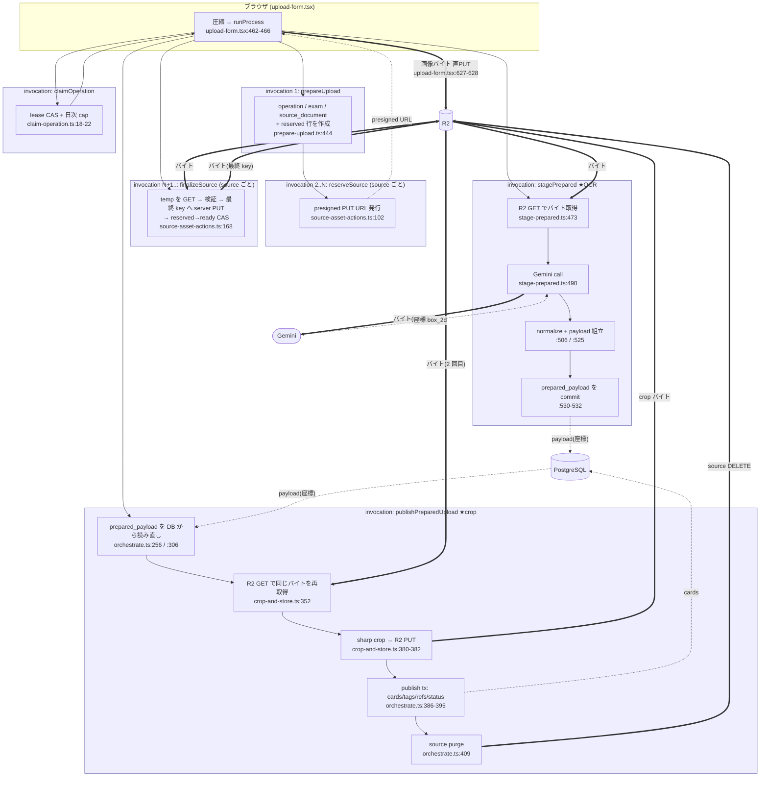
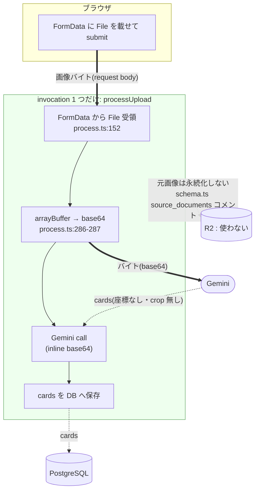
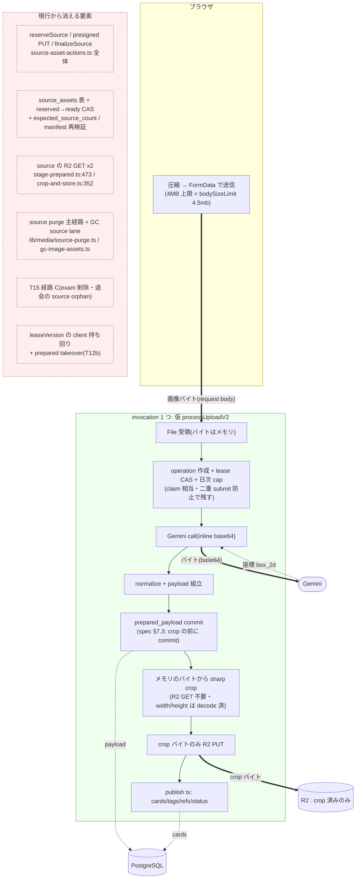

# OCR と crop が別 invocation に分かれている理由の確定 + アーキテクチャ図(調査のみ)

**日付**: 2026-08-04 / **範囲**: 実装・変更・commit なし(read-only)
**問い**: Gemini から座標を受け取った直後、同じ invocation の中でそのまま crop する形にできない技術的理由があるか。
**前提(確定・再議論なし)**: source を R2 に置く残存理由は「中断後に client のバイト再送なしで crop できる」1 点のみ → **中断時のユーザー再選択を許容する方針が確定したため、この理由は成立しない**。時間予算 / maxDuration の妥当性・PDF(②-4b)は対象外。

---

## 1. stagePrepared が return する時点で invocation が持っているもの

| 必要物 | invocation 内にあるか | 出所 |
|---|---|---|
| Gemini 応答(座標 `box_2d`) | **ある** | `rawResponse`(`stage-prepared.ts:498-500`)→ `normalized`(`:506`)→ `payload`(`:525`) |
| 元画像のバイト | **ある(base64 文字列として)** | `sourceImages`(`:471` 宣言・`:477-480` で push)。R2 GET は `:473`(`const obj = await getObject(source.objectKey)`)で、生 Buffer `obj.bytes` は loop 内のローカル束縛(同じ行で保持可能) |
| figure の asset ID | **ある** | `normalizePrepared(..., randomUUID)` が stage 発行(`:506`) |
| `sourceId` ↔ 画像の対応 | **ある** | `readySources`(`:464-468`)と `sourceImages` が同一順 |
| crop に要る `detectTarget` | **ある** | `payload.cards[].figures[].target`(publish 側の使用箇所 `publish-prepared-orchestrate.ts:364`) |
| **source の width / height** | **無い** | stage が読む列は `sourceId / objectKey / mime / status / byteSize` のみ(`stage-prepared.ts:106-112` の `SourceManifestRow`)。crop は `width / height` を別途 DB から読む(`lib/media/crop-and-store.ts:186-187`) |

- **「crop を続けて呼ぶために足りないもの」= source 行の `width` / `height` の 2 列だけ**。既に読んでいる同じ `source_assets` 行に載っており、SELECT に 2 列足すだけで揃う。バイトも座標も**再取得不要**。
- 都度 R2 から読み直しているか: **stage で 1 回 GET(`:473`)、crop で再び GET(`crop-and-store.ts:352`)= 同じバイトを 2 回読んでいる**。

## 2. 分けた理由の記述 → **記述なし**

- 分かれている**事実**を書いた箇所は 1 つある(理由ではない): `app/(app)/app/upload/_lib/constants.ts:67-70`
  > 「新 prepare→publish 方式では OCR(stage-prepared.ts・別 invocation)と crop(publishPreparedUpload の Step B・本 invocation)が別の server action 呼出に分かれているため、現行 `OCR_OVERALL_DEADLINE_MS`(ocr.ts・720s・OCR 専用)をそのまま流用しない」
  → これは**分かれている前提の上で time budget を分ける**判断の記述であり、分けた理由の記述ではない。
- spec が課しているのは**順序**であって invocation 境界ではない: spec `docs/superpowers/specs/2026-07-30-ocr-2-4a-image-figure-crop-design.md:29`「**【commit 後にのみ】crop asset 行作成・R2 PUT・ready 化**」/ §7.3(`:259`)「crop-derived asset 行・その R2 object を prepared_payload commit 前に作らない」。**同一 invocation 内で prepared を commit してから crop しても、この不変条件は満たされる**。
- ledger にある分割の理由は**task 分割**の理由であって invocation 分割の理由ではない: `.superpowers/sdd/2026-07-30-ocr-2-4a-image-figure-crop/progress.md:163`
  > 「T8 SPLIT into T8a (pure normalize-prepared.ts) + T8b (stage action). Reason: two concerns (pure domain + R2/Gemini/fencing orchestration), smaller reviews reduce multi-round churn」
- plan の cutover 記述は、むしろ**サーバー側を 1 括り**で書いている: `docs/superpowers/plans/2026-07-30-ocr-2-4a-image-figure-crop.md`(Phase Cut)
  > 「呼び出し列 = 圧縮 → `prepareUpload` → presigned PUT → `finalizeSource` → `claimOperation` →(**server: OCR → stage → crop → `publishPreparedUpload`**)→ 結果表示」
- → **コード・spec・plan・session doc・ledger のいずれにも「OCR と crop を別の client 呼出に分けた理由」の記述は無い**。理由は推測しない。

## 3. 2 つの invocation の間の client 側処理 → **エラー分岐のみ。ユーザー操作は無い**

- `upload-form.tsx:722` `stagePrepared` → `:723-753` は `switch (staged.outcome)` の**エラー文言マッピングだけ**。成功 `'staged'` は `:724-725` で `break` し、そのまま `:757` の `publishPreparedUpload` へ落ちる。
- **ユーザーの確認・選択・入力を待つ UI は存在しない**(この区間に `await` されるユーザー操作なし)。
- 唯一 client でしか持てない値は `leaseVersion`(`upload-form.tsx:466-467`「claimOperation → stagePrepared → publishPreparedUpload の 3 者で同一値を使い回す(fencing の CAS token)」)だが、これは**分かれているから client が持ち回っている**のであって、client でなければ作れない値ではない。

## 4. crop の入力の出所 → **client 往復していない。DB から読み直している**

- publish の入力は `{ operationId, leaseVersion }` のみ(`upload-form.tsx:757` / `publish-prepared-orchestrate.ts:244-246`)。**座標は client を通らない**。
- 座標は DB から再取得: `preparedPayload` を SELECT(`publish-prepared-orchestrate.ts:256`)→ `preparedPayloadSchema.parse`(`:306`)→ `payload.cards.flatMap(card => card.figures)`(`:345`)→ `box2d: figure.box_2d` で crop へ(`:363`)。
- → **client 往復が必要な理由は存在しない**(そもそも往復していない)。stage が持っていた同じ値を、DB を経由して publish が読み直しているだけ。

## 5. publishPreparedUpload が crop 以外に行っていること

| Step | 内容 | file:line | crop と不可分か |
|---|---|---|---|
| A | payload 読取 + fenced fast-fail + 4 つの terminal 分岐(source_document 削除済 / payload NULL / parse 失敗 / cards 0) | `publish-prepared-orchestrate.ts:249-328` | **分離可**(crop の前提読取) |
| B | **crop ループ**(deadline 判定 + `cropFigureAndStore`) | `:343-367` | — |
| C | publish 条件判定(純粋 `planPublish`) | `:370-375` | 分離可(crop 結果を入力に取る) |
| D | publish tx(cards / tags / refs / card_count / status / upload_records) | `:386-395`(`publishPreparedUploadTx`) | **分離可**(crop 結果の disposition のみ依存) |
| E | source purge(post-commit) | `:409` | 分離可 |

→ **crop は Step B のみ**。A/C/D/E は crop と不可分ではなく、順序依存があるだけ。

## 6. fencing / lease / claim は「2 invocation」を前提にしているか

| 機構 | 現在の役割(file:line) | 1 invocation になった場合 |
|---|---|---|
| `claimOperation` の lease CAS | 単一 upload 制限 + 日次 cap + lease 取得(`claim-operation.ts:18-22`) | **残る**。ただし守る対象は「別タブ / 二重 submit の並行」であって stage↔publish 境界ではない |
| `leaseVersion` の client 持ち回り | 3 action で同一 token(`upload-form.tsx:466`) | **不要**(同一 invocation のメモリ内で完結) |
| publish tx 冒頭の fencing | **lease を横取りされた stale worker を最終防衛**(`publish-prepared.ts` header「lease を横取りされた(takeover・T12b)stale worker は crop まで到達しうる…この publish tx 冒頭の … 不一致拒否で必ず弾かれる」) | **意味が変わる**。横取りが起きるのは「前の invocation が prepared 保存後に死んだ」場合であり、その復旧は再送前提なら不要 |
| `prepared_taken_over`(T12b) | 旧 worker が prepared 保存後に死んだ時の引き継ぎ(`claim-operation.ts:24-30` / `:264`) | **前提が消える**(バイト再送を許容するなら、payload 再利用は「Gemini 再課金の回避」だけが動機として残る) |
| `CROP_PHASE_BUDGET_MS` の per-invocation 予算 | OCR と crop が別 invocation ゆえ別予算(`constants.ts:67-72`) | **統合が必要**(OCR 720s + crop 600s を 1 invocation の 800s 内へ再配分) |
| spec §7.3 の「prepared commit 後にのみ crop」 | crop 側が `status='prepared'` を確認(`crop-and-store.ts:182` 付近) | **そのまま成立**(同一 invocation でも commit → crop の順は保てる) |

---

## 7. 図A — 現行フロー(invocation 境界を明示)

**太線 = 画像バイト / 点線 = 座標・メタ**。バイトは R2 を **3 回**通る(client PUT → finalize の GET+PUT → stage の GET → crop の GET)。座標は **client を通らず** DB を経由して stage → publish へ渡る。

## 8. 図B — legacy フロー(process.ts・R2 非経由)

**crop が存在しない**ため座標も R2 も不要だった。バイトは request body で server に入り、invocation 終了で破棄。

## 9. 図C — 想定形(1 invocation で OCR → crop、R2 は crop 済みのみ)

**残るもの**: `upload_operations`(冪等 replay / 日次 cap / 二重 submit 防止)、`prepared_payload` の atomic publish(spec §1.1「未完成カードを DB に置かない」)、crop 結果の `assets` / `asset_derivations`。

---

## 10. 結論

- **1 invocation にできない技術的理由: no**(現物上、見つからない)。
  - 座標もバイトも stage の invocation 内に既にある(§1)。crop に足りないのは source 行の `width`/`height` 2 列のみで、既に読んでいる行から取れる。
  - 間に client 側処理は無い(§3)。座標は client を往復していない(§4)。
  - spec が課すのは「prepared commit 後に crop」という**順序**であって invocation 境界ではない(§2)。同一 invocation で満たせる。
  - crop は publish の Step B のみで、他の Step と不可分ではない(§5)。
- **分けた理由の記述: 無し**。事実の記述(`constants.ts:67-70`)と task 分割の理由(ledger:163)はあるが、invocation を分けた理由は**コード・spec・plan・session doc・ledger のいずれにも無い**。
- **不明**: 40 枚 upper-scale の実測 / 1 invocation にした場合の時間予算の再配分値 / モバイル回線で 4MB POST の成功率 / Vercel が client 切断後に function を継続するか(前回調査から継続して不明)。
